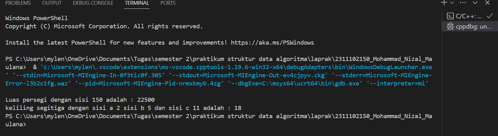
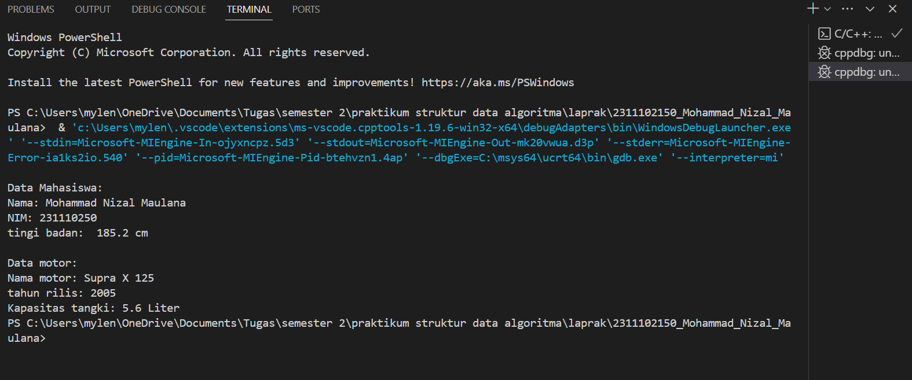
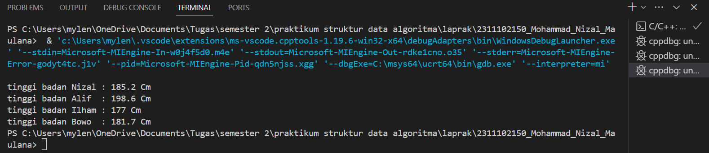

# <h1 align="center">Laporan Praktikum Modul 1 - Tipe Data</h1>
<p align="center">Mohammad Nizal Maulana - 2311102150</p>

## Dasar Teori
Tipe data adalah sebuah klasifikasi yang menentukan jenis nilai yang disimpan dan dioperasikan dalam sebuah variabel. Dalam pemrograman, tipe data bukan hanya soal bagaimana data disimpan, tetapi juga bagaimana data tersebut di interpretasikan dan di proses oleh komputer.

Berikut macam-macam tipe data dalam bahasa pemrograman C++ :
1. Tipe data Primitif 
Tipe data primitif merupakan tipe data yang telah ditentukan oleh sistem yang disediakan oleh bahasa pemrograman.
contoh tipe data primitif:
A. Int
<br>B. Float
<br>C. Double
<br>D. Char
<br>E. Boolean

2. Tipe data Abstrak
Tipe data abstrak merupakan sebuah tipe data yang harus dibentuk oleh programer itu sendiri, tipe data ini berisi banyak tipe data sehingga nilainya lebih dari satu tipe data.

3. Tipe data Koleksi
Tipe data koleksi merupakan tipe data yang digunakan untuk mengelompokan dan menyimpan beberapa nilai secara bersamaan.
contoh tipe data koleksi:

A. Array
adalah suatu struktur yang terdiri dari sejumlah elemen yang memiliki tipe data yang sama. elemen-elemen array tersusun secara sekunsional dalam memori komputer. semua elemen array bertipe sama.
<br>B. Vector
vector adalah sebuah library yang ada didalam bahasa pemrograman C++
<br>C. Map
 mirip seperti array namun dengan index yang memungkinkan untuk berupa tipe data selain Int.

## Guided 

### 1. Tipe data Primitif

```C++
#include <iostream>
#include <iomanip>

using namespace std;

int main(){
    char op;
    float num1,num2;

    cout << "Enter operator (+,-,*,/)";
    cin >> op;

    cout << "Enter two operands : ";
    cin >> num1>>num2;

    switch(op)
    {
        case '+':
             cout << "Result : "<<num1+num2;
             break;
        case '-':
             cout << "Result : "<<num1-num2;
             break;
        case '*':
            cout << "Result : "<<num1*num2;
            break;
        case '/':
            if(num2 !=0) {
                cout << "Result: "<<fixed<<setprecision(2)<<num1/num2;
            }else{
                cout << "ERROR! Division by zero is not allowed,";
            }        
            break;
        default:
            cout << "ERROR! operator is not correct";
    }
    return 0;
}
```
codingan di atas digunakan untuk memilih operasi penjumlahan(+),pengurangan(-),perkalian(*) dan pembagian(/). ke-empat pilihan tersebut akan berjalan jika pengguna telah menginput dua bilangan pada saat pengimputan cin. di program ini menggunakan tipe data primitif ada Float dan Char. 

### 2. Tipe data Abstrak

```C++
#include <stdio.h>
#include <string.h>

//struct
struct Mahasiswa{
    char name[50];
    char address[100];
    int age;
};

int main(){
    //menggunakan struct
    struct Mahasiswa mhs1, mhs2;
    //mengisi nilai ke struct
    strcpy(mhs1.name, "Dian");
    strcpy(mhs1.address, "Mataram");
    mhs1.age = 22;
    strcpy(mhs2.name, "Bambang");
    strcpy(mhs2.address, "Surabaya");
    mhs2.age = 23;

    //mencetak isi struct
    printf("## Mahasiswa 1 ##\n");
    printf("Nama : %s\n", mhs1.name);
    printf("Alamat : %s\n", mhs1.address);
    printf("Umur : %d\n", mhs1.age);
    printf("\n");
    printf("## Mahasiswa 2 ##\n");
    printf("Nama : %s\n", mhs2.name);
    printf("Alamat : %s\n", mhs2.address);
    printf("Umur : %d\n", mhs2.age);
    return 0;
}
```

Codingan di atas digunakan untuk mencetak struct. struct sendiri termasuk dalam tipe data abstrak. pada codingan dia atas terdapat sebuah struct mahasiswa. di struct mahasiswa ini ada 3 nilai, yaitu char name yang ukurannya 50, dan char address yang ukurannya juga 50, dan int age. terus di int main di isi nilai 2 struct mahasiswa dengan objek mhs1 = Dian dan mhs2 = Bambang.

### 3. Tipe data Koleksi

```C++
#include <iostream>
#include <array>
using namespace std;

int main(){
    // Deklarasi daninisialisasi array
    int nilai[5];
    nilai[0] = 23;
    nilai[1] = 50;
    nilai[2] = 34;
    nilai[3] = 78;
    nilai[4] = 90;

    //mencetak array dengan tab
    cout << "Isi array pertama : "<<nilai[0] <<endl;
    cout << "Isi array kedua   : "<<nilai[1] <<endl;
    cout << "Isi array ketiga  : "<<nilai[2] <<endl;
    cout << "Isi array keempat : "<<nilai[3] <<endl;
    cout << "Isi array kelima  : "<<nilai[4] <<endl;

    return 0;
}
```

codingan di atas menggunakan array, array sendiri masuk ke dalam tipe data koleksi. pada codingan di atas, terdapat library array yang membantu proses pemrogramannya. terdapat juga nilai array yang menampung 5 nilai, yaitu 23,50,34,78, dan 90. terus nilai-nilai tersebut akan di deklarasikan di // mencetak array dengan tab.

## Unguided 

### 1. Buatlah program menggunaka tipe data primitif minimal dua fungsi dan bebas. menampilkan program, jelaskan program tersebut dan ambil kesimpulan dari materi data primitif!.

```C++
/*
oleh Mohammad Nizal Maulana - 2311102150
*/
#include <iostream>
using namespace std;

// fungsi menghitung luas Persegi
int menghitung_luas_persegi(int sisi){
    return sisi * sisi;
}

// fungsi menghitung keliling segitiga
int menghitung_keliling_segitiga(int a,int b,int c){
    return a+b+c;
}
int main(){
    //menggunakan fungsi menghitung luas persegi
    int sisi = 150;
    int luas = menghitung_luas_persegi(sisi);
    cout << "Luas persegi dengan sisi "<<sisi<< " adalah : "<< luas <<endl; 

    // menggunakan fungsi menghitung keliling segitiga
    int a = 2;
    int b = 5;
    int c = 11;
    int keliling = menghitung_keliling_segitiga(a,b,c);
    cout << "keliling segitiga dengan sisi a "<< a << " sisi b "<< b <<" dan sisi c "<< c << " adalah : "<< keliling <<endl;
    return 0;
}
```
#### Output:


codingan ini menggunakan salah satu tipe data primitif yaitu Int. program ini mempunyai dua fugsi yaitu, fungsi untuk menghitung luas persegi dan fungsi untuk menghitung keliling segitiga.kedua fungsi tersebut ada di dalam int main(). fungsi menghitung_luas_peraegi(int sisi): akan menerima panjang sisi persegi sebagaii parameter dan mengembalikan hasil perkalian dengan dirinya sendiri yang merupakan rumus luas persegi. fungsi menghitung_keliling_segitiga(int a,int b,int c): juga akan menerima ketiga panjang sisi segitiga sebagai parameter dan mengembalikan hasil penjumlahan ketiganya, yang merupakan rumus keliling segitiga.
di dalam int main() kedua fungsi ini akan dipanggil.
pertama, untuk menghitung luas persegi dengan sisi yang sudah di inputkan yaitu 150.
kedua, untuk menghitung keliling segitiga dengan sisi yang sudah di inputkan yaitu a=2, b=5, dan c=11.
hasil hitung-hitungan dari kedua fungsi akan dicetak menggunakan cout.

data tipe primitif dalam C++ adalah tipe data dasar seperti int,float,double,char dan bool. yang digunakan untuk menyimpan nilai tunggal dengan ukuran yang stetap. seperti bilangan bulat,desimal,karakter dan nilai true/false.

### 2. Jelaskan fungsi dari Class dan Struct secara detail dan berikan contoh programnya!

```C++
/*
Mohammad Nizal Maulana - 2311102150
*/
#include <iostream>
using namespace std;

// Deklarasi class mahasiswa_2150 yang berisi nama string, nim int, dan tb(tinggi badan) float dalam akses public
class Mahasiswa_2150 {
    public:
    // Data member (variabel)
    string nama_2150;
    int nim_2150;
    float tb_2150;

    // Fungsi member (metode)
    void display() {
        cout << "Nama: " << nama_2150 << endl;
        cout << "NIM: " << nim_2150 << endl;
        cout << "tingi badan:  " << tb_2150 << " cm " << endl;
    }
};

// Deklarasi struct
struct jenis_motor {
    // Data member (variabel)
    string nama_motor;
    int tahun_rilis;
    float kapasitas_tangki;

    // Tidak dapat memiliki fungsi member (metode)
};

int main() {
    // deklarasi Menggunakan class dengan fungi
    Mahasiswa_2150 mhs1;
    mhs1.nama_2150 = "Mohammad Nizal Maulana";
    mhs1.nim_2150 = 231110250;
    mhs1.tb_2150 = 185.2;
    cout << "Data Mahasiswa:" << endl;
    mhs1.display();
    cout << endl;

    // deklarasi Menggunakan struct
    jenis_motor motor1;
    motor1.nama_motor = "Supra X 125";
    motor1.tahun_rilis = 2005;
    motor1.kapasitas_tangki = 5.6 ;
    cout << "Data motor:" << endl;
    cout << "Nama motor: " << motor1.nama_motor << endl;
    cout << "tahun rilis: " << motor1.tahun_rilis << endl;
    cout << "Kapasitas tangki: " << motor1.kapasitas_tangki << " Liter "<< endl;

    return 0;
}
```
#### Output:


codingan di atas digunakan untuk mencetak sebuah class dan struct. di codingan tersebut terdapat class mahasiswa_2150 yang menampung nilai string nama_2150, int nim_2150 dan float tb_150. juga ada struct jenis_motor dengan nilai string nama_motor, int tahun_rilis dan float kapasitas_tangki. class mahasiswa_2150 akan diidi dengan nilai Nama : Mohammad Nizal Maulana, NIM : 2311102150, dan tinggi badan 185.2 cm. sedangkan untuk struct jenis_motor akan diisi Data motor: , Nama motor : Supra X 125, tahun rilis : 2005, dan Kapasitas tangki: 5.6 liter.kemudian class dan struct ini akan di deklarasikan.

A. fungsi dari Class
fungsi dari class c++ adalah untuk membuat tipe data baru yang menggabungkan data dan fungsi yang beroperasi dari data yang ada. hal ini memudahkan programer untuk mengorganisir kode menjadi unit yang lebih terstruktur.

B. fungsi dari Struct
Struct di C++ digunakan untuk mengelompokan data yang  ada tanpa metode atau fungsi, struct menyediakan cara untuk mengorganisir variabel terkait menjadi satu kesatuan data yang lebih terstruktur.

### 3. Buat dan jelaskan program menggunakan fungsi map dan jelaskan perbedaan dari array dengan map!

```C++
/*
Mohammad Nizal Maulana - 2311102150
*/
#include <iostream>
#include <map> //Menggunakan library map agar bisa menggunakan fungsi map pada program ini
using namespace std;

int main(){
    map<string, float> tinggi_badan; //membuat map dengan key bertipe string dan value bertipe float

    //menambahkan data kedalam map
    tinggi_badan["Nizal"] = 185.2;
    tinggi_badan["Alif"] = 198.6;
    tinggi_badan["Ilham"] = 177;
    tinggi_badan["Bowo"] = 181.7;

    //mengakses dan mencetak nilai dari map
    cout << "tinggi badan Nizal : "<< tinggi_badan["Nizal"] << " Cm "<< endl;
    cout << "tinggi badan Alif  : "<< tinggi_badan["Alif"] << " Cm "<< endl;
    cout << "tinggi badan Ilham : "<< tinggi_badan["Ilham"] << " Cm "<< endl;
    cout << "tinggi badan Bowo  : "<< tinggi_badan["Bowo"] << " Cm "<< endl;

    return 0;
}
```

#### Output :


codingan dia atas adalah contoh penggunaan library map dalam C++. dalam program ini, sebuah map tinggi_badan dengan key bertipe string dan value bertipe float digunakan untuk menyimpan data tinggi badan beberapa orang. kemudian program akan mengakses dan mencetak tinggi badan setiap orang, dan program akan diakhiri dengan mengembalikan nilai 0.

Perbedaan Array dari Map

1. Array digunakan untuk menyimpan data yang berurutan dengan ukuran yang tetap. Array menggunakan  sebuah indeks sebagai key untuk mengeksekusi nilai.
2. Sedangkan Map digunakan untuk menyimpan data yang berpasangan (key-value) dengan ukuran yang dinamis. key di Map bisa berupa tipe data apa saja dan tidak harus berurutan.

## Kesimpulan
Tipe data dalam c++ terbagi menjadi 3 yaitu tipe data primitif, abstrak dan koleksi. tipe data sendiri merupakan bagian yang penting dalam pemrograman c++. dengan adanya tipe data sangat mempermudah programer untuk menyimpan dan mengelola data dalam program secara mudah dan efisien.

## Referensi
[1] PURBASARI, Wika, et al. ALGORITMA PEMROGRAMAN. 2024.
<br>[2] Pratama, M. A. (2020). STRUKTUR DATA ARRAY DUA DIMENSI PADA PEMROGRAMAN C++.
