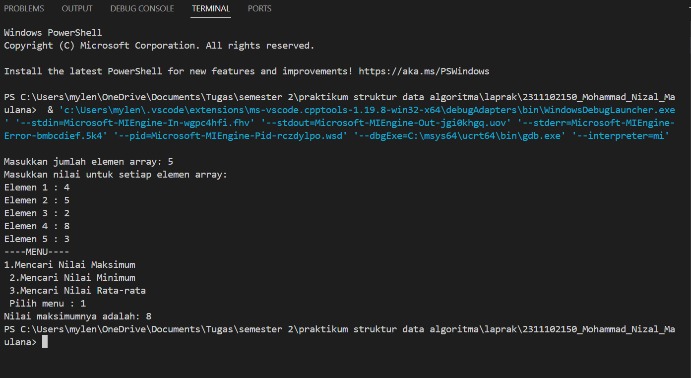

# <h1 align="center">Laporan Praktikum Modul 2 Array</h1>
<p align="center">Mohammad Nizal Maulana - 2311102150</p>

## Dasar Teori

dasar teori

## Guided 

### 1. Program Input Array Tiga Dimensi

```C++
#include <iostream>
using namespace std;
// PROGRAM INPUT ARRAY 3 DIMENSI
int main()
{
    // Deklarasi array
    int arr[2][3][3];
    // Input elemen
    for (int x = 0; x < 2; x++)
    {
        for (int y = 0; y < 3; y++)
        {
            for (int z = 0; z < 3; z++)
            {
                cout << "Input Array[" << x << "][" << y << "][" << z << "] = ";
                cin >> arr[x][y][z];
            }
        }
        cout << endl;
    }
    // Output Array
    for (int x = 0; x < 2; x++)
    {
        for (int y = 0; y < 3; y++)
        {
            for (int z = 0; z < 3; z++)
            {
                cout << "Data Array[" << x << "][" << y << "][" << z
                     << "] = " << arr[x][y][z] << endl;
            }
        }
    }
    cout << endl;
    // Tampilan array
    for (int x = 0; x < 2; x++)
    {
        for (int y = 0; y < 3; y++)
        {
            for (int z = 0; z < 3; z++)
            {
                cout << arr[x][y][z] << ends;
            }
            cout << endl;
        }
        cout << endl;
    }
}
```
Kode di atas merupakan program yang menggunakan array tiga dimensi. Program tersebut meminta user untuk menginputkan nilai ke dalam array tiga dimensi dengan ukuran array 2x3x3. Setelah semua nilai di inputkan, kemudian nilai akan dicetak dengan format matriks.

### 2. Program Mencari Nilai Maksimal pada Array

```C++
#include <iostream>
using namespace std;
int main()
{
    int maks, a, i = 1, lokasi;
    cout << "Masukkan panjang array: ";
    cin >> a;
    int array[a];
    cout << "Masukkan " << a << " angka\n";
    for (i = 0; i < a; i++)
    {
        cout << "Array ke-" << (i) << ": ";
        cin >> array[i];
    }
    maks = array[0];
    for (i = 0; i < a; i++)
    {
        if (array[i] > maks)
        {
            maks = array[i];
            lokasi = i;
        }
    }
    cout << "Nilai maksimum adalah " << maks << " berada di Array ke " << lokasi << endl;
}
```
Kode diatas merupakan program yang digunakan untuk mencari nilai maksimum pada sebuah array satu dimensi dengan panjang array dan nilai indeks yang akan di inputkan oleh user. Setelah memasukkan nilai array, program akan mencari nilai maksimum pada elemen-elemen yang telah di inputkan tadi. setelah menemukan nilai maksimumnya program akan mencetak nilai maksimumnya.


## Unguided 

### 1. Buatlah Program untuk menampilkan Output seperti berikut dengan data yang diinputkan oleh user!


```C++
#include <iostream>
using namespace std;

int main(){
    int panjangArray_150;

    // masukkan panjang array
    cout << "Masukkan panjang array: ";
    cin >> panjangArray_150;

    // Masukkan elemen-elemen array
    int Elemen_150[panjangArray_150];
    for(int i=0; i<panjangArray_150; i++){
        cout << "Masukkan nilai array indeks ke- "<< i << " = ";
        cin >> Elemen_150[i];
    }
    cout << endl;
    // Output Data Array
    cout << "Data Array = ";
    for(int i=0; i<panjangArray_150;i++){
        cout << Elemen_150[i] << " "<<ends;
    }
    cout << endl;

    //Output Array bilangan genap
    cout << "Nomor Genap = ";
    for(int i =0; i < panjangArray_150; i++){
        if(Elemen_150[i] % 2 == 0){ //misal nilai array Elemen_150 dibagi 2 akan memiliki sisa nilai 0, maka output akan menampilkan
            cout << Elemen_150[i] << " , "<<ends;
        }
    }
    cout << endl;

    //Output Array bilangan ganjil
    cout << "Nomor Ganjil = ";
    for(int i = 0; i < panjangArray_150; i++){ // Misal nilai array Elemen_150 dibagi 2 akan memiliki sisa nilai 1, maka output akan menampilkan
        if(Elemen_150[i] % 2 == 1){
            cout << Elemen_150[i] << " , "<<ends;
        }
    }
    cout << endl;

    return 0;
}
```
#### Output:


Kode diatas adalah program yang digunakan untuk menginputkan elemen array lalu menampilkan dan memisahkan bilangan genap dan ganjil. program diatas menggunakan array Elemen_150 dengan panjang array di inputkan oleh user. lalu user juga diminta menginputkan nilai array Elemen_150 di setiap indeksnya. terakhir program akan menampilkan bilangan inputan dari user dan menampilkan bilangan ganjil dan genap berdasarkan bilangan yang di inputkan user.


### 2. Buatlah program Input array tiga dimensi (seperti pada guided) tetapi jumlah atau ukuran elemen diinputkan oleh user!

```C++
#include <iostream>
using namespace std;

int main(){
    int x_150,y_150,z_150;
    cout << "masukkan jumlah elemen untuk dimensi x : "; //Meminta user memasukkan ukuran array x
    cin >> x_150;
    cout << "Masukkan jumlah elemen untuk dimensi y : "; //Meminta user memasukkan ukuran array y
    cin >> y_150;
    cout << "Masukkan jumlah elemen untuk dimensi z : "; //Meminta user memasukkan ukuran array z
    cin >> z_150;

    // Mendeklarasikan array 3 dimensi
    int array3D_150 [x_150][y_150][z_150];

    //Memasukkan nilai ke dalam array
    cout << "Masukkan nilai untuk setiap elemen array: "<<endl;
    for (int i=0; i < x_150; i++){
        for(int j=0; j < y_150; j++){
            for(int k=0; k < z_150; k++){
                cout << "Elemen ["<< i << "][" << j <<"][" << k << "]: ";
                cin >> array3D_150[i][j][k];
            }
        }
    }
    //Menampilkan nilai dari array3D_150
     cout << "Nilai yang dimasukkan ke dalam array:  "<<endl;
    for (int i=0; i < x_150; i++){
        for(int j=0; j < y_150; j++){
            for(int k=0; k < z_150; k++){
                cout << "Elemen ["<< i << "][" << j <<"][" << k << "]: ";
                cin >> array3D_150[i][j][k];
            }
        }
    }
     cout << endl;
    // Tampilan array3D_150
    for (int x = 0; x < x_150; x++)
    {
        for (int y = 0; y < y_150; y++)
        {
            for (int z = 0; z < z_150; z++)
            {
                cout << array3D_150[x][y][z] << ends;
            }
            cout << endl;
        }
        cout << endl;
    }
}
```
#### Output:


deskripsi unguided 2

### 3. Buatlah program menu untuk mencari nilai Maksimum,Minimum dan Nilai rata-rata dari suatu array dengan input yang dimasukan oleh user!

```C++
#include <iostream>
using namespace std;
int main(){
    int jmlhElemen_150;
    int arr[jmlhElemen_150]; // Mendeklarasikan array dengan ukuran yang dimasukan user
    // User memasukka jumlah elemen array
    int pilih_150; // untuk memilih menu
    cout << "Masukkan jumlah elemen array: ";
    cin >> jmlhElemen_150;

    //Memasukkan nilai untuk setiap elemen array
    cout << "Masukkan nilai untuk setiap elemen array: "<<endl;
    for(int i=0;i<jmlhElemen_150;++i){
        cout<< "Elemen "<< i + 1<< " : ";
        cin >> arr[i];
    }
    //Menampilkan menu
    cout << "----MENU----"<<endl;
    cout << "1.Mencari Nilai Maksimum\n ";
    cout << "2.Mencari Nilai Minimum\n ";
    cout << "3.Mencari Nilai Rata-rata\n ";
    cout << "Pilih menu : "; 
    cin >> pilih_150;
    // Melakukan operasi sesuai dengan pilihan  user
    switch(pilih_150){
        case 1:{
            //Mencari nilai maksimum
            int max_150 = arr[0];
            for(int i=1;i<jmlhElemen_150;i++){
                if (arr[i]>max_150){
                    max_150 = arr[i];
                }
            }
            cout << "Nilai maksimumnya adalah: "<< max_150 <<endl;
            break;
        }
        case 2:{
            //Mencari nilai minimum
            int min_150 = arr[0];
            for(int i=1;i<jmlhElemen_150;i++){
                if(arr[i]<min_150){
                    min_150=arr[i];
                }
            }
            cout << "Nilai Minimumnya adalah: "<< min_150 << endl;
            break;
        }
        case 3:{
            //Mencari nilai Rata-rata
            double rta_150 = 0;
            for(int i=0;i<jmlhElemen_150;i++){
                rta_150 += arr[i];
            }
            double rataRata_150 = rta_150 / jmlhElemen_150;
            cout << "Nilai Rata-ratanya adalah: "<< rataRata_150 << endl;
            break;
        }
        default:
            cout << "Pilihan anda tidak tersedia"<<endl;
    }
    return 0;
}
```
#### Output:



deskripsi unguided 3

## Kesimpulan

## Referensi
