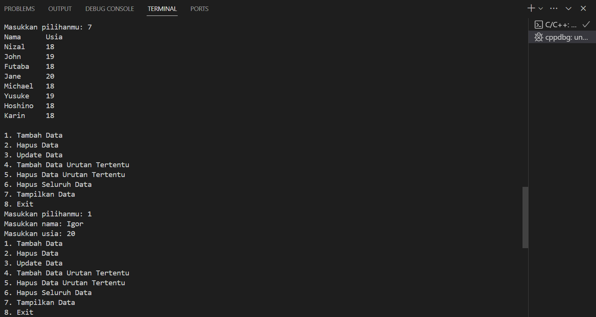
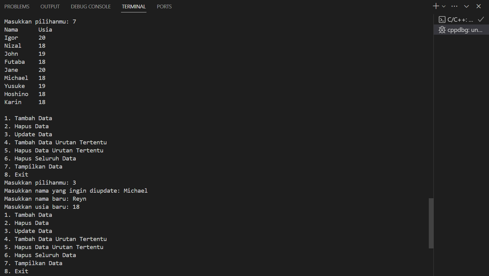
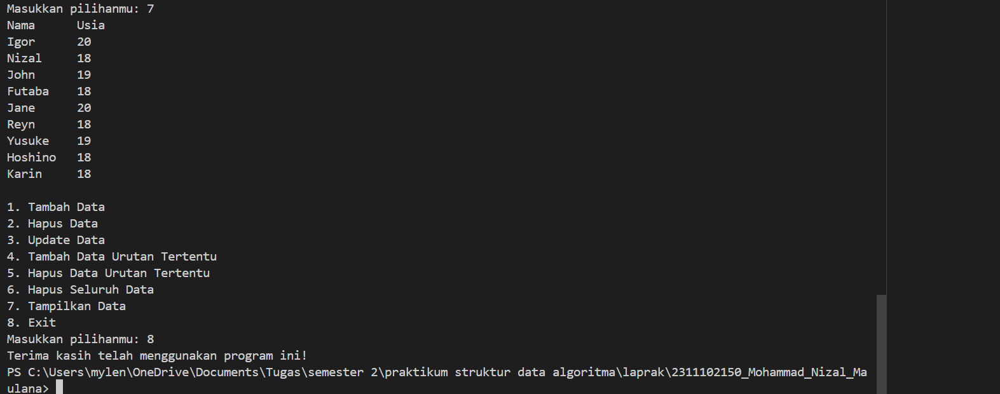
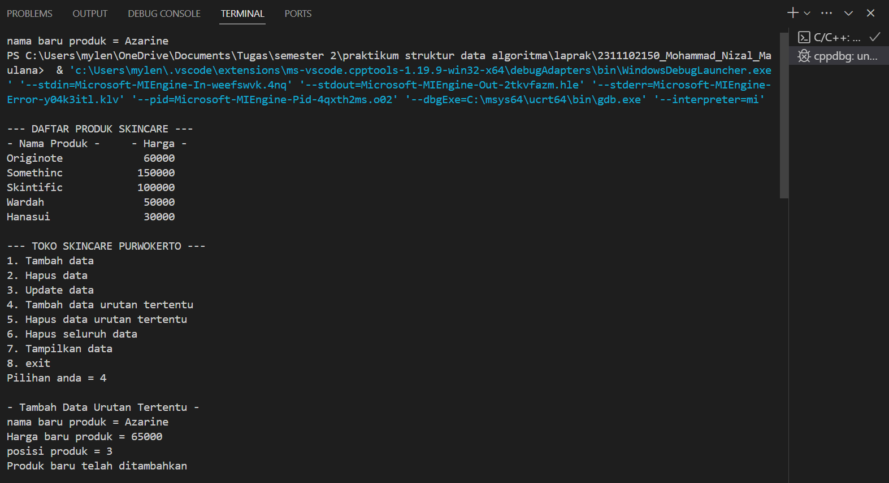
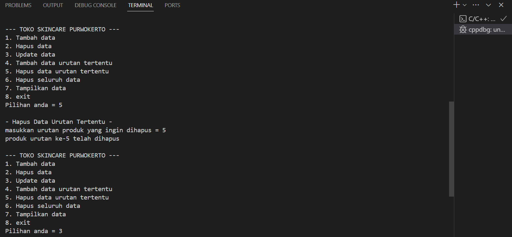
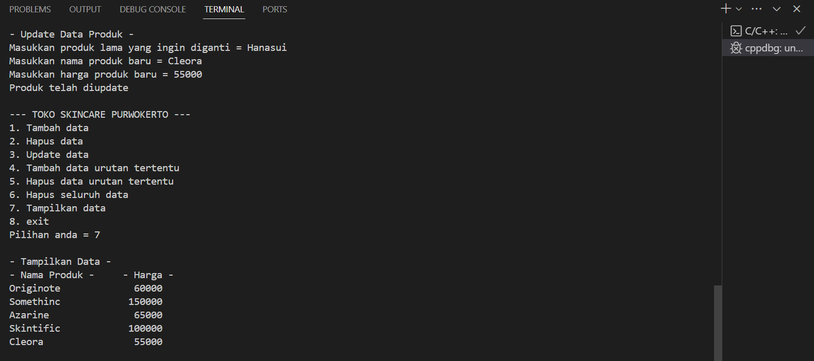
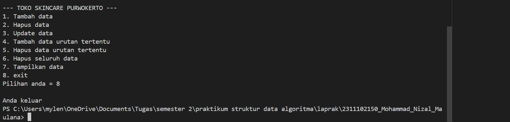

# <h1 align="center">Laporan Praktikum Modul 3 - Linked List</h1>
<p align="center">Mohammad Nizal Maulana - 2311102150</p>

## Dasar Teori
Linked List atau senarai berantai merupakan sebuah struktur data yang digunakan untuk menyimpan sejumlah objek data biasana secara terurut sehingga memungkinkan penambahan,pengurangan dan pencarian atas elemen data yang tersimpan dalam daftar dilakukab secara lebih efektif. Pada praktiknya sebuah struktur data memiliki elemen yang digunakan untuk saling menyimpan rujukan antara satu dengan yang lainya sehingga membentuk daftar abstrak, setiap elemen yang terdapat pada daftar abstrak ini disebut dengan node.

- Single Linked List </br>
Single Linked list adalah Daftar terhubung yang setiap simpul pembentuknya mempunyai satu rantai(link) ke simpul lainnya. Single Linked List memiliki dua macam yaitu:
    - Single Linked List Non Circular </br>
    Setiap node pada Linked List mempunyai field yang berisi data dan pointer ke node berikutnya dan ke node sebelumnya, mulanya poniter next dan prev akan menunjuk ke nilai NULL. Selanjutnya pointer prev akan menunjuk ke node sebelumnya, dan pointer next akan menunjuk ke node selanjutnya pada list.</br>
    - Single Linked List Circular </br>
    Single Linked List yang pointer nextnya menunjuk pada dirinya sendiri. Jika Single Linked List tersebut terdiri dari beberapa node, maka pointer next pada node terakhir akan menunjuk ke node terdepannya.

- Double Linked List </br>
Pada dasarnya, penggunaan Double Linked List hampir sama dengan penggunaan Single Linked List yang telah kita pelajari pada materi sebelumnya. Hanya saja Double Linked List menerapkan sebuah pointer baru, yaitu prev, yang 
digunakan untuk menggeser mundur selain tetap mempertahankan pointer next. 

## Guided 

### 1. Latihan Single Linked List

```C++
#include <iostream>
using namespace std;
/// PROGRAM SINGLE LINKED LIST NON-CIRCULAR
// Deklarasi Struct Node
struct Node
{
    int data;
    Node *next;
};
Node *head;
Node *tail;
// Inisialisasi Node
void init()
{
    head = NULL;
    tail = NULL;
}
// Pengecekan
bool isEmpty()
{
    if (head == NULL)
        return true;
    else
        return false;
}
// Tambah Depan
void insertDepan(int nilai)
{
    // Buat Node baru
    Node *baru = new Node;
    baru->data = nilai;
    baru->next = NULL;
    if (isEmpty() == true)
    {
        head = tail = baru;
        tail->next = NULL;
    }
    else
    {
        baru->next = head;
        head = baru;
    }
}
// Tambah Belakang
void insertBelakang(int nilai)
{
    // Buat Node baru
    Node *baru = new Node;
    baru->data = nilai;
    baru->next = NULL;
    if (isEmpty() == true)
    {
        head = tail = baru;
        tail->next = NULL;
    }
    else
    {
        tail->next = baru;
        tail = baru;
    }
}
// Hitung Jumlah List
int hitungList()
{
    Node *hitung;
    hitung = head;
    int jumlah = 0;
    while (hitung != NULL)
    {
        jumlah++;
        hitung = hitung->next;
    }
    return jumlah;
}
// Tambah Tengah
void insertTengah(int data, int posisi)
{
    if (posisi < 1 || posisi > hitungList())
    {
        cout << "Posisi diluar jangkauan" << endl;
    }
    else if (posisi == 1)
    {
        cout << "Posisi bukan posisi tengah" << endl;
    }
    else
    {
        Node *baru, *bantu;
        baru = new Node();
        baru->data = data;
        // tranversing
        bantu = head;
        int nomor = 1;
        while (nomor < posisi - 1)
        {
            bantu = bantu->next;
            nomor++;
        }
        baru->next = bantu->next;
        bantu->next = baru;
    }
}
// Hapus Depan
void hapusDepan()
{
    Node *hapus;
    if (isEmpty() == false)
    {
        if (head->next != NULL)
        {
            hapus = head;
            head = head->next;
            delete hapus;
        }
        else
        {
            head = tail = NULL;
        }
    }
    else
    {
        cout << "List kosong!" << endl;
    }
}
// Hapus Belakang
void hapusBelakang()
{
    Node *hapus;
    Node *bantu;
    if (isEmpty() == false)
    {
        if (head != tail)
        {
            hapus = tail;
            bantu = head;
            while (bantu->next != tail)
            {
                bantu = bantu->next;
            }
            tail = bantu;
            tail->next = NULL;
            delete hapus;
        }
        else
        {
            head = tail = NULL;
        }
    }
    else
    {
        cout << "List kosong!" << endl;
    }
}
// Hapus Tengah
void hapusTengah(int posisi)
{
    Node *hapus, *bantu, *bantu2;
    if (posisi < 1 || posisi > hitungList())
    {
        cout << "Posisi di luar jangkauan" << endl;
    }
    else if (posisi == 1)
    {
        cout << "Posisi bukan posisi tengah" << endl;
    }
    else
    {
        int nomor = 1;
        bantu = head;
        while (nomor <= posisi)
        {
            if (nomor == posisi - 1)
            {
                bantu2 = bantu;
            }
            if (nomor == posisi)
            {
                hapus = bantu;
            }
            bantu = bantu->next;
            nomor++;
        }
        bantu2->next = bantu;
        delete hapus;
    }
}
// Ubah Depan
void ubahDepan(int data)
{
    if (isEmpty() == false)
    {
        head->data = data;
    }
    else
    {
        cout << "List masih kosong!" << endl;
    }
}
// Ubah Tengah
void ubahTengah(int data, int posisi)
{
    Node *bantu;
    if (isEmpty() == false)
    {
        if (posisi < 1 || posisi > hitungList())
        {
            cout << "Posisi di luar jangkauan" << endl;
        }
        else if (posisi == 1)
        {
            cout << "Posisi bukan posisi tengah" << endl;
        }
        else
        {
            bantu = head;
            int nomor = 1;
            while (nomor < posisi)
            {
                bantu = bantu->next;
                nomor++;
            }
            bantu->data = data;
        }
    }
    else
    {
        cout << "List masih kosong!" << endl;
    }
}
// Ubah Belakang
void ubahBelakang(int data)
{
    if (isEmpty() == false)
    {
        tail->data = data;
    }
    else
    {
        cout << "List masih kosong!" << endl;
    }
}
// Hapus List
void clearList()
{
    Node *bantu, *hapus;
    bantu = head;
    while (bantu != NULL)
    {
        hapus = bantu;
        bantu = bantu->next;
        delete hapus;
    }
    head = tail = NULL;
    cout << "List berhasil terhapus!" << endl;
}
// Tampilkan List
void tampil()
{
    Node *bantu;
    bantu = head;
    if (isEmpty() == false)
    {
        while (bantu != NULL)
        {
            cout << bantu->data << ends;
            bantu = bantu->next;
        }
        cout << endl;
    }
    else
    {
        cout << "List masih kosong!" << endl;
    }
}
int main()
{
    init();
    insertDepan(3);
    tampil();
    insertBelakang(5);
    tampil();
    insertDepan(2);
    tampil();
    insertDepan(1);
    tampil();
    hapusDepan();
    tampil();
    hapusBelakang();
    tampil();
    insertTengah(7, 2);
    tampil();
    hapusTengah(2);
    tampil();
    ubahDepan(1);
    tampil();
    ubahBelakang(8);
    tampil();
    ubahTengah(11, 2);
    tampil();
    return 0;
}
```
Kode diatas menggunakan Single Linked List non circular, dalam kode diatas, struktur data Node di definisikan untuk menyimpan data integer dan pointer yang akan menunjuk ke node berikutnya. fungsi-fungsi seperti `init()` berfungsi untuk menginisialisasi linked list, `itsEmpty()` untuk memeriksa apakah linked list kosond, `insertDepan()` untuk menambahkan elemen di depan linked list, dan fungsi-fungsi lainnya digunakan untuk operasi-operasi dasar seperti menyisipkan,menghapus,atau mengubah elemen dalam linked list. Kemudian fungsi-fungsi tersebut akan dipanggil ke dalam `main()` untuk dieksekusi.

### 2. Latihan Double Linked List

```C++
#include <iostream>
using namespace std;
class Node
{
public:
    int data;
    Node *prev;
    Node *next;
};
class DoublyLinkedList
{
public:
    Node *head;
    Node *tail;
    DoublyLinkedList()
    {
        head = nullptr;
        tail = nullptr;
    }
    void push(int data)
    {
        Node *newNode = new Node;
        newNode->data = data;
        newNode->prev = nullptr;
        newNode->next = head;
        if (head != nullptr)
        {
            head->prev = newNode;
        }
        else
        {
            tail = newNode;
        }
        head = newNode;
    }
    void pop()
    {
        if (head == nullptr)
        {
            return;
        }
        Node *temp = head;
        head = head->next;
        if (head != nullptr)
        {
            head->prev = nullptr;
        }
        else
        {
            tail = nullptr;
        }
        delete temp;
    }
    bool update(int oldData, int newData)
    {
        Node *current = head;
        while (current != nullptr)
        {
            if (current->data == oldData)
            {
                current->data = newData;
                return true;
            }
            current = current->next;
        }
        return false;
    }
    void deleteAll()
    {
        Node *current = head;
        while (current != nullptr)
        {
            Node *temp = current;
            current = current->next;
            delete temp;
        }
        head = nullptr;
        tail = nullptr;
    }
    void display()
    {
        Node *current = head;
        while (current != nullptr)
        {
            cout << current->data << " ";
            current = current->next;
        }
        cout << endl;
    }
};
int main()
{
    DoublyLinkedList list;
    while (true)
    {
        cout << "1. Add data" << endl;
        cout << "2. Delete data" << endl;
        cout << "3. Update data" << endl;
        cout << "4. Clear data" << endl;
        cout << "5. Display data" << endl;
        cout << "6. Exit" << endl;
        int choice;
        cout << "Enter your choice: ";
        cin >> choice;
        switch (choice)
        {
        case 1:
        {
            int data;
            cout << "Enter data to add: ";
            cin >> data;
            list.push(data);
            break;
        }
        case 2:
        {
            list.pop();
            break;
        }
        case 3:
        {
            int oldData, newData;
            cout << "Enter old data: ";
            cin >> oldData;
            cout << "Enter new data: ";
            cin >> newData;
            bool updated = list.update(oldData,newData);
            if (!updated)
            {
                cout << "Data not found" << endl;
            }
            break;
        }
        case 4:
        {
            list.deleteAll();
            break;
        }
        case 5:
        {
            list.display();
            break;
        }
        case 6:
        {
            return 0;
        }
        default:
        {
            cout << "Invalid choice" << endl;
            break;
        }
        }
    }
    return 0;
}
```
Kode diatas menggunakan implementasi Double Linked List, dimana setiap node memiliki data dan dua pointer, yaitu pointer ke node prev dan ke node next. Kelas `DoublyLinkedList` menyediakan operasi dasar seperti menambah data ke depan list, menghapus data dari depan list, memperbarui data, menghapus semua data, dan menampilkan isi list. Fungsi `main()` menampilkan menu untuk user, memungkinkan mereka untuk menambah, menghapus, memperbarui, membersihkan, atau menampilkan data dalam list. Looping terus menerus meminta input pengguna dan memprosesnya sesuai dengan pilihan yang dipilih. Ini memberikan fleksibilitas dalam manipulasi data menggunakan Double Linked List.

## Unguided 

### 1. Buatlah program menu Single Linked List Non-Circular untuk menyimpan Nama dan usia mahasiswa, dengan menggunakan inputan dari user. Lakukan operasi berikut:


```C++
#include <iostream>
#include <iomanip>
using namespace std;

// Deklarasi Struct Node
struct Node
{
    string nama_150;
    int usia_150;
    Node *next;
};

Node *head;
Node *tail;

// Inisialisasi Node
void init_150()
{
    head = NULL;
    tail = NULL;
}

// Pengecekan apakah linked list kosong
bool kosong()
{
    return head == NULL;
}

// Menghitung jumlah Node dalam linked list
int listNode_150()
{
    Node *hitung = head;
    int jumlah = 0;
    while (hitung != NULL)
    {
        jumlah++;
        hitung = hitung->next;
    }
    return jumlah;
}

// Menambahkan node di depan
void inputdepan_150(string nama, int usia)
{
    // membuat Node baru
    Node *baru = new Node;
    baru->nama_150 = nama;
    baru->usia_150 = usia;
    baru->next = NULL;
    if (kosong())
    {
        head = tail = baru;
    }
    else
    {
        baru->next = head;
        head = baru;
    }
}

// Menambahkan node di tengah
void inputtengah_150(string nama, int usia, int posisi)
{
    if (posisi < 1 || posisi > listNode_150() + 1)
    {
        cout << "Posisi diluar jangkauan" << endl;
    }
    else if (posisi == 1)
    {
        inputdepan_150(nama, usia);
    }
    else
    {
        Node *baru = new Node();
        baru->nama_150 = nama;
        baru->usia_150 = usia;
        Node *bantu = head;
        int nomor = 1;
        while (nomor < posisi - 1)
        {
            bantu = bantu->next;
            nomor++;
        }
        baru->next = bantu->next;
        bantu->next = baru;
    }
}

// Menambahkan node di belakang
void inputbelakang_150(string nama, int usia)
{
    // membuat Node baru
    Node *baru = new Node;
    baru->nama_150 = nama;
    baru->usia_150 = usia;
    baru->next = NULL;

    if (kosong())
    {
        head = tail = baru;
    }
    else
    {
        tail->next = baru;
        tail = baru;
    }
}

// Hapus Node di depan
void hapusDepan_150()
{
    if (!kosong())
    {
        Node *hapus = head;
        if (head == tail)
        {
            head = tail = NULL;
        }
        else
        {
            head = head->next;
        }
        delete hapus;
    }
    else
    {
        cout << "Tidak ada list yang tersedia" << endl;
    }
}

// Hapus Node di tengah
void hapusTengah_150(int posisi)
{
    if (posisi < 1 || posisi > listNode_150())
    {
        cout << "Posisi diluar jangkauan" << endl;
    }
    else if (posisi == 1)
    {
        hapusDepan_150();
    }
    else
    {
        Node *bantu = head;
        int nomor = 1;
        while (nomor < posisi - 1)
        {
            bantu = bantu->next;
            nomor++;
        }
        Node *hapus = bantu->next;
        bantu->next = hapus->next;
        delete hapus;
    }
}

// Hapus Node di belakang
void hapusBelakang_150()
{
    if (!kosong())
    {
        if (head == tail)
        {
            delete head;
            head = tail = NULL;
        }
        else
        {
            Node *bantu = head;
            while (bantu->next != tail)
            {
                bantu = bantu->next;
            }
            delete tail;
            tail = bantu;
            tail->next = NULL;
        }
    }
    else
    {
        cout << "List kosong!" << endl;
    }
}

// Update Node di tengah
void ubahTengah_150(string nama, int usia, int posisi)
{
    if (posisi < 1 || posisi > listNode_150())
    {
        cout << "Posisi di luar jangkauan" << endl;
    }
    else
    {
        Node *bantu = head;
        int nomor = 1;
        while (nomor < posisi)
        {
            bantu = bantu->next;
            nomor++;
        }
        bantu->nama_150 = nama;
        bantu->usia_150 = usia;
    }
}

// Update Node di belakang
void ubahBelakang_150(string nama, int usia)
{
    if (!kosong())
    {
        tail->nama_150 = nama;
        tail->usia_150 = usia;
    }
    else
    {
        cout << "Tidak ada list yang tersedia" << endl;
    }
}

// Hapus semua Node dalam linked list
void hapusList_150()
{
    Node *bantu = head;
    while (bantu != NULL)
    {
        Node *hapus = bantu;
        bantu = bantu->next;
        delete hapus;
    }
    head = tail = NULL;
    cout << "List berhasil terhapus!" << endl;
}

// Tampilkan semua Node dalam linked list
void Tampilan_150()
{
    Node *bantu = head;
    cout << left << setw(10) << "Nama" << right << setw(2) << "Usia" << endl;
    if (!kosong())
    {
        while (bantu != NULL)
        {
            cout << left << setw(10) << bantu->nama_150 << right << setw(2) << bantu->usia_150 << endl;
            bantu = bantu->next;
        }
        cout << endl;
    }
    else
    {
        cout << "Tidak ada data yang tersedia!" << endl;
    }
}

int main()
{
    init_150();
    cout << "single linked list" << endl;

    // Menambahkan data awal

    inputdepan_150("Karin", 18);
    inputdepan_150("Hoshino", 18);
    inputdepan_150("Akechi", 20);
    inputdepan_150("Yusuke", 19);
    inputdepan_150("Michael", 18);
    inputdepan_150("Jane", 20);
    inputdepan_150("John", 19);

    int pilih;
    do
    {
        // Menu utama program
        cout << "1. Tambah Data" << endl;
        cout << "2. Hapus Data" << endl;
        cout << "3. Update Data" << endl;
        cout << "4. Tambah Data Urutan Tertentu" << endl;
        cout << "5. Hapus Data Urutan Tertentu" << endl;
        cout << "6. Hapus Seluruh Data" << endl;
        cout << "7. Tampilkan Data" << endl;
        cout << "8. Exit" << endl;
        cout << "Masukkan pilihanmu: ";
        cin >> pilih;

        switch (pilih)
        {
        case 1:
        {
            string nama_150;
            int usia_150;
            cout << "Masukkan nama: ";
            cin >> nama_150;
            cout << "Masukkan usia: ";
            cin >> usia_150;
            inputdepan_150(nama_150, usia_150);
            break;
        }
        case 2:
        {
            string namaHapus;
            cout << "Masukkan nama data yang ingin dihapus: ";
            cin >> namaHapus;
            Node *temp = head;
            int posisi = 1;
            while (temp != NULL && temp->nama_150 != namaHapus)
            {
                temp = temp->next;
                posisi++;
            }
            if (temp != NULL)
            {
                hapusTengah_150(posisi);
                cout << "Data dengan nama " << namaHapus << " berhasil dihapus." << endl;
            }
            else
            {
                cout << "Data dengan nama " << namaHapus << " tidak ditemukan." << endl;
            }
            break;
        }
        case 3:
        {
            string namaLama, namaBaru;
            int usiaBaru;
            cout << "Masukkan nama yang ingin diupdate: ";
            cin >> namaLama;
            cout << "Masukkan nama baru: ";
            cin >> namaBaru;
            cout << "Masukkan usia baru: ";
            cin >> usiaBaru;
            Node *temp = head;
            int posisi = 1;
            while (temp != NULL && temp->nama_150 != namaLama)
            {
                temp = temp->next;
                posisi++;
            }
            if (temp != NULL)
            {
                ubahTengah_150(namaBaru, usiaBaru, posisi);
            }
            else
            {
                cout << "Data tidak ditemukan" << endl;
            }
            break;
        }
        case 4:
        {
            string nama, namabaru;
            int usia;
            cout << "Masukkan nama: ";
            cin >> nama;
            cout << "Masukkan usia: ";
            cin >> usia;
            cout << "Masukkan nama setelah data baru: ";
            cin >> namabaru;
            Node *temp = head;
            int posisi = 1;
            while (temp != NULL && temp->nama_150 != namabaru)
            {
                temp = temp->next;
                posisi++;
            }
            if (temp != NULL)
            {
                inputtengah_150(nama, usia, posisi + 1);
            }
            else
            {
                cout << "Data tidak ditemukan" << endl;
            }
            break;
        }
        case 5:
        {
            int posisi;
            cout << "Masukkan posisi data yang ingin dihapus: ";
            cin >> posisi;
            hapusTengah_150(posisi);
            break;
        }
        case 6:
        {
            hapusList_150();
            break;
        }
        case 7:
        {
            Tampilan_150();
            break;
        }
        case 8:
        {
            cout << "Terima kasih telah menggunakan program ini!" << endl;
            break;
        }
        default:
        {
            cout << "Pilihan tidak valid" << endl;
            break;
        }
        }
    } while (pilih != 8);

    return 0;
}
```
#### Output:






Kode ini merupakan implementasi dari struktur data single linked list yang dimodifikas. Linked list adalah Program ini menggunakan struct `Node` untuk mendefinisikan elemen-elemen dalam linked list, yang terdiri dari nama dan usia. Program menyediakan beberapa operasi dasar untuk linked list seperti menambahkan node di depan, di tengah, dan di belakang, menghapus node, mengupdate node, serta menampilkan seluruh isi linked list.
Fungsi-fungsi utama dalam program ini meliputi `inputdepan_150`, `inputtengah_150`, `inputbelakang_150` untuk menambahkan node, `hapusDepan_150`, `hapusTengah_150`, `hapusBelakang_150` untuk menghapus node, `ubahTengah_150` dan `ubahBelakang_150` untuk mengupdate node, serta `Tampilan_150` untuk menampilkan isi linked list. Selain itu, program juga memiliki fungsi utilitas seperti `kosong` untuk memeriksa apakah linked list kosong, dan `listNode_150` untuk menghitung jumlah node dalam linked list.
Di dalam fungsi `main`, program memberikan menu utama kepada pengguna untuk melakukan operasi-operasi tersebut. Pengguna dapat menambahkan, menghapus, mengupdate, dan menampilkan isi linked list sesuai dengan pilihannya. Program akan terus berjalan hingga pengguna memilih untuk keluar.

### 2.  Modifikasi Guided Double Linked List dilakukan dengan penambahan operasi untuk menambah data, menghapus, dan update di tengah / di urutan tertentu yang diminta. Selain itu, buatlah agar tampilannya menampilkan Nama produk dan harga.

case:

1. Tambahkan produk Azarine dengan harga 65000 diantara Somethinc dan Skinitific.
2. Hapus produk Wardah.
3. Update produk Hanasui menjadi Cleora dengan harga 55000.
4. Tampilkan menu seperti dibawah ini.

```C++
Toko Skincare Purwokerto
 1. Tambah Data
 2. Hapus Data
 3. Update Data
 4. Tambah Data Urutan Tertentu
 5. Hapus Data Urutan Tertentu
 6. Hapus Seluruh Data
 7. Tampilkan Data
 8. Exit
```
Pada menu 7, tampilan akhirnya akan menjadi seperti dibawah ini:


```C++
#include<iostream>
#include<iomanip>

using namespace std;

struct node{
    string barang_150;
    int harga_150;
    node *prev;
    node *next;
};
    node *head;
    node *tail;

//prosedur inisiaslisasi 
void Inisialisasi_150(){
    head = nullptr;
    tail = nullptr;
}

//prosedur tambah node
void TambahNode_150(string produk_150, int harga_150, int posisi){
    if(posisi < 1 ){
        cout << "node berada diluar jangkauan" << endl;
    } else if(posisi == 1){
        node *baru = new node;
        baru->barang_150 = produk_150;
        baru->harga_150 = harga_150;
        baru->next = head;
        baru->prev = nullptr;
        if(head != nullptr){
            head->prev = baru;
        } else {
            tail = baru;
        }
        head = baru;
    } else {
        node *current = head;
        node *baru = new node;
        baru->barang_150 = produk_150;
        baru->harga_150 = harga_150;
        baru->next = nullptr;
        baru->prev = nullptr;
        int hitung = 1;
        while(hitung < posisi - 1){
            hitung++;
            current = current->next;
        }
        baru->next = current->next;
        baru->prev = current;
        if(current->next != nullptr){
            current->next->prev = baru;
        } else {
            tail = baru;
        }
        current->next = baru;
    }
}

//prosedur hapus node
void HapusNode_150(int posisi){
    if(posisi < 1){
        cout << "Posisis node berada diluar jangkauan" << endl;
    } else if(posisi == 1){
        node *current = head;  
        head = head->next;     
        if(head != nullptr) {
            head->prev = nullptr;  
        }
        delete current;  
    } else {
        node *current = head;
        int hitung = 1;
        while(hitung < posisi){
            hitung++;
            current = current->next;
        }
        current->prev->next = current->next;
        current->next->prev = current->prev;
        delete current;
    }
}

// update data
bool UpdateData(string ProdukLama, string ProdukBaru, int HargaBaru){
    node *current = head;
    while (current != nullptr){
        if(current->barang_150 == ProdukLama){
            current->barang_150 = ProdukBaru;
            current->harga_150 = HargaBaru;
            return true;
        }
        current = current->next;
    }
    return false;
}

//hapus semua data
void HapusSemua_150(){
    node *current = head;
    while(current != nullptr){
        node *temp = current;
        current = current->next;
        delete temp;
    }
    head = nullptr;
    tail = nullptr;
}

// tampilkan data
void TampilData_150(){
    node *current = head;
    if(head != nullptr){
        cout << left << setw(20) << "- Nama Produk -" << right << setw(5) << "- Harga -" << endl; 
        while(current != nullptr){
            cout << left << setw(20) << current->barang_150 << right << setw(7) << current->harga_150 << endl; 
            current = current->next;
        }
    }
    cout << endl;
}

int main(){
    int pilih, HargaBaru_150, Posisi;
    string ProdukBaru_150, ProdukLama_150;
    Inisialisasi_150();
    cout << "--- DAFTAR PRODUK SKINCARE ---" << endl;
    TambahNode_150("Hanasui", 30000, 1 );
    TambahNode_150("Wardah", 50000, 1);
    TambahNode_150("Skintific", 100000, 1);
    TambahNode_150("Somethinc", 150000, 1);
    TambahNode_150("Originote", 60000, 1);
    TampilData_150();

    mainMenu:
    cout << "--- TOKO SKINCARE PURWOKERTO ---" << endl;
    cout << "1. Tambah data" << endl;
    cout << "2. Hapus data" << endl;
    cout << "3. Update data" << endl;
    cout << "4. Tambah data urutan tertentu" << endl;
    cout << "5. Hapus data urutan tertentu" << endl;
    cout << "6. Hapus seluruh data" << endl;
    cout << "7. Tampilkan data" << endl;
    cout << "8. exit" << endl;
    cout << "Pilihan anda = "; cin >> pilih;
    cout << endl;

    switch(pilih){
        case 1 :
            cout << "- Tambah Data Produk -" << endl;
            cout << "Masukkan nama produk yang ingin ditambahkan = "; cin >> ProdukBaru_150;
            cout << "Masukkan harga produk = "; cin >> HargaBaru_150;
            TambahNode_150(ProdukBaru_150, HargaBaru_150, 1);
            cout << "Produk telah ditambahkan" << endl;
            cout << endl;
            goto mainMenu;
            break;
        case 2 :
            cout << "- Hapus Data Produk Pertama - " << endl;
            HapusNode_150(1);
            cout << "Data produk ke-1 telah dihapus" << endl;
            cout << endl;
            goto mainMenu;
            break;
        case 3 :
            cout << "- Update Data Produk -" << endl;
            cout << "Masukkan produk lama yang ingin diganti = ";cin >> ProdukLama_150;
            cout << "Masukkan nama produk baru = "; cin >> ProdukBaru_150;
            cout << "Masukkan harga produk baru = "; cin >> HargaBaru_150;
            UpdateData(ProdukLama_150, ProdukBaru_150, HargaBaru_150);
            cout << "Produk telah diupdate" << endl;
            cout << endl;
            goto mainMenu;
            break;
        case 4 :
            cout << "- Tambah Data Urutan Tertentu -" << endl;
            cout << "nama baru produk = "; cin >> ProdukBaru_150;
            cout << "Harga baru produk = "; cin >> HargaBaru_150;
            cout << "posisi produk = "; cin >> Posisi;
            TambahNode_150(ProdukBaru_150, HargaBaru_150, Posisi);
            cout << "Produk baru telah ditambahkan" << endl;
            cout << endl;
            goto mainMenu;
            break;
        case 5 :
            cout << "- Hapus Data Urutan Tertentu -" << endl;
            cout << "masukkan urutan produk yang ingin dihapus = "; cin >> Posisi;
            HapusNode_150(Posisi);
            cout << "produk urutan ke-" << Posisi << " telah dihapus" << endl;
            cout << endl;
            goto mainMenu;
            break;
        case 6 :
            cout << "- Hapus Seluruh Data -" << endl;
            HapusSemua_150();
            cout << "seluruh data telah dihapus" << endl;
            cout << endl;
            goto mainMenu;
            break;
        case 7 :
            cout << "- Tampilkan Data -" << endl;
            TampilData_150();
            cout << endl;
            goto mainMenu;
            break;
        case 8 :
            cout << "Anda keluar" << endl;
            return 0;
        default :
            cout << "pilihan tak tersedia di menu" << endl;
            cout << endl;
            goto mainMenu;
            break;
    }    
}
```
#### Output:





kode diatas menggunakan konsep Double linked list untuk menyimpan data produk, dengan setiap node dari linked list menyimpan informasi mengenai nama produk (dalam variabel barang_150) dan harga produk (dalam variabel harga_150).
Struktur data node digunakan untuk merepresentasikan setiap elemen dalam linked list. Program memiliki fungsi-fungsi dasar seperti menambahkan node baru (TambahNode_150), menghapus node (HapusNode_150), mengupdate data produk (UpdateData), menghapus semua data (HapusSemua_150), dan menampilkan seluruh data produk (TampilData_150).
Pada bagian main(), program memulai dengan menginisialisasi linked list dan menambahkan beberapa data produk skincare. Setelah itu, program menampilkan menu utama yang memberikan pilihan kepada user untuk melakukan berbagai operasi, seperti menambah, menghapus, mengupdate, atau menampilkan data. Pengguna dapat memilih opsi tersebut dengan memasukkan angka yang sesuai pada menu.
Setiap opsi diproses dalam sebuah loop switch-case yang memanggil fungsi-fungsi yang sesuai berdasarkan pilihan pengguna. Setelah operasi selesai dilakukan, program kembali ke menu utama sehingga pengguna dapat melakukan operasi lain atau keluar dari program dengan memilih opsi "exit".

## Kesimpulan
Linked List merupakan sebuah struktur data dalam c++ yang memungkinkan pengelolaan data secara dinamis. Linked list merupakan sebuah kumpulan elemen yang terhubung dengan pointer, single linked list hanya memiliki satu pointer saja per elemen, dan double linked list memiliki dua pointer per elemen.[1]<br>
keuntungan menggunakan linked list ini adalah kemampuan dalam menangani penambahan dan penghapusan sebuah elemen dengan cepat dan fleksibel. Implementasi linked list memanfaatkan manipulasi pointer dan struktur data yang efisien untuk optimalasi kinerja dan penggunaan memori dalam mengelola datset dalam jumlah yang besar.[2]
## Referensi
[1] Triase, Triase. "Struktur Data: Diktat Edisi Revisi." (2020).</br>
[2] Arraffi, Adzriel. "PENGERTIAN LINIER DALAM STRUKTUR DATA MAJEMUK." (2019).