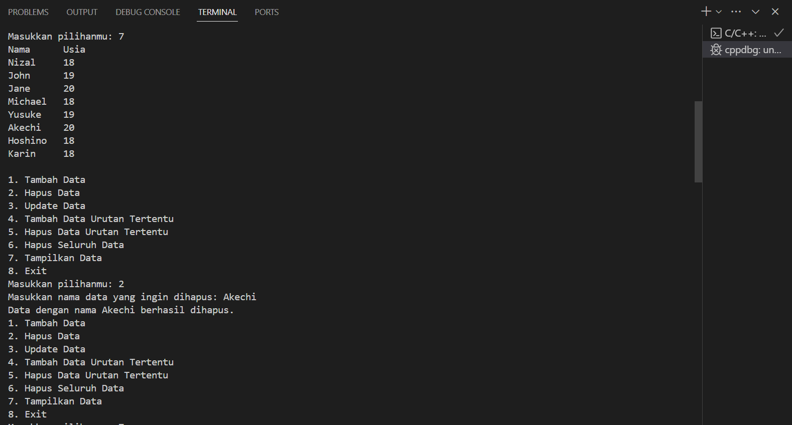
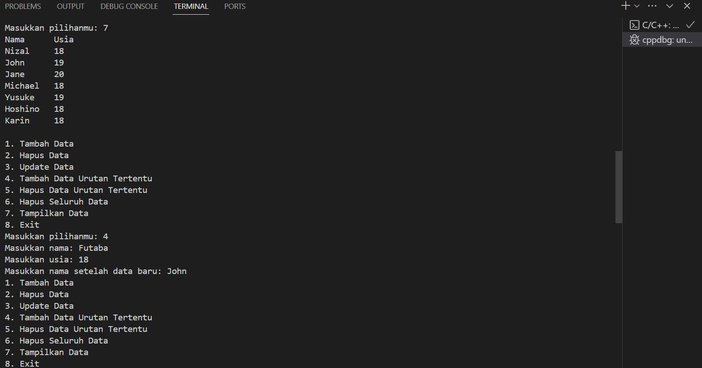

# <h1 align="center">Laporan Praktikum Modul 3 - Linked List</h1>
<p align="center">Mohammad Nizal Maulana - 2311102150</p>

## Dasar Teori
Linked List atau senarai berantai merupakan sebuah struktur data yang digunakan untuk menyimpan sejumlah objek data biasana secara terurut sehingga memungkinkan penambahan,pengurangan dan pencarian atas elemen data yang tersimpan dalam daftar dilakukab secara lebih efektif. Pada praktiknya sebuah struktur data memiliki elemen yang digunakan untuk saling menyimpan rujukan antara satu dengan yang lainya sehingga membentuk daftar abstrak, setiap elemen yang terdapat pada daftar abstrak ini disebut dengan node.

- Single Linked List </br>
Single Linked list adalah Daftar terhubung yang setiap simpul pembentuknya mempunyai satu rantai(link) ke simpul lainnya. Single Linked List memiliki dua macam yaitu:
    - Single Linked List Non Circular </br>
    Setiap node pada Linked List mempunyai field yang berisi data dan pointer ke node berikutnya dan ke node sebelumnya, mulanya poniter next dan prev akan menunjuk ke nilai NULL. Selanjutnya pointer prev akan menunjuk ke node sebelumnya, dan pointer next akan menunjuk ke node selanjutnya pada list.</br>
    - Single Linked List Circular </br>
    Single Linked List yang pointer nextnya menunjuk pada dirinya sendiri. Jika Single Linked List tersebut terdiri dari beberapa node, maka pointer next pada node terakhir akan menunjuk ke node terdepannya.

- Double Linked List </br>
Pada dasarnya, penggunaan Double Linked List hampir sama dengan penggunaan Single Linked List yang telah kita pelajari pada materi sebelumnya. Hanya saja Double Linked List menerapkan sebuah pointer baru, yaitu prev, yang 
digunakan untuk menggeser mundur selain tetap mempertahankan pointer next. 

## Guided 

### 1. Latihan Single Linked List

```C++
#include <iostream>
using namespace std;
/// PROGRAM SINGLE LINKED LIST NON-CIRCULAR
// Deklarasi Struct Node
struct Node
{
    int data;
    Node *next;
};
Node *head;
Node *tail;
// Inisialisasi Node
void init()
{
    head = NULL;
    tail = NULL;
}
// Pengecekan
bool isEmpty()
{
    if (head == NULL)
        return true;
    else
        return false;
}
// Tambah Depan
void insertDepan(int nilai)
{
    // Buat Node baru
    Node *baru = new Node;
    baru->data = nilai;
    baru->next = NULL;
    if (isEmpty() == true)
    {
        head = tail = baru;
        tail->next = NULL;
    }
    else
    {
        baru->next = head;
        head = baru;
    }
}
// Tambah Belakang
void insertBelakang(int nilai)
{
    // Buat Node baru
    Node *baru = new Node;
    baru->data = nilai;
    baru->next = NULL;
    if (isEmpty() == true)
    {
        head = tail = baru;
        tail->next = NULL;
    }
    else
    {
        tail->next = baru;
        tail = baru;
    }
}
// Hitung Jumlah List
int hitungList()
{
    Node *hitung;
    hitung = head;
    int jumlah = 0;
    while (hitung != NULL)
    {
        jumlah++;
        hitung = hitung->next;
    }
    return jumlah;
}
// Tambah Tengah
void insertTengah(int data, int posisi)
{
    if (posisi < 1 || posisi > hitungList())
    {
        cout << "Posisi diluar jangkauan" << endl;
    }
    else if (posisi == 1)
    {
        cout << "Posisi bukan posisi tengah" << endl;
    }
    else
    {
        Node *baru, *bantu;
        baru = new Node();
        baru->data = data;
        // tranversing
        bantu = head;
        int nomor = 1;
        while (nomor < posisi - 1)
        {
            bantu = bantu->next;
            nomor++;
        }
        baru->next = bantu->next;
        bantu->next = baru;
    }
}
// Hapus Depan
void hapusDepan()
{
    Node *hapus;
    if (isEmpty() == false)
    {
        if (head->next != NULL)
        {
            hapus = head;
            head = head->next;
            delete hapus;
        }
        else
        {
            head = tail = NULL;
        }
    }
    else
    {
        cout << "List kosong!" << endl;
    }
}
// Hapus Belakang
void hapusBelakang()
{
    Node *hapus;
    Node *bantu;
    if (isEmpty() == false)
    {
        if (head != tail)
        {
            hapus = tail;
            bantu = head;
            while (bantu->next != tail)
            {
                bantu = bantu->next;
            }
            tail = bantu;
            tail->next = NULL;
            delete hapus;
        }
        else
        {
            head = tail = NULL;
        }
    }
    else
    {
        cout << "List kosong!" << endl;
    }
}
// Hapus Tengah
void hapusTengah(int posisi)
{
    Node *hapus, *bantu, *bantu2;
    if (posisi < 1 || posisi > hitungList())
    {
        cout << "Posisi di luar jangkauan" << endl;
    }
    else if (posisi == 1)
    {
        cout << "Posisi bukan posisi tengah" << endl;
    }
    else
    {
        int nomor = 1;
        bantu = head;
        while (nomor <= posisi)
        {
            if (nomor == posisi - 1)
            {
                bantu2 = bantu;
            }
            if (nomor == posisi)
            {
                hapus = bantu;
            }
            bantu = bantu->next;
            nomor++;
        }
        bantu2->next = bantu;
        delete hapus;
    }
}
// Ubah Depan
void ubahDepan(int data)
{
    if (isEmpty() == false)
    {
        head->data = data;
    }
    else
    {
        cout << "List masih kosong!" << endl;
    }
}
// Ubah Tengah
void ubahTengah(int data, int posisi)
{
    Node *bantu;
    if (isEmpty() == false)
    {
        if (posisi < 1 || posisi > hitungList())
        {
            cout << "Posisi di luar jangkauan" << endl;
        }
        else if (posisi == 1)
        {
            cout << "Posisi bukan posisi tengah" << endl;
        }
        else
        {
            bantu = head;
            int nomor = 1;
            while (nomor < posisi)
            {
                bantu = bantu->next;
                nomor++;
            }
            bantu->data = data;
        }
    }
    else
    {
        cout << "List masih kosong!" << endl;
    }
}
// Ubah Belakang
void ubahBelakang(int data)
{
    if (isEmpty() == false)
    {
        tail->data = data;
    }
    else
    {
        cout << "List masih kosong!" << endl;
    }
}
// Hapus List
void clearList()
{
    Node *bantu, *hapus;
    bantu = head;
    while (bantu != NULL)
    {
        hapus = bantu;
        bantu = bantu->next;
        delete hapus;
    }
    head = tail = NULL;
    cout << "List berhasil terhapus!" << endl;
}
// Tampilkan List
void tampil()
{
    Node *bantu;
    bantu = head;
    if (isEmpty() == false)
    {
        while (bantu != NULL)
        {
            cout << bantu->data << ends;
            bantu = bantu->next;
        }
        cout << endl;
    }
    else
    {
        cout << "List masih kosong!" << endl;
    }
}
int main()
{
    init();
    insertDepan(3);
    tampil();
    insertBelakang(5);
    tampil();
    insertDepan(2);
    tampil();
    insertDepan(1);
    tampil();
    hapusDepan();
    tampil();
    hapusBelakang();
    tampil();
    insertTengah(7, 2);
    tampil();
    hapusTengah(2);
    tampil();
    ubahDepan(1);
    tampil();
    ubahBelakang(8);
    tampil();
    ubahTengah(11, 2);
    tampil();
    return 0;
}
```
deskripsi guided 1

### 2. Latihan Double Linked List

```C++
#include <iostream>
using namespace std;
class Node
{
public:
    int data;
    Node *prev;
    Node *next;
};
class DoublyLinkedList
{
public:
    Node *head;
    Node *tail;
    DoublyLinkedList()
    {
        head = nullptr;
        tail = nullptr;
    }
    void push(int data)
    {
        Node *newNode = new Node;
        newNode->data = data;
        newNode->prev = nullptr;
        newNode->next = head;
        if (head != nullptr)
        {
            head->prev = newNode;
        }
        else
        {
            tail = newNode;
        }
        head = newNode;
    }
    void pop()
    {
        if (head == nullptr)
        {
            return;
        }
        Node *temp = head;
        head = head->next;
        if (head != nullptr)
        {
            head->prev = nullptr;
        }
        else
        {
            tail = nullptr;
        }
        delete temp;
    }
    bool update(int oldData, int newData)
    {
        Node *current = head;
        while (current != nullptr)
        {
            if (current->data == oldData)
            {
                current->data = newData;
                return true;
            }
            current = current->next;
        }
        return false;
    }
    void deleteAll()
    {
        Node *current = head;
        while (current != nullptr)
        {
            Node *temp = current;
            current = current->next;
            delete temp;
        }
        head = nullptr;
        tail = nullptr;
    }
    void display()
    {
        Node *current = head;
        while (current != nullptr)
        {
            cout << current->data << " ";
            current = current->next;
        }
        cout << endl;
    }
};
int main()
{
    DoublyLinkedList list;
    while (true)
    {
        cout << "1. Add data" << endl;
        cout << "2. Delete data" << endl;
        cout << "3. Update data" << endl;
        cout << "4. Clear data" << endl;
        cout << "5. Display data" << endl;
        cout << "6. Exit" << endl;
        int choice;
        cout << "Enter your choice: ";
        cin >> choice;
        switch (choice)
        {
        case 1:
        {
            int data;
            cout << "Enter data to add: ";
            cin >> data;
            list.push(data);
            break;
        }
        case 2:
        {
            list.pop();
            break;
        }
        case 3:
        {
            int oldData, newData;
            cout << "Enter old data: ";
            cin >> oldData;
            cout << "Enter new data: ";
            cin >> newData;
            bool updated = list.update(oldData,newData);
            if (!updated)
            {
                cout << "Data not found" << endl;
            }
            break;
        }
        case 4:
        {
            list.deleteAll();
            break;
        }
        case 5:
        {
            list.display();
            break;
        }
        case 6:
        {
            return 0;
        }
        default:
        {
            cout << "Invalid choice" << endl;
            break;
        }
        }
    }
    return 0;
}
```
deskripsi guided 2

## Unguided 

### 1. Buatlah program menu Single Linked List Non-Circular untuk menyimpan Nama dan usia mahasiswa, dengan menggunakan inputan dari user. Lakukan operasi berikut:


```C++
#include <iostream>
using namespace std;

//Deklarasi Struct Node
struct Node {
    string nama_150;
    int umur_150;
    Node* next;
};

Node* head;
Node* tail;

//Inisialisasi Node
void init_150() {
    head = NULL;
    tail = NULL;
}
// Pengecekan
bool kosong_150() {
    if (head == NULL)
        return true;
    else
        return false;
}
//Tambah Depan
void tambahDepan_150(string nama, int umur) {
    //Buat Node baru
    Node* baru = new Node;
    baru->nama_150 = nama;
    baru->umur_150 = umur;
    baru->next = NULL;

    if (kosong_150() == true) {
        head = tail = baru;
        tail->next = NULL;
    }
    else {
        baru->next = head;
        head = baru;
    }
}
//Tambah Belakang
void tambahBelakang_150(string nama, int umur) {
    //Buat Node baru
    Node* baru = new Node;
    baru->nama_150 = nama;
    baru->umur_150 = umur;
    baru->next = NULL;

    if (kosong_150() == true) {
        head = tail = baru;
        tail->next = NULL;
    }
    else {
        tail->next = baru;
        tail = baru;
    }
}
//Hitung Jumlah List
int hitungList_150() {
    Node* hitung;
    hitung = head;
    int jumlah = 0;

    while (hitung != NULL) {
        jumlah++;
        hitung = hitung->next;
    }

    return jumlah;
}
//Tambah Tengah
void tambahTengah_150(string nama, int umur, int posisi) {
    if (posisi < 1 || posisi > hitungList_150()) {
        cout << "Posisi ada diluar jangkauan" << endl;
    }
    else if (posisi == 1) {
        cout << "Posisi bukan posisi tengah." << endl;
    }
    else {
        Node* baru, * bantu;
        baru = new Node();
        baru->nama_150 = nama;
        baru->umur_150 = umur;

        // tranversing
        bantu = head;
        int nomor = 1;

        while (nomor < posisi - 1) {
            bantu = bantu->next;
            nomor++;
        }

        baru->next = bantu->next;
        bantu->next = baru;
    }
}
//Hapus Depan
void hapusDepan_150() {
    Node* hapus;

    if (kosong_150() == false) {
        if (head->next != NULL) {
            hapus = head;
            head = head->next;
            delete hapus;
        }
        else {
            head = tail = NULL;
        }
    }
    else {
        cout << "KOSONG!" << endl;
    }
}
//Hapus Belakang
void hapusBelakanh_150() {
    Node* hapus;
    Node* bantu;

    if (kosong_150() == false) {
        if (head != tail) {
            hapus = tail;
            bantu = head;

            while (bantu->next != tail) {
                bantu = bantu->next;
            }

            tail = bantu;
            tail->next = NULL;
            delete hapus;
        }
        else {
            head = tail = NULL;
        }
    }
    else {
        cout << "KOSONG!" << endl;
    }
}
//Hapus Tengah
void hapusTengah_150(int posisi) {
    Node* hapus, * bantu, * bantu2;

    if (posisi < 1 || posisi > hitungList_150()) {
        cout << "Posisi ada diuar jangkauan!" << endl;
    }
    else if (posisi == 1) {
        cout << "Posisi bukan posisi tengah." << endl;
    }
    else {
        int nomor = 1;
        bantu = head;

        while (nomor <= posisi) {
            if (nomor == posisi - 1) {
                bantu2 = bantu;
            }

            if (nomor == posisi) {
                hapus = bantu;
            }

            bantu = bantu->next;
            nomor++;
        }

        bantu2->next = bantu;
        delete hapus;
    }
}
//Ubah Depan
void ubahDepan_150(string nama, int umur) {
    if (kosong_150() == false) {
        head->nama_150 = nama;
        head->umur_150 = umur;
    }
    else {
        cout << "LIST MASIH KOSONG!" << endl;
    }
}
//Ubah Tengah
void ubahTengah_150(string nama, int umur, int posisi) {
    Node* bantu;
    if (kosong_150() == false) {
        if (posisi < 1 || posisi > hitungList_150()) {
            cout << "Posisi berada diluar jangkauan!" << endl;
        }
        else if (posisi == 1) {
            cout << "Posisi buukan posisi tengah." << endl;
        }
        else {
            bantu = head;
            int nomor = 1;
            while (nomor < posisi) {
                bantu = bantu->next;
                nomor++;
            }
            bantu->nama_150 = nama;
            bantu->umur_150 = umur;
        }
    }
    else {
        cout << "KOSONG" << endl;
    }
}
//Ubah Belakang
void ubahBelakang(string nama, int umur) {
    if (kosong_150() == false) {
        tail->nama_150 = nama;
        tail->umur_150 = umur;
    }
    else {
        cout << "KOSONG" << endl;
    }
}
//Hapus List
void hapusList_150() {
    Node* bantu, * hapus;
    bantu = head;
    while (bantu != NULL) {
        hapus = bantu;
        bantu = bantu->next;
        delete hapus;
    }
    head = tail = NULL;
    cout << "List berhasil dihapus" << endl;
}
//Tampilkan List
void tampilkan_150() {
    Node* bantu;
    bantu = head;

    if (kosong_150() == false) {
        while (bantu != NULL) {
            cout << bantu->nama_150 << " " << bantu->umur_150 << endl;
            bantu = bantu->next;
        }

        cout << endl;
    }
    else {
        cout << "KOSONG!" << endl;
    }
}

int main() {
    init_150(); // Inisialisasi Linked List
     // Menjawab pertanyaan A
    cout << "(a). Masukkan data sesuai urutan berikut. (Gunakan insert depan,belakang atau tengah). Data pertama yang dimasukkan adalah nama dan usia anda."<<endl;
    tambahDepan_150("Karin      ", 18);
    tambahDepan_150("Hoshino    ", 18);
    tambahDepan_150("Akechi     ", 20);
    tambahDepan_150("Yusuke     ", 19);
    tambahDepan_150("Michael    ", 18);
    tambahDepan_150("Jane       ", 20);
    tambahDepan_150("John       ", 19);
    tambahDepan_150("Nizal      ", 18);
    tampilkan_150();

    // Menjawab pertanyaan b
    cout << "(b). Hapus data Akechi" << endl;
    hapusTengah_150(6);
    tampilkan_150();

    // Menjawab pertenyaan c
    cout << "(c). Tambahkan data Futaba 18 diantara John dan Jane" << endl;
    tambahTengah_150("Futaba     ", 18, 3);
    tampilkan_150();

    // Menjawab pertanyaan d
    cout << "(d). Tambahkan data Igor 20 di awal" << endl;
    tambahDepan_150 ("Igor       ",20);
    tampilkan_150();

    // Menjawab pertanyaan e 
    cout << "(e). Ubah data Michael menjadi Reyn 18" << endl;
    ubahTengah_150("Reyn       ", 18, 6);
    tampilkan_150();

    //Menjawab pertanyaan f
    cout << "(f). Tampilkan seluruh data "<<endl;
    tampilkan_150();

    return 0;
}
```
#### Output:






deskripsi ugu 1

### 2.  Modifikasi Guided Double Linked List dilakukan dengan penambahan operasi untuk menambah data, menghapus, dan update di tengah / di urutan tertentu yang diminta. Selain itu, buatlah agar tampilannya menampilkan Nama produk dan harga.

case:

1. Tambahkan produk Azarine dengan harga 65000 diantara Somethinc dan Skinitific.
2. Hapus produk Wardah.
3. Update produk Hanasui menjadi Cleora dengan harga 55000.
4. Tampilkan menu seperti dibawah ini.

```C++
Toko Skincare Purwokerto
 1. Tambah Data
 2. Hapus Data
 3. Update Data
 4. Tambah Data Urutan Tertentu
 5. Hapus Data Urutan Tertentu
 6. Hapus Seluruh Data
 7. Tampilkan Data
 8. Exit
```
Pada menu 7, tampilan akhirnya akan menjadi seperti dibawah ini:


```C++

```
#### Output:


## Kesimpulan


## Referensi
[1] Triase, Triase. "Struktur Data: Diktat Edisi Revisi." (2020).</br>
[2] Arraffi, Adzriel. "PENGERTIAN LINIER DALAM STRUKTUR DATA MAJEMUK." (2019).