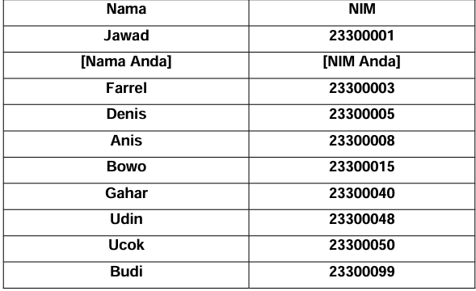
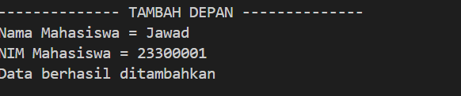
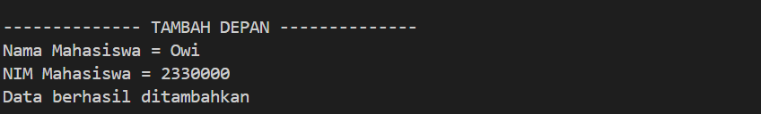

# <h1 align="center">Laporan Praktikum Modul 4 - LINKED LIST CIRCULAR DAN NON CIRCULAR</h1>
<p align="center">Mohammad Nizal Maulana - 2311102150</p>

## Dasar Teori
Linked List atau senarai berantai merupakan sebuah struktur data yang digunakan untuk menyimpan sejumlah objek data biasana secara terurut sehingga memungkinkan penambahan,pengurangan dan pencarian atas elemen data yang tersimpan dalam daftar dilakukab secara lebih efektif. Pada praktiknya sebuah struktur data memiliki elemen yang digunakan untuk saling menyimpan rujukan antara satu dengan yang lainya sehingga membentuk daftar abstrak, setiap elemen yang terdapat pada daftar abstrak ini disebut dengan node.

- Single Linked List </br>
Single Linked list adalah Daftar terhubung yang setiap simpul pembentuknya mempunyai satu rantai(link) ke simpul lainnya. Single Linked List memiliki dua macam yaitu:
- Single Linked List Non Circular </br>
Setiap node pada Linked List mempunyai field yang berisi data dan pointer ke node berikutnya dan ke node sebelumnya, mulanya poniter next dan prev akan menunjuk ke nilai NULL. Selanjutnya pointer prev akan menunjuk ke node sebelumnya, dan pointer next akan menunjuk ke node selanjutnya pada list.</br>
- Single Linked List Circular </br>
Single Linked List yang pointer nextnya menunjuk pada dirinya sendiri. Jika Single Linked List tersebut terdiri dari beberapa node, maka pointer next pada node terakhir akan menunjuk ke node terdepannya.

## Guided 

### 1. [Linked List non Circular]

```C++
#include <iostream>
using namespace std;
/// PROGRAM SINGLE LINKED LIST NON-CIRCULAR
// Deklarasi Struct Node
struct Node
{
    int data;
    Node *next;
};
Node *head;
Node *tail;

// Inisialisasi Node
void init()
{
    head = NULL;
    tail = NULL;
}
// Pegecekan
bool isEmpty()
{
    if (head == NULL)
        return true;
    else
        return false;
}
// Tambah depan
void insertDepan(int nilai)
{
    // Buat Node Baru
    Node *baru = new Node;
    baru->data = nilai;
    baru->next = NULL;
    if (isEmpty() == true)
    {
        head = tail = baru;
        tail->next = NULL;
    }
    else
    {
        baru->next = head;
        head = baru;
    }
}
// Tambah belakang
void insertBelakang(int nilai)
{
    // Buat Node baru
    Node *baru = new Node;
    baru->data = nilai;
    baru->next = NULL;
    if (isEmpty() == true)
    {
        head = tail = baru;
        tail->next = NULL;
    }
    else
    {
        tail->next = baru;
        tail = baru;
    }
}
// Hitung jumlah list
int hitungList()
{
    Node *hitung;
    hitung = head;
    int jumlah = 0;
    while (hitung != NULL)
    {
        jumlah++;
        hitung = hitung->next;
    }
    return jumlah;
}
// Tambah tengah
void insertTengah(int data, int posisi)
{
    if (posisi < 1 || posisi > hitungList())
    {
        cout << "Posisi diluar jangkauan" << endl;
    }
    else
    {
        Node *baru, *bantu;
        baru = new Node();
        baru->data = data;
        // Traversing
        bantu = head;
        int nomor = 1;
        while (nomor < posisi - 1)
        {
            bantu = bantu->next;
            nomor++;
        }
        baru->next = bantu->next;
        bantu->next = baru;
    }
}
// Hapus depan
void hapusDepan()
{
    Node *hapus;
    if (isEmpty() == false)
    {
        if (head->next != NULL)
        {
            hapus = head;
            head = head->next;
            delete hapus;
        }
        else
        {
            head = tail = NULL;
        }
    }
    else
    {
        cout << "List kosong!" << endl;
    }
}
// Hapus Belakang
void hapusBelakang()
{
    Node *hapus;
    Node *bantu;
    if (isEmpty() == false)
    {
        if (head != tail)
        {
            hapus = tail;
            bantu = head;
            while (bantu->next != tail)
            {
                bantu = bantu->next;
            }
            tail = bantu;
            tail->next = NULL;
            delete hapus;
        }
        else
        {
            head = tail = NULL;
        }
    }
    else
    {
        cout << "List kosong!" << endl;
    }
}
// Hapus Tengah
void hapusTengah(int posisi)
{
    Node *bantu, *hapus, *sebelum;
    if (posisi < 1 || posisi > hitungList())
    {
        cout << "Posisi di luar jangkauan" << endl;
    }
    else if (posisi == 1)
    {
        cout << "Posisi bukan posisi tengah" << endl;
    }
    else
    {
        int nomor = 1;
        bantu = head;
        while (nomor <= posisi)
        {
            if (nomor == posisi - 1)
            {
                sebelum = bantu;
            }
            if (nomor == posisi)
            {
                hapus = bantu;
            }
            bantu = bantu->next;
            nomor++;
        }
        sebelum->next = bantu;
        delete hapus;
    }
}
// Ubah depan
void ubahDepan(int data)
{
    if (isEmpty() == 0)
    {
        head->data;
    }
    else
    {
        cout << "List masih kosong!" << endl;
    }
}
// Ubah tengah
void ubahTengah(int data, int posisi)
{
    Node *bantu;
    if (isEmpty() == 0)
    {
        if (posisi < 1 || posisi > hitungList())
        {
            cout << "Posisi diluar jangkauan" << endl;
        }
        else if (posisi == 1)
        {
            cout << "Posisi bukan posisi tengah" << endl;
        }
        else
        {
            bantu = head;
            int nomor = 1;
            while (nomor < posisi)
            {
                bantu->data = data;
            }
        }
    }
    else
    {
        cout << "List Masih kosong!" << endl;
    }
}
//Ubah belakang
void ubahBelakang(int data){
    if(isEmpty() == 0){
        tail->data = data;
    }
    else{
        cout << "List masih kosong!"<<endl;
    }
}
//Hpus List
void clearList(){
    Node *bantu, *hapus;
    bantu = head;
    while(bantu != NULL){
        hapus = bantu;
        bantu = bantu->next;
        delete hapus;
    }
    head = tail = NULL;
    cout << "List berhasil terhapus"<<endl;
}
//Tampilkan list
void tampil(){
    Node *bantu;
    bantu = head;
    if(isEmpty() == false){
        while(bantu != NULL){
            cout << bantu->data <<ends;
            bantu = bantu->next;
        }
        cout << endl;
    }
    else{
        cout << "List masih kosong"<<endl;
    }
}
int main() 
{ 
init(); 
insertDepan(3); 
tampil(); 
insertBelakang(5); 
tampil(); 
insertDepan(2); 
tampil(); 
insertDepan(1); 
tampil(); 
hapusDepan(); 
tampil(); 
hapusBelakang(); 
tampil(); 
insertTengah(7, 2); 
tampil(); 
hapusTengah(2); 
tampil(); 
ubahDepan(1); 
tampil(); 
ubahBelakang(8); 
tampil(); 
ubahTengah(11, 2); 
tampil(); 
return 0;
}
```
kode diatas adalah sebuah implementasi dari Linked List non-circular. fungsi-fungsi yang ada di kode tersebut antara lain, `init()` untuk menetapkan nilai head dan tail, `isEmpty()`untuk memeriksa apakah linked list kosong,`insertDepan()`menambahkan node baru di depan,`insertBelakang()`menambahkan node baru di belakang,`hitungList()`menghitung jumlah node dalam linked list,`insertTengah()`untuk menambahkan node di posisi tertentu di tengah,`hapusDepan()`untuk meghapus node di depan,`hapusBelakang()`menghapus node di belakang,`hapusTengah()`menghapus node pada urutan tertentu,`ubahDepan()`untuk mengubah node di depan,`ubahTengah()`mengubah node urutan tertentu,`ubahBelakang()`mengubah node di belakang,`clearList()`menghapus semua node,`tampil()`menampilkan isi dari linked list.
pada `main()` akan memanggil beberapa fungsi diatas untuk menguji linked listnya, seperti menambahkan node,menghapus,dan mengubah ilai.

### 2. [Linked List Circular]

```C++
#include <iostream>
using namespace std;

// Deklarasi Struct Node
struct Node{
    string data;
    Node* next;
};

Node* head, * tail, * baru, * bantu, * hapus;

//Inisialisasi node head & tail
void init(){
    head = NULL;
    tail = head;
}

//Pengecekan isi list
int isEmpty(){
    if (head == NULL){
        return 1; // true
    } else {
        return 0; // false
    }
}

//Buat Node Baru
void buatNode(string data){
    baru = new Node;
    baru->data = data;
    baru->next = NULL;
}

//Hitung List
int hitungList(){
    bantu = head;
    int jumlah = 0;
    while (bantu != NULL) {
        jumlah++;
        bantu = bantu->next;
    }
    return jumlah;
}

//Tambah Depan
void insertDepan(string data){
    // Buat Node baru
    buatNode(data);

    if (isEmpty() == 1){
        head = baru;
        tail = head;
        baru->next = head;
    } else {
        while (tail->next != head){
            tail = tail->next;
        }
        baru->next = head;
        head = baru;
        tail->next = head;
    }
}

//Tambah Belakang
void insertBelakang(string data){
    // Buat Node baru
    buatNode(data);

    if (isEmpty() == 1){
        head = baru;
        tail = head;
        baru->next = head;
    } else {
        while (tail->next != head){
            tail = tail->next;
        }
        tail->next = baru;
        baru->next = head;
    }
}

//Tambah Tengah
void insertTengah(string data, int posisi){
    if (isEmpty() == 1){
        head = baru;
        tail = head;
        baru->next = head;
    } else {
        baru->data = data;
        // transversing
        int nomor = 1;
        bantu = head;
        while (nomor < posisi - 1){
            bantu = bantu->next;
            nomor++;
        }
        baru->next = bantu->next;
        bantu->next = baru;
    }
}

//Hapus Depan
void hapusDepan(){
    if (isEmpty() == 0){
        hapus = head;
        tail = head;
        if (hapus->next == head){
            head = NULL;
            tail = NULL;
            delete hapus;
        } else {
            while (tail->next != hapus){
                tail = tail->next;
            }
            head = head->next;
            tail->next = head;
            hapus->next = NULL;
            delete hapus;
        }
    } else {
        cout << "List masih kosong!" << endl;
    }
}

//Hapus Belakang
void hapusBelakang(){
    if (isEmpty() == 0){
        hapus = head;
        tail = head;
        if (hapus->next == head){
            head = NULL;
            tail = NULL;
            delete hapus;
        } else {
            while (hapus->next != head){
                hapus = hapus->next;
            }
            while (tail->next != hapus){
                tail = tail->next;
            }
            tail->next = head;
            hapus->next = NULL;
            delete hapus;
        }
    } else {
        cout << "List masih kosong!" << endl;
    }
}

// Hapus Tengah
void hapusTengah(int posisi){
    if (isEmpty() == 0){
        // transversing
        int nomor = 1;
        bantu = head;
        while (nomor < posisi - 1){
            bantu = bantu->next;
            nomor++;
        }
        hapus = bantu->next;
        bantu->next = hapus->next;
        delete hapus;
    } else {
        cout << "List masih kosong!" << endl;
    }
}

//Hapus List
void clearList(){
    if (head != NULL){
        hapus = head->next;
        while (hapus != head){
            bantu = hapus->next;
            delete hapus;
            hapus = bantu;
        }
        delete head;
        head = NULL;
    }
    cout << "List berhasil terhapus!" << endl;
}

//Tampilkan List
void tampil(){
    if (isEmpty() == 0){
        tail = head;
        do {
            cout << tail->data << ends;
            tail = tail->next;
        } while (tail != head);
        cout << endl;
    } else {
        cout << "List masih kosong!" << endl;
    }
}

int main(){
    init();
    insertDepan("Ayam");
    tampil();
    insertDepan("Bebek");
    tampil();
    insertBelakang("Cicak");
    tampil();
    insertBelakang("Domba");
    tampil();
    hapusBelakang();
    tampil();
    hapusDepan();
    tampil();
    insertTengah("Sapi", 2);
    tampil();
    hapusTengah(2);
    tampil();
    
    return 0;
}
```
kode diatas menggunakan implementasi circular linked list. Dalam kode tersebut terdapat deklarasi node yang mempunyai dua anggota data yang tipenya string dan next yang bertipe pointer. kemudian ada beberapa fungsi dalam kode tersebut ada init() untuk menginisialisasi node head dan tail, isEmpty() untuk memeriksa apakah list kosong, fungsi untuk menambahkan elemen ke dalam list baik depan,belakang dan tengah, fungsi menghapus elemen list, hitungList() untuk menghitung jumlah elemen dalam list, clearList() untuk menghapus seluruh elemen list dan tampil() untuk menampilkan isi list. dalam main() terdapat contoh penggunaan dari fungsi-fungsi tersebut untuk menambah, menghapus serta menampilkan elemen-elemen dalam list.

## Unguided 
### Buatlah program menu Linked List Non Circular untuk menyimpan Nama dan NIM Mahasiswa, dengan meggunakan Input dari User

### 1. Buatlah menu untuk menambahkan,mengubah,menghapus dan melihat Nama dan NIM Mahasiswa. Berikut contoh tampilan output dari nomor 1:


```C++
#include<iostream>
#include<iomanip>

using namespace std;

//deklarasi struct node
struct node{
    string Nama_150;
    string NIM_150;
    node *next;
};
    node *head;
    node *tail;

//Inisialisasi node head & tail
void Inisialisasi_150(){
    head = NULL;
    tail = NULL;
}

//mengecek apakah list kosong
bool isEmpty_150(){
    if(head == NULL){
        return true;
    } else {
        return false;
    }
}

//prosedur hitung node
int HitungNode_150(){
    node *hitung = head;
    int jumlah_150 = 0;
    while (hitung != NULL){
        hitung = hitung->next;
        jumlah_150++;
    }
    return jumlah_150;
}

//prosedur tambah depan untuk menambahkan data diawal
void TambahDepan_150(string Name, string NIM){
    node *baru = new node;
    baru->Nama_150 = Name;
    baru->NIM_150 = NIM;
    baru->next = NULL;
    if(isEmpty_150() == true){
        head = tail = baru;
        tail->next = NULL;
    } else {
        baru->next = head;
        head = baru;
    }
}

//prosedur tambah belakang untuk menambahkan data diakhir
void TambahBelakang_150(string Name, string NIM){
    node *baru = new node;
    baru->Nama_150 = Name;
    baru->NIM_150 = NIM;
    baru->next = NULL;
    if(isEmpty_150() == true){
        head = tail = baru;
        tail->next = NULL;
    } else {
        tail->next = baru;
        tail = baru;
    }
}

//prosedur tambah tengah untuk menambah data di tengah (posisi tertentu)
void TambahTengah_150(string Name, string NIM, int Posisi){
    if(Posisi < 1 || Posisi > HitungNode_150()){
        cout << "posisi berada diluar jangkauan!" << endl;
    } else if(Posisi == 1){
        cout << "Posisi bukan posisi tengah!"<< endl;
    } else {
        node *bantu = head;
        node *baru = new node;
        baru->Nama_150 = Name;
        baru->NIM_150 = NIM;
        int hitung = 1;
        while(hitung < Posisi - 1){
            bantu = bantu->next;
            hitung++;
        }
        baru->next = bantu->next;
        bantu->next = baru;
    }
}

//prosedur hapus depan untuk menghapus data pertama
void HapusDepan_150(){
    node *hapus;
    if(isEmpty_150() == true){
        cout << "List masih kosong!" << endl;
    } else {
        if(head->next != NULL){
            hapus = head;
            head = head->next;
            delete hapus;
        } else {
            head = tail = NULL;
        }
    }
}

//fungsi tampil data depan untuk menampilkan data diawal
string TampilDepan_150(){
    string NamaYangDihapus = "";
    if(isEmpty_150() == false){
        NamaYangDihapus = head->Nama_150;
    } else {
        cout << "List masih kosong" << endl;
    }
    return NamaYangDihapus;
}

//prosedur hapus belakang untuk menghapus data diakhir
void HapusBelakang_150(){
    node *hapus, *bantu;
    if(isEmpty_150() == true){
        cout << "List masih kosong!" << endl;
    } else {
        if(head != tail){
            hapus = tail;
            bantu = head;
            while(bantu->next != tail){
                bantu = bantu->next;
            }
            tail = bantu;
            tail->next = NULL;
            delete hapus;
        } else {
            head = tail = NULL;
        }
    }
}

//fungsi tampil data belakang untuk menampilkan data pertama
string TampilBelakang_150(){
    string NamaYangDihapus = "";
    if(isEmpty_150() == false){
        NamaYangDihapus = tail->Nama_150;
    } else {
        cout << "List masih kosong" << endl;
    }
    return NamaYangDihapus;
}


//prosedur hapus tengah untuk menghapus data urutan tertentu
void HapusTengah_150(int posisi){
    if(posisi < 1 || posisi > HitungNode_150()){ 
        cout << "Posisi diluar jangkauan" << endl;
    } else if(posisi == 1){
        cout << "Posisi bukan posisi tengah" << endl;
    } else {
        node *hapus, *bantu, *bantu2;
        bantu = head;
        int nomor = 1;
        while(nomor <= posisi){
            if(nomor == posisi - 1){
                bantu2 = bantu;
            } else if(nomor == posisi){
                hapus = bantu;
            }
            bantu = bantu->next;
            nomor++; 
        }
        bantu2->next = bantu;
        delete hapus;
    }
}

//fungsi tampil data tengah untuk menampilkan data posisi tertentu
string TampilTengah_150(int Posisi){
    string NamaYangDihapus = "";
    node *tampil = head;
    node *bantu;
    if(isEmpty_150() == false){
        int nomor = 1;
        while (nomor <= Posisi - 1){
            if(nomor == Posisi - 1){
                bantu = tampil;
            }
            tampil = tampil->next;
            nomor++;
        }
        bantu->next = tampil;
        NamaYangDihapus = tampil->Nama_150;       
    } else {
        cout << "List masih kosong" << endl;
    }
    return NamaYangDihapus;
}

//prosedur Ubah depan untuk mengubah data pertama
void UbahDepan_150(string namaBaru, string NIMbaru){
    if(isEmpty_150() == true){
        cout << "List masih kosong!" << endl;
    } else {
        head->Nama_150 = namaBaru;
        head->NIM_150 = NIMbaru;
    }
}

//prosedur ubah belakang untuk mengubah data terakhir
void UbahBelakang_150(string namaBaru, string NIMbaru){
    if(isEmpty_150() == true){
        cout << "List masih kosong!" << endl;
    } else {
        tail->Nama_150 = namaBaru;
        tail->NIM_150 = NIMbaru;
    }
}

//prosedur ubah tengah untuk mengubah data posisi tertentu
void UbahTengah_150(string namaBaru, string NIMbaru, int Posisi){
    if(isEmpty_150() == true){
        cout << "List masih kosong!" << endl;
    } else {
        if(Posisi < 1 || Posisi > HitungNode_150()){
            cout <<"Posisi berada diluar jangkauan!" << endl;
        } else if(Posisi == 1){
            cout << "Posisi bukan posisi tengah!" << endl;
        } else {
            node *bantu;
            bantu = head;
            int nomor = 1;
            while(nomor < Posisi){
                bantu = bantu->next;
                nomor++;
            }
           bantu->Nama_150 = namaBaru;
           bantu->NIM_150 = NIMbaru;
        }
    }
}

//prosedur hapus list untuk menghapus semua list
void clearList_150(){
    node *hapus;
    node *bantu = head;
    if(isEmpty_150() == true){
        cout << "List masih kosong!" << endl;
    } else {
        while(bantu != NULL){
            hapus = bantu;
            bantu = bantu->next;
            delete hapus;   
        }
        head = tail = NULL;
    }
}

//prosedur tampil list untuk menampilkan list
void TampilList_150(){
    node *bantu = head;
    if(isEmpty_150() == true){
        cout << "List masih kosong!" << endl;
    } else {
        cout << "------------------------------------------" << endl;
        cout << "|         NAMA         |       NIM       |" << endl;
        cout << "------------------------------------------" << endl;
        while(bantu != NULL){
            cout << "|" << setw(22) << left << bantu->Nama_150 << "|" << setw(17) << left << bantu->NIM_150 << "|" << endl;
            bantu = bantu->next;
        }
        cout << "------------------------------------------" << endl;
    }
}

int main(){
    int Posisi, pilih;
    string nama_150, namaLama_150, NIM_150;
    Inisialisasi_150();
    MenuUtama:
    cout << "------- PROGRAM SINGLE LINKED LIST -------" << endl;
    cout << "-------------- NON-CIRCULAR --------------" << endl; 
    cout << "| 1. TAMBAH DEPAN                        |" << endl;
    cout << "| 2. TAMBAH BELAKANG                     |" << endl;
    cout << "| 3. TAMBAH TENGAH                       |" << endl;
    cout << "| 4. UBAH DEPAN                          |" << endl;
    cout << "| 5. UBAH BELAKANG                       |" << endl;
    cout << "| 6. UBAH TENGAH                         |" << endl;
    cout << "| 7. HAPUS DEPAN                         |" << endl;
    cout << "| 8. HAPUS BELAKANG                      |" << endl;
    cout << "| 9. HAPUS TENGAH                        |" << endl;
    cout << "| 10. HAPUS LIST                         |" << endl;
    cout << "| 11. TAMPILKAN                          |" << endl;
    cout << "| 0. KELUAR                              |" << endl;
    cout << "| Keluar dari program                    |" << endl;
    cout << "------------------------------------------" << endl;
    cout << "Masukkan pilihan anda = ";
    cin >> pilih;
    cout << endl;
    switch(pilih){
        case 1:
            cout << "-------------- TAMBAH DEPAN --------------" << endl;
            cout << "Nama Mahasiswa = ";
            cin >> nama_150;
            cout << "NIM Mahasiswa = ";
            cin >> NIM_150;
            TambahDepan_150(nama_150, NIM_150);
            cout << "Data berhasil ditambahkan" << endl;
            cout << endl;
            goto MenuUtama;
            break;
        case 2:
            cout << "------------ TAMBAH BELAKANG -------------" << endl;
            cout << "Nama Mahasiswa = ";
            cin >> nama_150;
            cout << "NIM Mahasiswa = ";
            cin >> NIM_150;
            TambahBelakang_150(nama_150, NIM_150);
            cout << "Data berhasil ditambahkan" << endl;
            cout << endl;
            goto MenuUtama;
            break;
        case 3:
            cout << "------------- TAMBAH TENGAH --------------" << endl;
            cout << "Nama Mahasiswa = ";
            cin >> nama_150;
            cout << "NIM Mahasiswa = ";
            cin >> NIM_150;
            cout << "Posisi = ";
            cin >> Posisi;
            TambahTengah_150(nama_150, NIM_150, Posisi);
            cout << "Data berhasil ditambahkan" << endl;
            cout << endl;
            goto MenuUtama;
            break;
        case 4:
            cout << "----------------- UBAH DEPAN -----------------" << endl;
            cout << "Nama Mahasiswa yang ingin diubah = ";
            cin >> namaLama_150;
            cout << "Nama mahasiswa yang ingin ditambahkan = "; 
            cin >> nama_150;
            cout << "NIM mahasiswa baru = ";
            cin >> NIM_150;
            UbahDepan_150(nama_150, NIM_150);
            cout << "Data mahasiswa " << namaLama_150 << " telah diganti dengan data mahasiswa baru " << nama_150 << " (" << NIM_150 << ")" << endl;
            cout << endl;
            goto MenuUtama;
            break;
        case 5:
            cout << "--------------- UBAH BELAKANG ----------------" << endl;
            cout << "Nama Mahasiswa yang ingin diubah = ";
            cin >> namaLama_150;
            cout << "Nama mahasiswa yang ingin ditambahkan = "; 
            cin >> nama_150;
            cout << "NIM mahasiswa baru = ";
            cin >> NIM_150;
            UbahBelakang_150(nama_150, NIM_150);
            cout << "Data mahasiswa " << nama_150 << " telah diganti dengan data mahasiswa baru " << nama_150 << " (" << NIM_150 << ")" << endl;
            cout << endl;
            goto MenuUtama;
            break;
        case 6:
            cout << "---------------- UBAH TENGAH -----------------" << endl;
            cout << "Nama Mahasiswa yang ingin diubah = ";
            cin >> namaLama_150;
            cout << "Posisi nama yang ingin diubah = ";
            cin >> Posisi;
            cout << "Nama mahasiswa yang ingin ditambahkan = "; 
            cin >> nama_150;
            cout << "NIM mahasiswa baru = ";
            cin >> NIM_150;
            UbahTengah_150(nama_150, NIM_150, Posisi);
            cout << "Data mahasiswa " << namaLama_150 << " pada posisi ke-" << Posisi << " telah diganti dengan data mahasiswa baru " << nama_150 << " (" << NIM_150 << ")" << endl;
            cout << endl;
            goto MenuUtama;
            break;
        case 7:
            cout << "---------------- HAPUS DEPAN -----------------" << endl;
            HapusDepan_150();
            cout << "data mahasiswa "<< TampilDepan_150() << " telah dihapus "<<endl;
            cout << endl;
            goto MenuUtama;
            break;
        case 8:
            cout << "--------------- HAPUS BELAKANG ---------------" << endl;
            HapusBelakang_150();
            cout << "data mahasiswa "<< TampilBelakang_150() << "telah dihapus" <<endl;
            cout << endl;
            goto MenuUtama;
            break;
        case 9:
            cout << "---------------- HAPUS TENGAH ----------------" << endl;
            cout << "Masukkan posisi data yang ingin dihapus = ";
            cin >> Posisi;
            HapusTengah_150(Posisi);
            cout << "data mahasiswa "<< TampilTengah_150(Posisi) << "telah dihapus" <<endl; 
            cout << endl;
            goto MenuUtama;
            break;
        case 10:
            cout << "----------------- HAPUS LIST -----------------" << endl;
            clearList_150();
            cout << "list telah terhapus" <<endl;
            cout << endl;
            goto MenuUtama;
            break;
        case 11:
            cout << "-------------- TAMPIL LIST ---------------" << endl;
            TampilList_150();
            cout << endl;
            goto MenuUtama;
            break;
        case 0:
            cout << "Anda keluar dari program" << endl;
            return 0;
            break;
        default:
            cout << "Pilihan anda tidak tersedia" << endl;
            cout << endl;
            goto MenuUtama;
            break;
    }
}
```
#### Tampilan Menu:

#### Tambah depan:

#### Tambah belakang:

#### Tambah tengah:

#### Ubah depan:

#### Ubah belakang:

#### Ubah Tengah:

#### Hapus depan:

#### Hapus Belakang:

#### Hapus Tengah:

#### Tampilan depan:

#### Tampilkan list:

#### Tampilan keluar:


Pada nomor 1 ini menampilkan sebuah menu-menu dalam `int main()` yang ada dalam program, pertama akan menampilkan menu utama yang ada di program. Pilihan menu 1 untuk menambahkan data didepan atau diawal, menu ke-2 untuk menambahkan data di belakang atau di akhir, menu ke-3 untuk menambahkan data ditengah dengan posisi tengah di inputkan user, menu ke-4 untuk mengubah data didepan, menu ke-5 untuk mengubah data di belakang, menu ke-6 untuk mengubah data di tengah posisi data yang diubah di inputkan oleh user, menu ke-7 untuk menghapus data urutan pertama, menu ke-8 untuk menghapus data bagian belakang atau terakhir, menu ke-9 untuk menghapus data bagian tengah dengan posisi yang di inputkan oleh user, menu ke-10 untuk menghapus seluruh data, menu ke-11 untuk menampilkan seluruh list dan menu ke-0 untuk keluar dari program.

### 2. Setelah membuat menu tersebut, masukkan data sesuai urutan berikut, lalu tampilkan data yang telah dimasukkan. (Gunakan insert depan, belakang atau tengah)

```C++
#include<iostream>
#include<iomanip>

using namespace std;

//deklarasi struct node
struct node{
    string Nama_150;
    string NIM_150;
    node *next;
};
    node *head;
    node *tail;

//Inisialisasi node head & tail
void Inisialisasi_150(){
    head = NULL;
    tail = NULL;
}

//mengecek apakah list kosong
bool isEmpty_150(){
    if(head == NULL){
        return true;
    } else {
        return false;
    }
}

//prosedur hitung node
int HitungNode_150(){
    node *hitung = head;
    int jumlah_150 = 0;
    while (hitung != NULL){
        hitung = hitung->next;
        jumlah_150++;
    }
    return jumlah_150;
}

//prosedur tambah depan untuk menambahkan data diawal
void TambahDepan_150(string Name, string NIM){
    node *baru = new node;
    baru->Nama_150 = Name;
    baru->NIM_150 = NIM;
    baru->next = NULL;
    if(isEmpty_150() == true){
        head = tail = baru;
        tail->next = NULL;
    } else {
        baru->next = head;
        head = baru;
    }
}

//prosedur tambah belakang untuk menambahkan data diakhir
void TambahBelakang_150(string Name, string NIM){
    node *baru = new node;
    baru->Nama_150 = Name;
    baru->NIM_150 = NIM;
    baru->next = NULL;
    if(isEmpty_150() == true){
        head = tail = baru;
        tail->next = NULL;
    } else {
        tail->next = baru;
        tail = baru;
    }
}

//prosedur tambah tengah untuk menambah data di tengah (posisi tertentu)
void TambahTengah_150(string Name, string NIM, int Posisi){
    if(Posisi < 1 || Posisi > HitungNode_150()){
        cout << "posisi berada diluar jangkauan!" << endl;
    } else if(Posisi == 1){
        cout << "Posisi bukan posisi tengah!"<< endl;
    } else {
        node *bantu = head;
        node *baru = new node;
        baru->Nama_150 = Name;
        baru->NIM_150 = NIM;
        int hitung = 1;
        while(hitung < Posisi - 1){
            bantu = bantu->next;
            hitung++;
        }
        baru->next = bantu->next;
        bantu->next = baru;
    }
}

//prosedur hapus depan untuk menghapus data pertama
void HapusDepan_150(){
    node *hapus;
    if(isEmpty_150() == true){
        cout << "List masih kosong!" << endl;
    } else {
        if(head->next != NULL){
            hapus = head;
            head = head->next;
            delete hapus;
        } else {
            head = tail = NULL;
        }
    }
}

//fungsi tampil data depan untuk menampilkan data diawal
string TampilDepan_150(){
    string NamaYangDihapus = "";
    if(isEmpty_150() == false){
        NamaYangDihapus = head->Nama_150;
    } else {
        cout << "List masih kosong" << endl;
    }
    return NamaYangDihapus;
}

//prosedur hapus belakang untuk menghapus data diakhir
void HapusBelakang_150(){
    node *hapus, *bantu;
    if(isEmpty_150() == true){
        cout << "List masih kosong!" << endl;
    } else {
        if(head != tail){
            hapus = tail;
            bantu = head;
            while(bantu->next != tail){
                bantu = bantu->next;
            }
            tail = bantu;
            tail->next = NULL;
            delete hapus;
        } else {
            head = tail = NULL;
        }
    }
}

//fungsi tampil data belakang untuk menampilkan data pertama
string TampilBelakang_150(){
    string NamaYangDihapus = "";
    if(isEmpty_150() == false){
        NamaYangDihapus = tail->Nama_150;
    } else {
        cout << "List masih kosong" << endl;
    }
    return NamaYangDihapus;
}


//prosedur hapus tengah untuk menghapus data urutan tertentu
void HapusTengah_150(int posisi){
    if(posisi < 1 || posisi > HitungNode_150()){ 
        cout << "Posisi diluar jangkauan" << endl;
    } else if(posisi == 1){
        cout << "Posisi bukan posisi tengah" << endl;
    } else {
        node *hapus, *bantu, *bantu2;
        bantu = head;
        int nomor = 1;
        while(nomor <= posisi){
            if(nomor == posisi - 1){
                bantu2 = bantu;
            } else if(nomor == posisi){
                hapus = bantu;
            }
            bantu = bantu->next;
            nomor++; 
        }
        bantu2->next = bantu;
        delete hapus;
    }
}

//fungsi tampil data tengah untuk menampilkan data posisi tertentu
string TampilTengah_150(int Posisi){
    string NamaYangDihapus = "";
    node *tampil = head;
    node *bantu;
    if(isEmpty_150() == false){
        int nomor = 1;
        while (nomor <= Posisi - 1){
            if(nomor == Posisi - 1){
                bantu = tampil;
            }
            tampil = tampil->next;
            nomor++;
        }
        bantu->next = tampil;
        NamaYangDihapus = tampil->Nama_150;       
    } else {
        cout << "List masih kosong" << endl;
    }
    return NamaYangDihapus;
}

//prosedur Ubah depan untuk mengubah data pertama
void UbahDepan_150(string namaBaru, string NIMbaru){
    if(isEmpty_150() == true){
        cout << "List masih kosong!" << endl;
    } else {
        head->Nama_150 = namaBaru;
        head->NIM_150 = NIMbaru;
    }
}

//prosedur ubah belakang untuk mengubah data terakhir
void UbahBelakang_150(string namaBaru, string NIMbaru){
    if(isEmpty_150() == true){
        cout << "List masih kosong!" << endl;
    } else {
        tail->Nama_150 = namaBaru;
        tail->NIM_150 = NIMbaru;
    }
}

//prosedur ubah tengah untuk mengubah data posisi tertentu
void UbahTengah_150(string namaBaru, string NIMbaru, int Posisi){
    if(isEmpty_150() == true){
        cout << "List masih kosong!" << endl;
    } else {
        if(Posisi < 1 || Posisi > HitungNode_150()){
            cout <<"Posisi berada diluar jangkauan!" << endl;
        } else if(Posisi == 1){
            cout << "Posisi bukan posisi tengah!" << endl;
        } else {
            node *bantu;
            bantu = head;
            int nomor = 1;
            while(nomor < Posisi){
                bantu = bantu->next;
                nomor++;
            }
           bantu->Nama_150 = namaBaru;
           bantu->NIM_150 = NIMbaru;
        }
    }
}

//prosedur hapus list untuk menghapus semua list
void clearList_150(){
    node *hapus;
    node *bantu = head;
    if(isEmpty_150() == true){
        cout << "List masih kosong!" << endl;
    } else {
        while(bantu != NULL){
            hapus = bantu;
            bantu = bantu->next;
            delete hapus;   
        }
        head = tail = NULL;
    }
}

//prosedur tampil list untuk menampilkan list
void TampilList_150(){
    node *bantu = head;
    if(isEmpty_150() == true){
        cout << "List masih kosong!" << endl;
    } else {
        cout << "------------------------------------------" << endl;
        cout << "|         NAMA         |       NIM       |" << endl;
        cout << "------------------------------------------" << endl;
        while(bantu != NULL){
            cout << "|" << setw(22) << left << bantu->Nama_150 << "|" << setw(17) << left << bantu->NIM_150 << "|" << endl;
            bantu = bantu->next;
        }
        cout << "------------------------------------------" << endl;
    }
}

int main(){
    int Posisi, pilih;
    string nama_150, namaLama_150, NIM_150;
    Inisialisasi_150();
    MenuUtama:
    cout << "------- PROGRAM SINGLE LINKED LIST -------" << endl;
    cout << "-------------- NON-CIRCULAR --------------" << endl; 
    cout << "| 1. TAMBAH DEPAN                        |" << endl;
    cout << "| 2. TAMBAH BELAKANG                     |" << endl;
    cout << "| 3. TAMBAH TENGAH                       |" << endl;
    cout << "| 4. UBAH DEPAN                          |" << endl;
    cout << "| 5. UBAH BELAKANG                       |" << endl;
    cout << "| 6. UBAH TENGAH                         |" << endl;
    cout << "| 7. HAPUS DEPAN                         |" << endl;
    cout << "| 8. HAPUS BELAKANG                      |" << endl;
    cout << "| 9. HAPUS TENGAH                        |" << endl;
    cout << "| 10. HAPUS LIST                         |" << endl;
    cout << "| 11. TAMPILKAN                          |" << endl;
    cout << "| 0. KELUAR                              |" << endl;
    cout << "| Keluar dari program                    |" << endl;
    cout << "------------------------------------------" << endl;
    cout << "Masukkan pilihan anda = ";
    cin >> pilih;
    cout << endl;
    switch(pilih){
        case 1:
            cout << "-------------- TAMBAH DEPAN --------------" << endl;
            cout << "Nama Mahasiswa = ";
            cin >> nama_150;
            cout << "NIM Mahasiswa = ";
            cin >> NIM_150;
            TambahDepan_150(nama_150, NIM_150);
            cout << "Data berhasil ditambahkan" << endl;
            cout << endl;
            goto MenuUtama;
            break;
        case 2:
            cout << "------------ TAMBAH BELAKANG -------------" << endl;
            cout << "Nama Mahasiswa = ";
            cin >> nama_150;
            cout << "NIM Mahasiswa = ";
            cin >> NIM_150;
            TambahBelakang_150(nama_150, NIM_150);
            cout << "Data berhasil ditambahkan" << endl;
            cout << endl;
            goto MenuUtama;
            break;
        case 3:
            cout << "------------- TAMBAH TENGAH --------------" << endl;
            cout << "Nama Mahasiswa = ";
            cin >> nama_150;
            cout << "NIM Mahasiswa = ";
            cin >> NIM_150;
            cout << "Posisi = ";
            cin >> Posisi;
            TambahTengah_150(nama_150, NIM_150, Posisi);
            cout << "Data berhasil ditambahkan" << endl;
            cout << endl;
            goto MenuUtama;
            break;
        case 4:
            cout << "----------------- UBAH DEPAN -----------------" << endl;
            cout << "Nama Mahasiswa yang ingin diubah = ";
            cin >> namaLama_150;
            cout << "Nama mahasiswa yang ingin ditambahkan = "; 
            cin >> nama_150;
            cout << "NIM mahasiswa baru = ";
            cin >> NIM_150;
            UbahDepan_150(nama_150, NIM_150);
            cout << "Data mahasiswa " << namaLama_150 << " telah diganti dengan data mahasiswa baru " << nama_150 << " (" << NIM_150 << ")" << endl;
            cout << endl;
            goto MenuUtama;
            break;
        case 5:
            cout << "--------------- UBAH BELAKANG ----------------" << endl;
            cout << "Nama Mahasiswa yang ingin diubah = ";
            cin >> namaLama_150;
            cout << "Nama mahasiswa yang ingin ditambahkan = "; 
            cin >> nama_150;
            cout << "NIM mahasiswa baru = ";
            cin >> NIM_150;
            UbahBelakang_150(nama_150, NIM_150);
            cout << "Data mahasiswa " << nama_150 << " telah diganti dengan data mahasiswa baru " << nama_150 << " (" << NIM_150 << ")" << endl;
            cout << endl;
            goto MenuUtama;
            break;
        case 6:
            cout << "---------------- UBAH TENGAH -----------------" << endl;
            cout << "Nama Mahasiswa yang ingin diubah = ";
            cin >> namaLama_150;
            cout << "Posisi nama yang ingin diubah = ";
            cin >> Posisi;
            cout << "Nama mahasiswa yang ingin ditambahkan = "; 
            cin >> nama_150;
            cout << "NIM mahasiswa baru = ";
            cin >> NIM_150;
            UbahTengah_150(nama_150, NIM_150, Posisi);
            cout << "Data mahasiswa " << namaLama_150 << " pada posisi ke-" << Posisi << " telah diganti dengan data mahasiswa baru " << nama_150 << " (" << NIM_150 << ")" << endl;
            cout << endl;
            goto MenuUtama;
            break;
        case 7:
            cout << "---------------- HAPUS DEPAN -----------------" << endl;
            HapusDepan_150();
            cout << "data mahasiswa "<< TampilDepan_150() << " telah dihapus "<<endl;
            cout << endl;
            goto MenuUtama;
            break;
        case 8:
            cout << "--------------- HAPUS BELAKANG ---------------" << endl;
            HapusBelakang_150();
            cout << "data mahasiswa "<< TampilBelakang_150() << "telah dihapus" <<endl;
            cout << endl;
            goto MenuUtama;
            break;
        case 9:
            cout << "---------------- HAPUS TENGAH ----------------" << endl;
            cout << "Masukkan posisi data yang ingin dihapus = ";
            cin >> Posisi;
            HapusTengah_150(Posisi);
            cout << "data mahasiswa "<< TampilTengah_150(Posisi) << "telah dihapus" <<endl; 
            cout << endl;
            goto MenuUtama;
            break;
        case 10:
            cout << "----------------- HAPUS LIST -----------------" << endl;
            clearList_150();
            cout << "list telah terhapus" <<endl;
            cout << endl;
            goto MenuUtama;
            break;
        case 11:
            cout << "-------------- TAMPIL LIST ---------------" << endl;
            TampilList_150();
            cout << endl;
            goto MenuUtama;
            break;
        case 0:
            cout << "Anda keluar dari program" << endl;
            return 0;
            break;
        default:
            cout << "Pilihan anda tidak tersedia" << endl;
            cout << endl;
            goto MenuUtama;
            break;
    }
}
```

#### tambah Depan Jawad:

#### tambah Tengah ke-2 Nizal:

#### tambah Tengah ke-3 Farrel:

#### tambah Tengah ke-4 Denis:

#### tambah Tengah ke-5 Anis:

#### tambah Tengah ke-6 Bowo:

#### tambah Tengah ke-7 Gahar:

#### tambah Tengah ke-8 Udin:

#### tambah Tengah ke-9 Ucok:

#### tambah Belakang Budi:

#### Tampilan akhir:


Pada nomor 2 ini menggunakan fungsi`TambahDepan_150()` untuk menambahkan data 'Jawad' di urutan pertama, di ikuti 
penggunaan fungsi `TambahTengah_150(posisi)` untuk menambahkan data-data pada urutan ke-2 (Nizal), ke-3 (Farrel), ke-4 (Denis), ke-5 (Anis), ke-6 (Bowo), ke-7 (Gahar), ke-8 (Udin), ke-9 (Ucok). Lalu menggunakan fungsi `TambahBelakang_150()` untuk menambahkan data 'Budi' pada urutan terakhir. kemudian akan ditampilkan semua data tersebut dalam fungsi `TampilList_150()` seperti pada gambar output.

### 3. Lakukan perintah berikut:

```C++
#include<iostream>
#include<iomanip>

using namespace std;

//deklarasi struct node
struct node{
    string Nama_150;
    string NIM_150;
    node *next;
};
    node *head;
    node *tail;

//Inisialisasi node head & tail
void Inisialisasi_150(){
    head = NULL;
    tail = NULL;
}

//mengecek apakah list kosong
bool isEmpty_150(){
    if(head == NULL){
        return true;
    } else {
        return false;
    }
}

//prosedur hitung node
int HitungNode_150(){
    node *hitung = head;
    int jumlah_150 = 0;
    while (hitung != NULL){
        hitung = hitung->next;
        jumlah_150++;
    }
    return jumlah_150;
}

//prosedur tambah depan untuk menambahkan data diawal
void TambahDepan_150(string Name, string NIM){
    node *baru = new node;
    baru->Nama_150 = Name;
    baru->NIM_150 = NIM;
    baru->next = NULL;
    if(isEmpty_150() == true){
        head = tail = baru;
        tail->next = NULL;
    } else {
        baru->next = head;
        head = baru;
    }
}

//prosedur tambah belakang untuk menambahkan data diakhir
void TambahBelakang_150(string Name, string NIM){
    node *baru = new node;
    baru->Nama_150 = Name;
    baru->NIM_150 = NIM;
    baru->next = NULL;
    if(isEmpty_150() == true){
        head = tail = baru;
        tail->next = NULL;
    } else {
        tail->next = baru;
        tail = baru;
    }
}

//prosedur tambah tengah untuk menambah data di tengah (posisi tertentu)
void TambahTengah_150(string Name, string NIM, int Posisi){
    if(Posisi < 1 || Posisi > HitungNode_150()){
        cout << "posisi berada diluar jangkauan!" << endl;
    } else if(Posisi == 1){
        cout << "Posisi bukan posisi tengah!"<< endl;
    } else {
        node *bantu = head;
        node *baru = new node;
        baru->Nama_150 = Name;
        baru->NIM_150 = NIM;
        int hitung = 1;
        while(hitung < Posisi - 1){
            bantu = bantu->next;
            hitung++;
        }
        baru->next = bantu->next;
        bantu->next = baru;
    }
}

//prosedur hapus depan untuk menghapus data pertama
void HapusDepan_150(){
    node *hapus;
    if(isEmpty_150() == true){
        cout << "List masih kosong!" << endl;
    } else {
        if(head->next != NULL){
            hapus = head;
            head = head->next;
            delete hapus;
        } else {
            head = tail = NULL;
        }
    }
}

//fungsi tampil data depan untuk menampilkan data diawal
string TampilDepan_150(){
    string NamaYangDihapus = "";
    if(isEmpty_150() == false){
        NamaYangDihapus = head->Nama_150;
    } else {
        cout << "List masih kosong" << endl;
    }
    return NamaYangDihapus;
}

//prosedur hapus belakang untuk menghapus data diakhir
void HapusBelakang_150(){
    node *hapus, *bantu;
    if(isEmpty_150() == true){
        cout << "List masih kosong!" << endl;
    } else {
        if(head != tail){
            hapus = tail;
            bantu = head;
            while(bantu->next != tail){
                bantu = bantu->next;
            }
            tail = bantu;
            tail->next = NULL;
            delete hapus;
        } else {
            head = tail = NULL;
        }
    }
}

//fungsi tampil data belakang untuk menampilkan data pertama
string TampilBelakang_150(){
    string NamaYangDihapus = "";
    if(isEmpty_150() == false){
        NamaYangDihapus = tail->Nama_150;
    } else {
        cout << "List masih kosong" << endl;
    }
    return NamaYangDihapus;
}

//prosedur hapus tengah untuk menghapus data urutan tertentu
void HapusTengah_150(int posisi){
    if(posisi < 1 || posisi > HitungNode_150()){ 
        cout << "Posisi diluar jangkauan" << endl;
    } else if(posisi == 1){
        cout << "Posisi bukan posisi tengah" << endl;
    } else {
        node *hapus, *bantu, *bantu2;
        bantu = head;
        int nomor = 1;
        while(nomor <= posisi){
            if(nomor == posisi - 1){
                bantu2 = bantu;
            } else if(nomor == posisi){
                hapus = bantu;
            }
            bantu = bantu->next;
            nomor++; 
        }
        bantu2->next = bantu;
        delete hapus;
    }
}

//fungsi tampil data tengah untuk menampilkan data posisi tertentu
string TampilTengah_150(int Posisi){
    string NamaYangDihapus = "";
    node *tampil = head;
    node *bantu;
    if(isEmpty_150() == false){
        int nomor = 1;
        while (nomor <= Posisi - 1){
            if(nomor == Posisi - 1){
                bantu = tampil;
            }
            tampil = tampil->next;
            nomor++;
        }
        bantu->next = tampil;
        NamaYangDihapus = tampil->Nama_150;       
    } else {
        cout << "List masih kosong" << endl;
    }
    return NamaYangDihapus;
}

//prosedur Ubah depan untuk mengubah data pertama
void UbahDepan_150(string namaBaru, string NIMbaru){
    if(isEmpty_150() == true){
        cout << "List masih kosong!" << endl;
    } else {
        head->Nama_150 = namaBaru;
        head->NIM_150 = NIMbaru;
    }
}

//prosedur ubah belakang untuk mengubah data terakhir
void UbahBelakang_150(string namaBaru, string NIMbaru){
    if(isEmpty_150() == true){
        cout << "List masih kosong!" << endl;
    } else {
        tail->Nama_150 = namaBaru;
        tail->NIM_150 = NIMbaru;
    }
}

//prosedur ubah tengah untuk mengubah data posisi tertentu
void UbahTengah_150(string namaBaru, string NIMbaru, int Posisi){
    if(isEmpty_150() == true){
        cout << "List masih kosong!" << endl;
    } else {
        if(Posisi < 1 || Posisi > HitungNode_150()){
            cout <<"Posisi berada diluar jangkauan!" << endl;
        } else if(Posisi == 1){
            cout << "Posisi bukan posisi tengah!" << endl;
        } else {
            node *bantu;
            bantu = head;
            int nomor = 1;
            while(nomor < Posisi){
                bantu = bantu->next;
                nomor++;
            }
           bantu->Nama_150 = namaBaru;
           bantu->NIM_150 = NIMbaru;
        }
    }
}

//prosedur hapus list untuk menghapus semua list
void clearList_150(){
    node *hapus;
    node *bantu = head;
    if(isEmpty_150() == true){
        cout << "List masih kosong!" << endl;
    } else {
        while(bantu != NULL){
            hapus = bantu;
            bantu = bantu->next;
            delete hapus;   
        }
        head = tail = NULL;
    }
}

//prosedur tampil list untuk menampilkan list
void TampilList_150(){
    node *bantu = head;
    if(isEmpty_150() == true){
        cout << "List masih kosong!" << endl;
    } else {
        cout << "------------------------------------------" << endl;
        cout << "|         NAMA         |       NIM       |" << endl;
        cout << "------------------------------------------" << endl;
        while(bantu != NULL){
            cout << "|" << setw(22) << left << bantu->Nama_150 << "|" << setw(17) << left << bantu->NIM_150 << "|" << endl;
            bantu = bantu->next;
        }
        cout << "------------------------------------------" << endl;
    }
}

int main(){
    int Posisi, pilih;
    string nama_150, namaLama_150, NIM_150;
    Inisialisasi_150();
    MenuUtama:
    cout << "------- PROGRAM SINGLE LINKED LIST -------" << endl;
    cout << "-------------- NON-CIRCULAR --------------" << endl; 
    cout << "| 1. TAMBAH DEPAN                        |" << endl;
    cout << "| 2. TAMBAH BELAKANG                     |" << endl;
    cout << "| 3. TAMBAH TENGAH                       |" << endl;
    cout << "| 4. UBAH DEPAN                          |" << endl;
    cout << "| 5. UBAH BELAKANG                       |" << endl;
    cout << "| 6. UBAH TENGAH                         |" << endl;
    cout << "| 7. HAPUS DEPAN                         |" << endl;
    cout << "| 8. HAPUS BELAKANG                      |" << endl;
    cout << "| 9. HAPUS TENGAH                        |" << endl;
    cout << "| 10. HAPUS LIST                         |" << endl;
    cout << "| 11. TAMPILKAN                          |" << endl;
    cout << "| 0. KELUAR                              |" << endl;
    cout << "| Keluar dari program                    |" << endl;
    cout << "------------------------------------------" << endl;
    cout << "Masukkan pilihan anda = ";
    cin >> pilih;
    cout << endl;
    switch(pilih){
        case 1:
            cout << "-------------- TAMBAH DEPAN --------------" << endl;
            cout << "Nama Mahasiswa = ";
            cin >> nama_150;
            cout << "NIM Mahasiswa = ";
            cin >> NIM_150;
            TambahDepan_150(nama_150, NIM_150);
            cout << "Data berhasil ditambahkan" << endl;
            cout << endl;
            goto MenuUtama;
            break;
        case 2:
            cout << "------------ TAMBAH BELAKANG -------------" << endl;
            cout << "Nama Mahasiswa = ";
            cin >> nama_150;
            cout << "NIM Mahasiswa = ";
            cin >> NIM_150;
            TambahBelakang_150(nama_150, NIM_150);
            cout << "Data berhasil ditambahkan" << endl;
            cout << endl;
            goto MenuUtama;
            break;
        case 3:
            cout << "------------- TAMBAH TENGAH --------------" << endl;
            cout << "Nama Mahasiswa = ";
            cin >> nama_150;
            cout << "NIM Mahasiswa = ";
            cin >> NIM_150;
            cout << "Posisi = ";
            cin >> Posisi;
            TambahTengah_150(nama_150, NIM_150, Posisi);
            cout << "Data berhasil ditambahkan" << endl;
            cout << endl;
            goto MenuUtama;
            break;
        case 4:
            cout << "----------------- UBAH DEPAN -----------------" << endl;
            cout << "Nama Mahasiswa yang ingin diubah = ";
            cin >> namaLama_150;
            cout << "Nama mahasiswa yang ingin ditambahkan = "; 
            cin >> nama_150;
            cout << "NIM mahasiswa baru = ";
            cin >> NIM_150;
            UbahDepan_150(nama_150, NIM_150);
            cout << "Data mahasiswa " << namaLama_150 << " telah diganti dengan data mahasiswa baru " << nama_150 << " (" << NIM_150 << ")" << endl;
            cout << endl;
            goto MenuUtama;
            break;
        case 5:
            cout << "--------------- UBAH BELAKANG ----------------" << endl;
            cout << "Nama Mahasiswa yang ingin diubah = ";
            cin >> namaLama_150;
            cout << "Nama mahasiswa yang ingin ditambahkan = "; 
            cin >> nama_150;
            cout << "NIM mahasiswa baru = ";
            cin >> NIM_150;
            UbahBelakang_150(nama_150, NIM_150);
            cout << "Data mahasiswa " << nama_150 << " telah diganti dengan data mahasiswa baru " << nama_150 << " (" << NIM_150 << ")" << endl;
            cout << endl;
            goto MenuUtama;
            break;
        case 6:
            cout << "---------------- UBAH TENGAH -----------------" << endl;
            cout << "Nama Mahasiswa yang ingin diubah = ";
            cin >> namaLama_150;
            cout << "Posisi nama yang ingin diubah = ";
            cin >> Posisi;
            cout << "Nama mahasiswa yang ingin ditambahkan = "; 
            cin >> nama_150;
            cout << "NIM mahasiswa baru = ";
            cin >> NIM_150;
            UbahTengah_150(nama_150, NIM_150, Posisi);
            cout << "Data mahasiswa " << namaLama_150 << " pada posisi ke-" << Posisi << " telah diganti dengan data mahasiswa baru " << nama_150 << " (" << NIM_150 << ")" << endl;
            cout << endl;
            goto MenuUtama;
            break;
        case 7:
            cout << "---------------- HAPUS DEPAN -----------------" << endl;
            HapusDepan_150();
            cout << "data mahasiswa "<< TampilDepan_150() << " telah dihapus "<<endl;
            cout << endl;
            goto MenuUtama;
            break;
        case 8:
            cout << "--------------- HAPUS BELAKANG ---------------" << endl;
            HapusBelakang_150();
            cout << "data mahasiswa "<< TampilBelakang_150() << "telah dihapus" <<endl;
            cout << endl;
            goto MenuUtama;
            break;
        case 9:
            cout << "---------------- HAPUS TENGAH ----------------" << endl;
            cout << "Masukkan posisi data yang ingin dihapus = ";
            cin >> Posisi;
            HapusTengah_150(Posisi);
            cout << "data mahasiswa "<< TampilTengah_150(Posisi) << "telah dihapus" <<endl; 
            cout << endl;
            goto MenuUtama;
            break;
        case 10:
            cout << "----------------- HAPUS LIST -----------------" << endl;
            clearList_150();
            cout << "list telah terhapus" <<endl;
            cout << endl;
            goto MenuUtama;
            break;
        case 11:
            cout << "-------------- TAMPIL LIST ---------------" << endl;
            TampilList_150();
            cout << endl;
            goto MenuUtama;
            break;
        case 0:
            cout << "Anda keluar dari program" << endl;
            return 0;
            break;
        default:
            cout << "Pilihan anda tidak tersedia" << endl;
            cout << endl;
            goto MenuUtama;
            break;
    }
}
```
#### a. Tambahkan data Wati (2330004) diantara Farrel dan Denis:

#### b. Hapus data Denis:

#### c. Tambahkan data Owi (23300000) diawal:

#### d. Tambahkan data David (23300100) diakhir:

#### e. Ubah data Udin menjadi Idin (23300045):

#### f. Ubah data terakhir menjadi Lucy (23300101):

#### g. Hapus data awal:

#### h. ubah data awal menjadi Bagas (2330002):

#### i. Hapus data akhir:

#### j. Tampilkan seluruh data:


Pada nomor 3 ini menjawab 10 perintah yang harus dikerjakan pada poin (a). disuruh menambahkan data wati diantara farrel dan denis, ini menggunakan fungsi `TambahTengah_150(posisi)` untuk mengerjakannya, poin (b). menghapus data denis menggunakan fungsi `HapusTengah_150(posisi)` untuk mengerjakannya, poin (c). menambahkan data owi diawal menggunakan fungsi `TambahDepan_150()`, poin (d). menambahkan data david dibelakang menggunakan fungsi `TambahBelakang_150()`, poin (e). menggubah data Udin menjadi Idin menggunakan fungsi `UbahTengah_150(posisi)`, poin (f). menggubah data terakhir menjadi lucy menggunakan fungsi `UbahBelakang_150()`,poin (g). Menghapus data awal menggunakan fungsi `HapusDepan_150()`, poin (h). menggubah data awal menjadi bagas menggunakan fungsi `UbahDepan_150()`, poin (i). menghapus data akhir menggunakan fungdi `HapusBelakang_150()` dan poin (j). Menampilkan seluruh data menggunakan fungsi `TampilList_150()`.

#### penjelasan seluruh program
Kode tersebut mengimplementasikan penggunaan Single Linked List Non-Circula Pada bagian awal program, dideklarasikan struct node yang memiliki dua atribut yaitu Nama_150 dan NIM_150 untuk menyimpan nama dan NIM mahasiswa. Selain itu, terdapat dua pointer yaitu head dan tail yang menandakan node pertama dan terakhir dalam linked list.
Program kemudian menyediakan beberapa fungsi utama seperti `Inisialisasi_150()` untuk menginisialisasi linked list, fungsi-fungsi untuk menambahkan `(TambahDepan_150()`, `TambahBelakang_150()`, `TambahTengah_150())`, menghapus `(HapusDepan_150()`, `HapusBelakang_150()`, `HapusTengah_150()`, `clearList_150())`, mengubah `(UbahDepan_150()`, `UbahBelakang_150()`, `UbahTengah_150())`, serta menampilkan `(TampilList_150())` data dalam linked list.
Di dalam fungsi `main()`, terdapat penggunaan menu yang memungkinkan pengguna untuk memilih operasi apa yang ingin mereka lakukan terhadap linked list. Setiap pilihan menu akan memanggil fungsi yang sesuai untuk menjalankan operasi yang diminta, kemudian kembali ke menu utama hingga pengguna memilih untuk keluar dari program. Program juga dilengkapi dengan fitur pengembalian ke menu utama `(goto MenuUtama)` setelah setiap operasi selesai dieksekusi.

## Kesimpulan
Single linked list circular memiliki koneksi langsung antara elemen terakhir dengan elemen pertama, hal ini mempermudah navigasi antara elemen terakhir dan elemen pertama tanpa perlu perhitungan tambahan[1].</br>
sedangkan single linked list non-circular tidak memiliki koneksi langsung antara elemen terakhir dengan elemen pertama. sebagai gantinya, elemen terakhir menunjuk ke NULL sebagai penenda akhir dari list. Navigasi dari elemen terakhir ke elemen pertama memerlukan perhitungan tambahan[2].

## Referensi
[1] Arraffi, Adzriel. PENGERTIAN LINIER DALAM STRUKTUR DATA MAJEMUK. OSF Preprints, 30 Mar. 2019. Web.</br>
[2] Triase, Triase. "Struktur Data: Diktat Edisi Revisi." (2020).