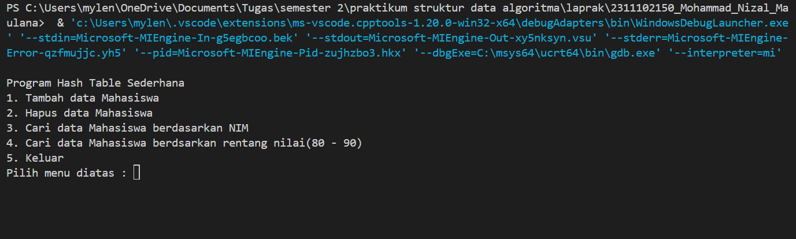
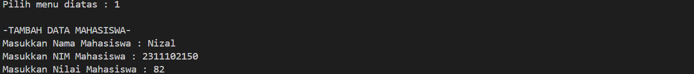
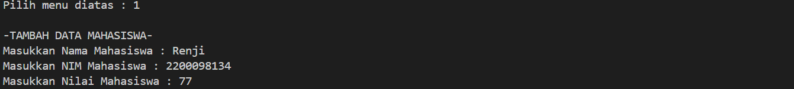
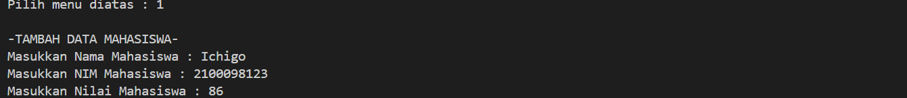
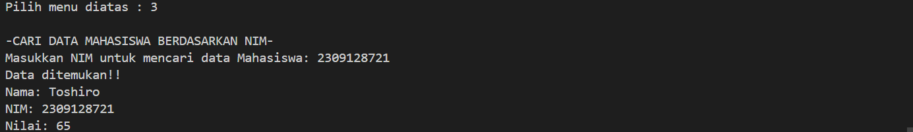
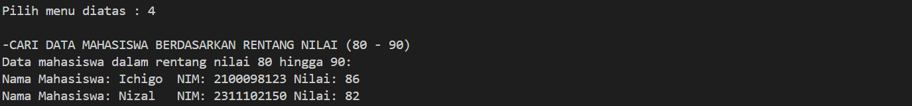
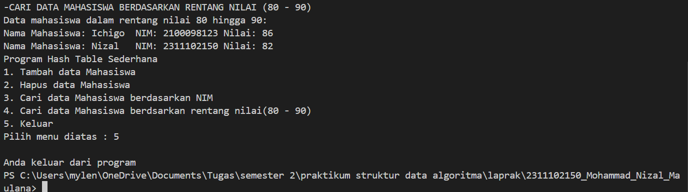

# <h1 align="center">Laporan Praktikum Modul 5 - HASH TABLE</h1>
<p align="center">Mohammad Nizal Maulana - 2311102150</p>

## Dasar Teori

Hash Table adalah sebuah struktur data yang sangat cepat dalam insertion dan searchig. Hash Table diimplementasikan menggunakan array. Penambahan dan pencarian sebuah key pada hash table berdasarkan fungsi hash yang dipakai. fungsi hash memetakkan elemen pada indeks hash table. Fungsi hash yang baik memiliki sifat berikut : mudah dihitung, cukup mampu mendistribusikan key, meminimalkan jumlah collision (tabrakan) yang terjadi. Fungsi hash dapat menggunakan beberapa teknik, diantaranya :</br>
a. Truncatio. Mengambil beberapa digit dari key sebagai indeks.</br>
b. Folding. Menjumlahkan beberapa digit dari key, hasil penjumlahan sebagai indeks</br>
c. Modular. Menggunakan sisa hasil bagi dari key (bilangan bulat) dengan ukuran hash table.</br>
Hash Table menggunakan memori penyimpanan utama berbentuk array dengan tambahan algoritma untuk mempercepat pemrosesan data. beberapa hal yang perlu diperhatikan dalam membuat hash function adalah :</br>
a. ukuran array/table size</br>
b. key value/nilai yang didapat dari data </br>
c. hash value/hash indeks/indeks yang dituju.

## Guided 

### 1. Guided 1

```C++
#include <iostream>
using namespace std;
const int MAX_SIZE = 10;
// Fungsi hash sederhana
int hash_func(int key)
{
    return key % MAX_SIZE;
}
// Struktur data untuk setiap node
struct Node
{
    int key;
    int value;
    Node *next;
    Node(int key, int value) : key(key), value(value),next(nullptr) {}
};
// Class hash table
class HashTable
{
private:
    Node **table;

public:
    HashTable()
    {
        table = new Node *[MAX_SIZE]();
    }
    ~HashTable()
    {
        for (int i = 0; i < MAX_SIZE; i++)
        {
            Node *current = table[i];
            while (current != nullptr)
            {
                Node *temp = current;
                current = current->next;
                delete temp;
            }
        }
        delete[] table;
    }
    // Insertion
    void insert(int key, int value)
    {
        int index = hash_func(key);
        Node *current = table[index];
        while (current != nullptr)
        {
            if (current->key == key)
            {
                current->value = value;
                return;
            }
            current = current->next;
        }
        Node *node = new Node(key, value);
        node->next = table[index];
        table[index] = node;
    }
    // Searching
    int get(int key)
    {
        int index = hash_func(key);
        Node *current = table[index];
        while (current != nullptr)
        {
            if (current->key == key)
            {
                return current->value;
            }
            current = current->next;
        }
        return -1;
    }
    // Deletion
    void remove(int key)
    {
        int index = hash_func(key);
        Node *current = table[index];
        Node *prev = nullptr;
        while (current != nullptr)
        {
            if (current->key == key)
            {
                if (prev == nullptr)
                {
                    table[index] = current->next;
                }
                else
                {
                    prev->next = current->next;
                }
                delete current;
                return;
            }
            prev = current;
            current = current->next;
        }
    }
    // Traversal
    void traverse()
    {
        for (int i = 0; i < MAX_SIZE; i++)
        {
            Node *current = table[i];
            while (current != nullptr)
            {
                cout << current->key << ": " << current->value<< endl;
                current = current->next;
            }
        }
    }
};
int main()
{
    HashTable ht;
    // Insertion
    ht.insert(1, 10);
    ht.insert(2, 20);
    ht.insert(3, 30);
    // Searching
    cout << "Get key 1: " << ht.get(1) << endl;
    cout << "Get key 4: " << ht.get(4) << endl;
    // Deletion
    ht.remove(4);
    // Traversal
    ht.traverse();
    return 0;
}
```
Kode diatas merupakan implementasi dari Hash Table sederhana. berikut beberapa fungsi yang ada didalam kode tersebut. Pertama terdapat fungsi hash sederhana (`hash_func`) yang menggunakan operasi modulo untuk memetakan key ke indeks dalam table. Kemudian ada struk `Node` yang merepresentasikan setiap node yang ada dalam linked list. Kemudian class `HashTable`memiliki atribut privat berupa array dan pointer `node`(`table`) yang merupakan hash table itu sendiri. kemudian nilai maksimum akan ditentukan fungsi (`MAX_SIZE`) dan akan dialokasikan memori untuk array dari pointer `Node`. beberapa metode dalam class `HashTable` termasuk `insert` untuk menyisipkan pasangan key kedalam hash table,`get` untuk mencari nilai key tertentu,`remove` untuk menghapus pasangan key dari hash table, dan `traverse` untuk menelusuri sebuah hash table dan mencetak semua key nya. Fungsi `main()` dipakai untuk menguji implementasi hash table ini dengan memasukkan beberapa pasangan key-nilai, melakukan pencarian, menghapus salah satu pasangan key-nilai, dan menelusuri seluruh hash table.

### 2. Guided 2

```C++
#include <iostream>
#include <string>
#include <vector>
using namespace std;
const int TABLE_SIZE = 11;
string name;
string phone_number;
class HashNode
{
public:
    string name;
    string phone_number;
    HashNode(string name, string phone_number)
    {
        this->name = name;
        this->phone_number = phone_number;
    }
};
class HashMap
{
private:
    vector<HashNode *> table[TABLE_SIZE];

public:
    int hashFunc(string key)
    {
        int hash_val = 0;
        for (char c : key)
        {
            hash_val += c;
        }
        return hash_val % TABLE_SIZE;
    }
    void insert(string name, string phone_number)
    {
        int hash_val = hashFunc(name);
        for (auto node : table[hash_val])
        {
            if (node->name == name)
            {
                node->phone_number = phone_number;
                return;
            }
        }
        table[hash_val].push_back(new HashNode(name,phone_number));
    }
    void remove(string name)
    {
        int hash_val = hashFunc(name);
        for (auto it = table[hash_val].begin(); it !=table[hash_val].end();it++)
        {
            if ((*it)->name == name)
            {
                table[hash_val].erase(it);
                return;
            }
        }
    }
    string searchByName(string name)
    {
        int hash_val = hashFunc(name);
        for (auto node : table[hash_val])
        {
            if (node->name == name)
            {
                return node->phone_number;
            }
        }
        return "";
    }
    void print()
    {
        for (int i = 0; i < TABLE_SIZE; i++)
        {
            cout << i << ": ";
            for (auto pair : table[i])
            {
                if (pair != nullptr)
                {
                    cout << "[" << pair->name << ", " << pair->phone_number << "]";
                }
            }
            cout << endl;
        }
    }
};
int main()
{
    HashMap employee_map;
    employee_map.insert("Mistah", "1234");
    employee_map.insert("Pastah", "5678");
    employee_map.insert("Ghana", "91011");
    cout << "NomerHpMistah:"
    << employee_map.searchByName("Mistah") << endl;
    cout << "PhoneHpPastah:"
    << employee_map.searchByName("Pastah") << endl;
    employee_map.remove("Mistah");
    cout << "NomerHpMistahsetelahdihapus:"
    << employee_map.searchByName("Mistah") << endl << endl;
    cout << "HashTable:" << endl;
    employee_map.print();
    return 0;
}
```
Kode diatas merupakan implementasi dari struktur data Hash Table. Hah table digunakan untuk menyimpan pasangan nama dan nomor telepon dengan menggunakan metode hash untuk operasi pencarian,penyisipan, dan penghapusan data. Struktur data utamanya adalah class `HashMap`, yang memiliki vektor dari pointer ke objek `HashNode`. metode-metodenya meliputi `insert` untuk menyisipkan data, `remove` untuk menghapusnya,`searchByName` untuk mencari nomor telepon berdasarkan nama, dan `print` untuk mencetak seluruh hash table. Fungsi `main()` menguji operasional kode diatas dengan memasukkan data, mencari data, menghapus data dan menampilkan isi dari hash table.

## Unguided 

### 1. Implementasikan hash table untuk menyimpan data mahasiswa. Setiap mahasiswa memiliki NIM dan nillai. Implementasikan fungsi untuk menambah data baru,menghapus data dan mencari data berdasarkan NIM, dan mencari data berdasarkan nilai. Dengan ketentuan : </br> a. Setiap mahasiswa memiliki NIM dan nilai </br> b. Program memiliki tampilan pilihan menu berisi poin C </br> c. Implementasikan fungsi untuk manambahkan data baru, menghapus data, mencari data berdasarkan NIM, dan mencari data berdasarkan rentang nilai (80 - 90).

```C++
#include <iostream>
#include <vector>
#include <string>
using namespace std;

// Struck untuk setiap mahasiswa
struct Mahasiswa{
    string nama_150;
    string nim_150;
    int nilai_150;
};

//struck untuk setiap node dalam hash table
struct HashNode{
    Mahasiswa data;
    HashNode* next;
    HashNode(const Mahasiswa& data) : data(data), next(nullptr){}
};

//class hash table
class HashTable{
    private:
    static const int TABLE_SIZE = 10;
    vector<HashNode*>table[TABLE_SIZE];

    // Fungsi hashFunc untuk menghasilkan indeks dari NIM
    int hashFunc_150(const string& nim_150){
        int hashVal = 0;
        for(char c : nim_150){
            hashVal += c;
        }
        return hashVal % TABLE_SIZE;
    }

    public:
    // untuk menambahkan data mahasiswa kedalam hash table
    void insert_150(const Mahasiswa& mahasiswa){
        int index = hashFunc_150(mahasiswa.nim_150);
        HashNode* newNode = new HashNode(mahasiswa);
        newNode->next = table[index].size() > 0 ? table[index][0] : nullptr;
        table[index].insert(table[index].begin(),newNode);
    }
    //fungsi menghapus data mahasiswa  berdasarkan NIM
    void hapus_150(const string& nim){
        int index = hashFunc_150(nim);
        for(size_t i=0; i<table[index].size(); i++){
            if(table[index][i]->data.nim_150 == nim){
                delete table[index][i];
                table[index].erase(table[index].begin()+i);
                return;
            }
        }
        cout << "Data mahasiswa dengan NIM " << nim << " tidak dapat ditemukan " <<endl;
    }

    //fungsi untuk mencari data mahasiswa berdasarkan NIM
    Mahasiswa* searchByNIM(const string& nim){
        int index = hashFunc_150(nim);
        for(size_t i = 0; i <table[index].size(); i++){
            if(table[index][i]->data.nim_150 == nim){
                return &(table[index][i]->data);
            }
        }
        return nullptr;
    }

    // Fungsi mencari data mahasiswa berdasarkan rentang nilai
    vector<Mahasiswa*> searchBYRange(int minNilai, int maxNilai){
        vector<Mahasiswa*> result;
        for(int i = 0; i < TABLE_SIZE; i++){
            for(size_t j = 0; j < table[i].size(); j++){
                if(table[i][j]->data.nilai_150 >= minNilai && table[i][j]->data.nilai_150 <= maxNilai){
                    result.push_back(&(table[i][j]->data));
                }
            }
        }
        return result;
    }

};

int main(){
    HashTable hashTable_150;
    int pilih_150;

    menu:
    cout << "Program Hash Table Sederhana" <<endl;
    cout << "1. Tambah data Mahasiswa"<<endl;
    cout << "2. Hapus data Mahasiswa"<<endl;
    cout << "3. Cari data Mahasiswa berdasarkan NIM"<<endl;
    cout << "4. Cari data Mahasiswa berdsarkan rentang nilai(80 - 90)"<<endl;
    cout << "5. Keluar"<<endl;
    cout << "Pilih menu diatas : "; cin >> pilih_150;
    cout << endl;

    switch(pilih_150){
        case 1 :{
            Mahasiswa mhs;
            cout << "-TAMBAH DATA MAHASISWA-"<<endl;
            cout << "Masukkan Nama Mahasiswa : ";
            cin >> mhs.nama_150;
            cout << "Masukkan NIM Mahasiswa : ";
            cin >> mhs.nim_150;
            cout << "Masukkan Nilai Mahasiswa : ";
            cin >> mhs.nilai_150;
            hashTable_150.insert_150(mhs);
            goto menu;
            break;
        }
        case 2 :{
            string nim;
            cout << "-HAPUS DATA MAHASISWA-"<<endl;
            cout << "Masukkan NIM untuk menghapus data Mahasiswa : ";
            cin >> nim;
            hashTable_150.hapus_150(nim);
            goto menu;
            break;
        }
        case 3 :{
            string nim;
            cout << "-CARI DATA MAHASISWA BERDASARKAN NIM-"<<endl;
            cout << "Masukkan NIM untuk mencari data Mahasiswa: ";
            cin >> nim;
            Mahasiswa* result = hashTable_150.searchByNIM(nim);
            if(result != nullptr){
                cout << "Data ditemukan!!"<<endl;
                cout << "Nama: " << result->nama_150 << "\nNIM: " << result->nim_150 << "\nNilai: " << result->nilai_150 <<endl;
            }else{
                cout << "Data mahasiswa dengan NIM " << nim << "Tidak dapat ditemukan"<<endl;
            }
            goto menu;
            break;
        }
        case 4 :{
            int minNilai = 80, maxNilai = 90;
            cout << "-CARI DATA MAHASISWA BERDASARKAN RENTANG NILAI (80 - 90)" <<endl;
            vector<Mahasiswa*> result = hashTable_150.searchBYRange(minNilai, maxNilai);
            if(result.size() > 0){
                cout << "Data mahasiswa dalam rentang nilai " << minNilai << " hingga " << maxNilai << ":\n";
                for(Mahasiswa* mhs : result){
                    cout << "Nama Mahasiswa: " << mhs->nama_150 << "\tNIM: " << mhs->nim_150 << "\tNilai: "<< mhs->nilai_150 <<endl;
                }
            }else{
                cout << "Tidak ada Mahasiswa dalam rentang nilai tersebut "<<endl;
            }
            goto menu;
            break;
        }
        case 5:
            cout << "Anda keluar dari program"<<endl;
            break;
        default:
            cout << "pilihan tidak ada dalam menu";
            goto menu;
    }
    return 0;
}
```
#### Output:

gambar tampilan menu awal program

menambah data Nizal

menambah data Renji

menambah data Ichigo

menambah data Toshiro

Hapus data 2200098134 (Renji)

Mencari data berdasarkan NIM 

Mencari data berdasarkan rentang nilai(80 - 90)

Tampilan keluar

Kode diatas mengimpletasikan penggunaan Hash Table sederhana. Struktur data utama yang digunakan `Mahasiswa`, yang mencakup informasi nama,NIM dan nilai mahasiswa. Kemudian terdapat struktur `HashNode` yang mereplesentasikan setiap node dalam hash table, yang memiliki data mahasiswa serta pointer ke node berikutnya. Class `HashTable` menyediakan operasi-operasi dasar untuk memanipulasi data dalam hash table.metode `insert_150` digunakan untuk memasukkan data mahasiswa ke dalam table hash dengan menggunakan fungsi hash untuk menentukan indeksnya. metode `hapus_150` digunakan untuk menghapus data mahasiswa berdasarkan NIM yang diinputkan user. meetode `searchByNIM` digunakan untuk mencari data mahasiswa berdasarkan NIM, mettode `searchByRange` digunakan untuk mencari data mahasiswa berdasarkan rentang nilai yang ditentukan.
pada fungsi `main()` disajikan menu-menu menambah mahasiswa,meghapus data, mencari data berdasarkan NIM, mencari data berdasarkan rentang nilai (80 - 90), dan keluar. 

## Kesimpulan
Hash Table merupakan sebuah struktur data efisien yang menggunakan fungsi hash untuk menyimpan dan mengakses data dengan cepat [1].</br>
Hash Table membutuhkan lebih banyak memori dan bisa mengalami masalah jika implementasinya tidak tepat, meskipun demikian, hash table tetaplah pilihan yang populer untuk berbagai aplikasi yang menggunakan penyimpanan dan pencarian data cepat [2].

## Referensi
[1] Holle, K. F. H. (2022). Modul praktikum struktur data.</br>
[2] Mulyana, A. (2023). E-Books Cara Mudah Mempelajari Algoritma dan Struktur Data.