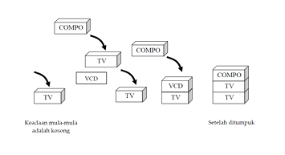
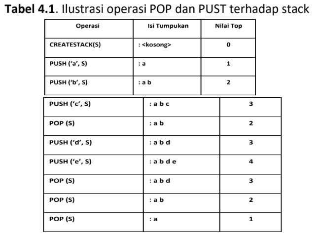
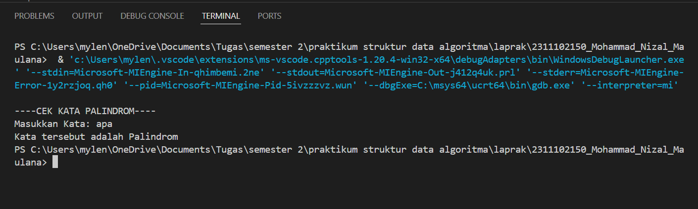
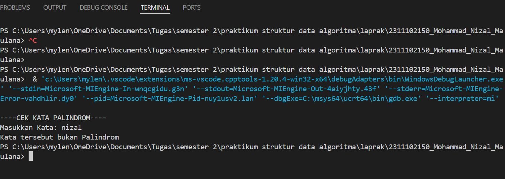
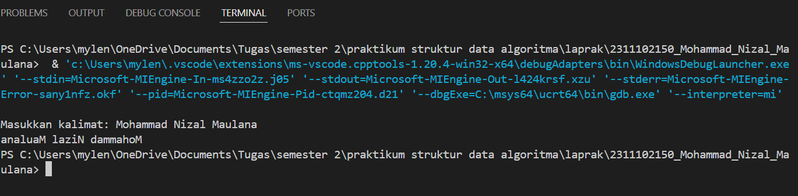

# <h1 align="center">Laporan Praktikum Modul 6 Stack</h1>
<p align="center">Mohammad Nizal Maulana - 2311102150</p>

## Dasar Teori

Stack adalah suatu tumpukan dari benda. Konsep utama nya adalah LFO (Last in First Out), yaitu benda yang terakhir masuk dalam stack akan menjadi benda pertama yang dikeluarkan oleh stack.
</br>
Pada gambar diatas, jika kita ingin mengambil sesuatu dari tumpukan, maka kita harus mengambil benda paling atas terlebih dahulu, yakni compo. Apabila VCD langsung diambil, maka compo akan jatuh. Prinsip stack ini dapat diterapkan dalam pemrograman. Di C++, ada dua cara penerapan stack yakni dengan array dan linked list.
setidaknya, stack harus memiliki operasi-operasi sebagai berikut: 
- Push = Untuk menambahkan item pada tumpukan paling atas.
- Pop = Untuk mengambil item teratas.
- Clear = untuk mengosongkan stacck.
- IsEmpty = Memeriksa apakah stack kosong.
- IsFull = Untuk memeriksa apakah stack penuh.
- Retrieve = Untuk mendapatkan nilai dari item teratas.</br>
Operasi-operasi dasar stack</br>
Operasi dasar pada stack sebagai berikut:
- CREATESTACK(S): Membuat tumpukan baru S dengan jumlah elemen kosong.
- MAKENULL(S): Mengosongkan tumpukan S jika ada elemen maka semua elemen dihapus.
- EMPTY: menguji apakah tumpukan kosong
- PUSH(x,S): Memasukkan elemen baru x ke dalam tumpukan S
- POP(S): mengeluarkan elemen posisi atas pada tumpukan S.

## Guided 

### 1. [Guided 1]

```C++
#include <iostream>
using namespace std;

string arrayBuku[5];
int maksimal = 5, top = 0;

bool isFull(){
    return (top == maksimal);
}

bool isEmpty(){
    return (top == 0);
}

void pushArrayBuku(string data){
    if(isFull()){
        cout<<"Data telah penuh"<<endl;
    }else{
        arrayBuku[top] = data;
        top++;
    }
}

void popArrayBuku(){
    if(isEmpty()){
        cout<<"Tidak ada data yang bisa dihapus"<<endl;
    }else{
        arrayBuku[top - 1] = "";
        top--;
    }
}

void peekArrayBuku(int posisi){
    if(isEmpty()){
        cout<<"Tidak ada data yang bisa dilihat"<<endl;
    }else{
        int index = top;
        for (int i = 1; i <= posisi; i++){
            index--;
        }
        cout<<"Posisi ke - " << posisi << " adalah "<< arrayBuku[index]<<endl;
    }
}

int countStack(){
    return top;
}

void changeArrayBuku(int posisi, string data){
    if(posisi > top){
        cout<< "Posisi melebihi data yang ada"<<endl;
    }else{
        int index = top;
        for (int i = 1; i<=posisi; i++){
            index--;
        }
        arrayBuku[index] = data;
    }
}

void destroyArrayBuku(){
    for(int i = top; i >=0; i--){
        arrayBuku[i]="";
    }
    top = 0;
}

void cetakArrayBuku(){
    if(isEmpty()){
        cout << "Tidak ada hasil yang dicetak"<<endl;
    }else{
        for(int i = top - 1; i>=0; i--){
            cout<<arrayBuku[i]<<endl;
        }
    }
}

int main(){
    pushArrayBuku("Kalkulus");
    pushArrayBuku("Struktur data");
    pushArrayBuku("Matematika Diskrit");
    pushArrayBuku("Dasar Multimedia");
    pushArrayBuku("Inggris");

    cetakArrayBuku();
    cout<<"\n";

    cout<<"Apakah data stack penuh?"<<isFull()<<endl;
    cout<<"Apakah data stack kosong?" <<isEmpty()<<endl;

    peekArrayBuku(2);
    popArrayBuku();

    cout << "Banyak data = " << countStack()<<endl;

    changeArrayBuku(2, "Bahasa Jerman");
    cetakArrayBuku();

    cout<<"\n";

    destroyArrayBuku();
    cout<<"Jumlah data yang dihapus = " << top << endl;

    cetakArrayBuku();

    return 0;
}
```
Kode diatas merupakan implementasi dari stack menggunakan array. Dalam kode tersebut terdapat fungsi-fungsi seperti pengecekan apakah stack penuh atau kosong, penambahan elemen kedalam stack, penghapusan elemen pada stack. Fungsi `pushArrayBuku()` digunakan untuk menambahkan elemen kedalam stack, sementara `popArrayBuku()` digunakan untuk menghapus elemen paling atas stack, fungsi `peekArrayBuku()` yang memungkinkan untuk melihat elemen pada posisi tertentu tanpa menghapusnya, lalu fungsi `changeArrayBuku()` yang memungkinkan untuk mengubah elemen pada posisi tertentu, pada fungsi `cetakArrayBuku()` seluruh elemen yang teleh dimasukan akan dicetak.

## Unguided 

### 1.  Buatlah program untuk menentukan apakah kalimat tersebut yang diinputkan dalam program stack adalah palindrom/tidak. Palindrom kalimat yang dibaca dari depan dan belakang sama. Jelaskan bagaimana cara kerja programnya.

```C++
#include <iostream>

using namespace std;

// Menentukan apakah kata adalah palindrom atau tidak
bool cekPalindrom_150(string kata_150) {
    int length = kata_150.length();
    for(int i = 0; i < length / 2; i++) {
        if(tolower(kata_150[i]) != tolower(kata_150[length - i - 1])) {
            return false;
        }
    }
    return true;
}

int main() {
    string masukanKalimat_150;
    cout << "----CEK KATA PALINDROM----"<<endl;
    cout << "Masukkan Kata: ";
    cin >> masukanKalimat_150;

    if(cekPalindrom_150(masukanKalimat_150)) {
        cout << "Kata tersebut adalah Palindrom" << endl;
    } else {
        cout << "Kata tersebut bukan Palindrom" << endl;
    }
    return 0;
}


```
#### Output:



Kode diatas merupakan kode yang menentukan sebuah kata itu palindrom atau bukan. Fungsi utama pada kode ini terletak pada `cekPalindrom_150`, fungsi tersebut akan menerima string sebagai argumen dan mengembalikan nilai boolean yang menunjukan apakah kata tersebut palindrom atau bukan. Kemudian fungsi `tolower()`
digunakan untuk memastikan perbandingan karakter case-insensitive.
pada int `main()` user diminta menginputkan kata pada variabel `masukanKalimat_150`,lalu program akan memanggil fungsi `cekPalindrom_150`. Jika fungsi tersebut mengembalikan true, maka program akan mencetak "Kata tersebut adalah palindrom", namun jika fungsi mengembalikan false maka program akan mencetak "Kata tersebut bukan palindrom".

### 2. Buatlah program untuk melakukan pembalikan terhadap kalimat menggunakan stack dengan minimal 3 kata. Jelaskan output program dan source codenya beserta operasi/fungsi yang dibuat?

```C++
#include <iostream>
#include <string>
#include <stack>

using namespace std;

void balikKalimat_150(string kalimat_150)
{
    stack<char> b;

    // Memasukkan karakter kalimat ke dalam stack
    for (char c : kalimat_150)
    {
        b.push(c);
    }

    // Mengambil karakter dari stack dan menyimpannya kembali ke dalam variabel kalimat yang dibalik
    string kalimatDibalik_150;
    while (!b.empty())
    {
        kalimatDibalik_150 += b.top();
        b.pop();
    }

    // Menampilkan kalimat yang dibalik
    cout << kalimatDibalik_150 << endl;
}

int main()
{
    string kalimat_150;

    // Meminta masukan kalimat dari pengguna
    cout << "Masukkan kalimat: ";
    getline(cin, kalimat_150);

    // Memastikan kalimat minimal memiliki 3 kata
    int kata = 1;
    for (char c : kalimat_150){
        if (c == ' '){
            kata++;
        }
    }
    if (kata < 3){
        cout << "Kalimat harus terdiri minimal 3 kata"<<endl;
    }else{
        // membalik kalimat dan menampilkan hasil kalimat yang dibalik
        balikKalimat_150(kalimat_150);
    }
    return 0;
}

```
#### Output:


Kode diatas merupakan sebuah kode program untuk membalik kalimat. Fungsi utama yang ada dalam kode diatas adalah `balikKalimat_150` yang menerima string sebagai argumen. Didalamnya, sebuah stack dideklarasikan untuk menyimpan karakter-karakter dari kalimat yang dimasukan. Setelah semua karakter dimasukan ke dalam stack,program akan mengambil karakter-karakter tersebut satu per satu dari stack dan menyusunnya kembali kedalam string `kalimatDibalik_150`. ini dilakukan untuk memanggil fungsi `top()` guna mendapatkan elemen teratas dari stack dan menghapusnya dengan `pop()`. Kemudian,program mencetak `kalimatDibalik_150` yang merupakan kalimat yang telah dibalikan.
dalam int `main()`, user diminta untuk memasukan `getline()` untuk mendapatkan seluruh baris teks yang dimasukan user, termasuk spasi. program kemudian akan memeriksa jumlah kata dalam kalimat dengan menghitung spasi, sebab perintah yang diberikan ialah minimalnya 3 kata. Jika jumlah kata kurang dari 3 maka program akan mencetak pesan bahwa "Kalimat harus terdiri minimal 3 kata", jika persyaratan terpenuhi, program akan memanggil fungsi `balikKalimat_150` untuk membalikkan kalimmat dan mencetak output yang benar.

## Kesimpulan
Kesimpulannya adalah
stack merupakan struktur data yang menggunakan prinsip Last in First Out (LIFO) atau elemen yang terakhir dimasukan kedalam stack akan menjadi elemen pertama yang dihapus[1]</br>
stack mirip dengan tumpukan buku, dimana buku terakhir yang ditumpuk akan menjadi buku pertama yang diambil, dalam implementasinya stack digunakan untuk membalik urutan data, mengevaluasi ekspresi matematika atau menyimpan situs sementara dalam program[2]</br>
stack juga menyediakan fungsi-fungsi bawaan seperti `pop`(untuk menghapus elemen teratas) dan `top`(untuk mengakses elemen teratas tanpa menghapusnya).[3]  

## Referensi
[1] Mulyana, A. (2023). E-Books Cara Mudah Mempelajari Algoritma dan Struktur Data.</br>
[2] Melladia, M., Efendi, G., & Zahmi, A. (2024). Algoritma dan Struktur Data dengan Pemograman Pascal dan Phyton. CV. Gita Lentera.