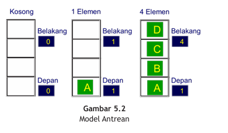
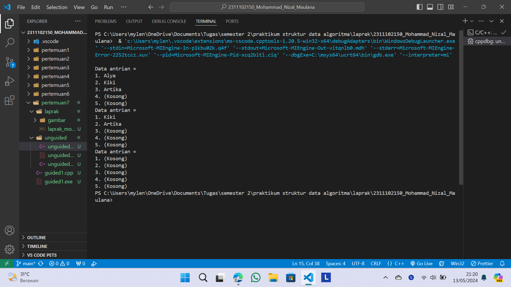
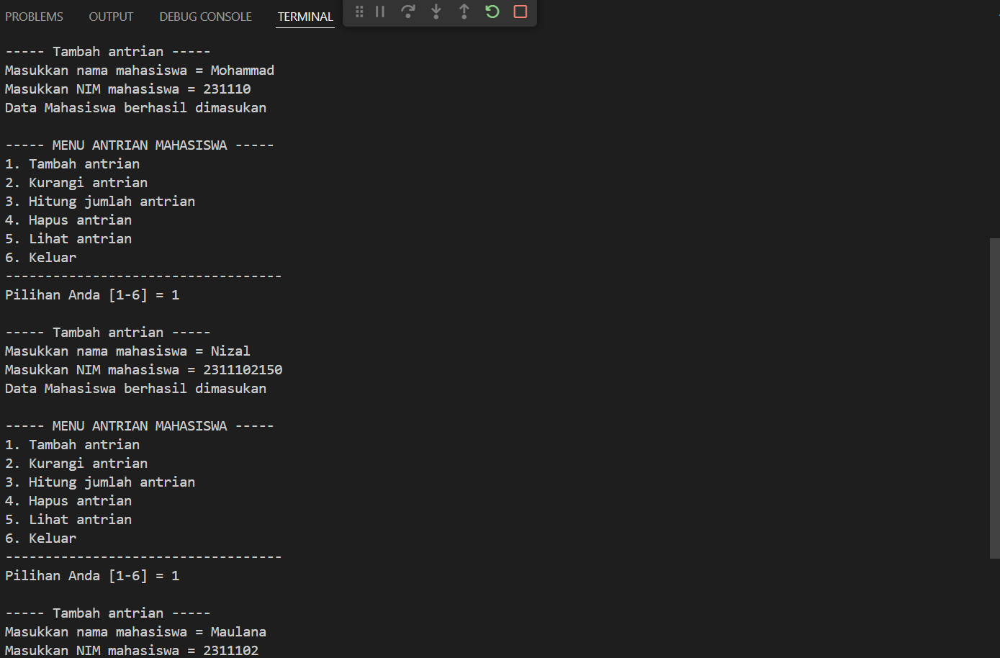
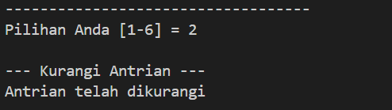
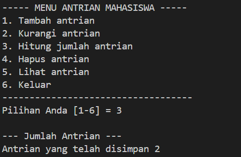
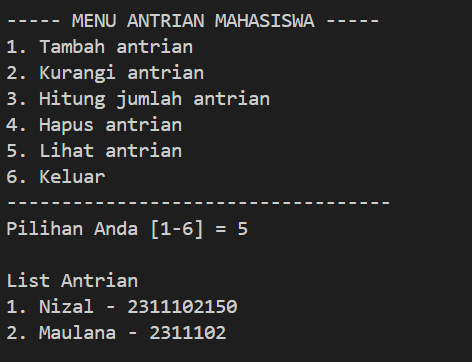
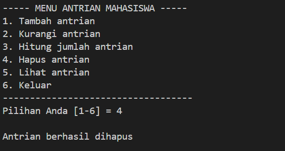
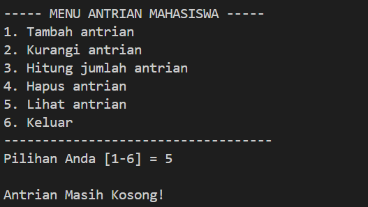

# <h1 align="center">Laporan Praktikum Modul 7 QUEUE</h1>
<p align="center">Mohammad Nizal Maulana - 2311102150</p>

## Dasar Teori

Antrean atau QUEUE adalah salah satu struktur data yang memiliki sistem kerja yang dimana pertama masuk maka akan menjadi yang pertama keluar (FIFO = First In First Out), sama halnya seperti antrian di dunia nyata. Namun hal ini tidak berlaku pada antrian berprioritas. Sebab, pada antrian berprioritas, urutan keluar dari sebuah antrian ditentukan berdasarkan prioritas masing-masing elemen dalam antrian terlebih dahulu. Pada sebuah antrian, elemen hanya dapat ditambahkan melalui sisi belakang queue dan hanya bisa diambil dari sisi depan queue. Oleh sebab itu ada dua dua buah  elemen pada sebuah queue, yaitu belakang (last atau rear) sebagai penunjuk paling belakang dan depan (first atau front) sebagai elemen bagian depan. Sama seperti stack dan list queue juga merupakan struktur data yang dapat di implementasikan menggunakan array dan pointer.



Pendeklarasian Queue </br>
dengan struct dan array
```C++
struct QUEUE
{
    int data[8];
    int head;
    int tail;
};
```
Operasi-operasi pada queue
- Create()
```C++
void Create(){
    antrian.head=antrian.tail=-1;
}
```
- IsEmpty()
```C++
int IsEmpty(){
    if(antrian.tail == -1){
        return 1;
    }else{
        return 0;
    }
}
```

- IsFull
```C++
int IsFull(){
    if(antrian.tail == MAX-1){
        return 1;
    }else{
        return 0;
    }
}
```

## Guided 

### 1. GUIDED

```C++
#include<iostream>

using namespace std;

const int MaksimalAntrian = 5;
int front = 0;
int back = 0;
string QueueTeller[5];

//Mengecek apakah antrian sudah penuh atau belum
bool isFull(){
    if(back == MaksimalAntrian){
        return true;
    } else {
        return false;
    }
}

//Mengecek apakah antrian masih kosong atau tidak
bool isEmpty(){
    if(back == 0){
        return true;
    } else {
        return false;
    }
}

//Menambah antrian
void TambahData(string nama){
    if(isFull()){
        cout << "Antrian sudah penuh" << endl;
    } else if(!isFull()){
        if(isEmpty()){
            QueueTeller[0] = nama;
            front++;
            back++;
        } else if(!isEmpty()){
            QueueTeller[back] = nama;
            back++;
        }
    }
}

//Mengurangi antrian
void KurangAntrian(){
    if(isEmpty()){
        cout << "Antrian masih kosong" << endl;
    } else if(!isEmpty()){
        for(int i = 0; i < back; i++){
            QueueTeller[i] =  QueueTeller[i+1];
        }
        back--;
    }
}

//Menghitung banyak antrian
int Count(){
    return back;
}

//Menghapus seluruh antrian
void ClearQueue(){
    if(isEmpty()){
        cout << "Antrian masih kosong" << endl;
    } else if(!isEmpty()){
        for(int i = 0; i < back; i++){
            QueueTeller[i] = "";
        }
        back = 0;
        front = 0;
    }
}

//Melihat Antrian
void ViewQueue(){
    cout << "Data antrian = " << endl;
    for(int i = 0; i < MaksimalAntrian; i++){
        if(QueueTeller[i] != ""){
            cout << i+1 << ". " << QueueTeller[i] << endl;
        } else {
            cout << i+1 << ". " << "(kosong)" << endl;
        }
    }
}

//main fungsi
int main(){
    //Menambah 3 data nama kedalam antrian
    TambahData("Alya");
    TambahData("Kiki");
    TambahData("Artika");

    //menampilkan data yang sudah ditambahkan
    ViewQueue();

    //mengurangi data
    KurangAntrian();

    //menampilkan data setelah dikurangi
    ViewQueue();

    //menghapus seluruh antrian
    ClearQueue();

    //menampilkan data setelah dihapus
    ViewQueue();
}
```
Kode diatas merupakan implementasi struktur data queue. pertama kode mendefinisikan konstanta `MaksimalAntrian` yang menentukan ukuran maksimal antrian yang ditampung, lalu dua variabel `front` dan `back` yang digunakan untuk menunjukan bagian depan da belakang. Fungsi `isFull()` digunakan untuk melihat apakah antrian penuh atau tidak, `isEmpty()` untuk memeriksa apakah antrian masih kosong, `TambahData()` untuk menambah data antrian, `KurangAntrian()` untuk menghapus antrian, `Count()` untuk menampilkan seluruh antrian dan `ClearQueue()` untuk menghapus semua antrian.

## Unguided 

### 1. Ubahlah penerapan konsep queue pada bagian guided dari array menjadilinked list

```C++
#include <iostream>
using namespace std;

// Struktur data untuk setiap elemen di linked list
struct Node{
    string data_150;
    Node* next;
};

// Pointer yang menunjuk ke front dan back linkedlist
Node* front = nullptr;
Node* back = nullptr;

//menambah data kebelakang antrian
void TambahData_150(string nama_150){
    Node* baru = new Node;
    baru->data_150 = nama_150;
    baru->next = nullptr;

    if(back == nullptr){
        front = baru;
        back = baru;
    }else{
        back->next = baru;
        back = baru;
    }
}

//Mengurangi data dari depan antrian
void KurangiAntrian_150(){
    if (front == nullptr){
        cout << "Antrian masih kosong" <<endl;
    }else{
        Node* temp = front;
        front = front->next;
        delete temp;
    }
}

//Menghitung banyak antrian
int jumlahAntrian_150(){
    int count_150 = 0;
    Node* current_150 = front;
    while(current_150 != nullptr){
        count_150++;
        current_150 = current_150->next;
    }
    return count_150;
}

//Menghapus seluruh antrian
void ClearAll_150(){
    while(front != nullptr){
        Node* temp = front;
        front = front->next;
        delete temp;
    }
    back = nullptr;
}

//Menampilkan antrian
void TampilkanAntrian_150(){
    cout << "Data antrian = " << endl;
    Node* current = front;
    int i = 1;
    int MaksimalAntrian_150 = 5;
    while (current != nullptr){
        cout << i << ". " << current->data_150 << endl;
        current = current->next;
        i++;
    }
    for (; i <= MaksimalAntrian_150; i++){
        cout << i << ". " << "(Kosong)" <<endl;
    }
}

int main(){
    //Menambah 3 data nama kedalam antria
    TambahData_150("Alya");
    TambahData_150("Kiki");
    TambahData_150("Artika");

    //Menampilkan data yang sudah ditambahkan
    TampilkanAntrian_150();

    //Mengurangi data
    KurangiAntrian_150();

    //Menampilkan data setelah dikurangi
    TampilkanAntrian_150();

    //Menghapus seluruh antrian
    ClearAll_150();

    //Menampilkan data setelah dihapus
    TampilkanAntrian_150();

    return 0;

}
```
#### Output:


Kode diatas merupakan ubahan kode dari guided 1 yang tadinya array diganti menjadi linked List, Linked List direpresentasikan ole Node yang mempunyai dua bagian yaitu `data_150` dan `next`. Fungsi `TambahData_150` digunakan untuk menambah data dibelakang antrian, `KurangiAntrian_150` untuk mengurangi data dari depan antrian, `jumlahAntrian_150` untuk menghitung jumlah elemen dalam antrian, `ClearAll_150` untuk menghapus seluruh antrian, `TampilkanAntrian_150` untuk menampilkan semua elemen yang ada didalam antrian

### 2. Dari nomor 1 buatlah konsep antri dengan atribut Nama mahasiswa dan NIM Mahasiswa

```C++
#include<iostream>

using namespace std;

//Deklarasi struct node
struct node{ 
    string Mahasiswa_150;
    string NIM_150;
    node *next;
};
    node *front; //Deklarasi node front
    node *back; //Deklarasi node back

//Prosedur inisialisasi node front dan back sebagai NULL
void Inisialisasi_150(){ 
    front = NULL;
    back = NULL;
}

//Untuk mengecek apakah queue kosong atau tidak
bool isEmpty_150(){
    if (front == 0){
        return true; 
    } else {
        return false;
    }
}

//Prosedur untuk menambah data pada antrian
void TambahAntrian_150(string Nama_150, string NIM_150){
    node *baru = new node;
    baru->Mahasiswa_150 = Nama_150; 
    baru->NIM_150 = NIM_150; 
    baru->next = NULL; 
    if(isEmpty_150() == true){ //jika antrian kosong, maka lanjutkan
        front = back = baru; 
        back->next = NULL;
    } else if(isEmpty_150() == false){ //jika antrian tidak kosong, maka lanjutkan
        back->next = baru; 
        back = baru; 
    }
}

//Prosedur untuk mengurangi antrian 
void KurangiAntrian_150(){
    node *hapus; 
    if(isEmpty_150() == false){ //jika antrian tidak kosong, maka lanjutkan
        if(front->next != NULL){ 
            hapus = front; 
            front = front->next; 
            delete hapus; 
        } else { //jika tidak ada node selanjutnya setelah antrian pertama, maka lanjutkan
            front = back = NULL; 
        }
    }
}

//Fungsi untuk menghitung jumlah antrian
int HitungAntrian_150(){
    node *hitung; 
    hitung = front; 
    int jumlah_150 = 0; 
    while(hitung != NULL){ 
        hitung = hitung->next; 
        jumlah_150++; 
    }
    return jumlah_150; 
}

//Prosedur untuk menghapus seluruh antrian
void HapusSemuaAntrian_150(){
    node *hapus, *bantu;
    bantu = front; 
    while(bantu != NULL){ 
        hapus = bantu; 
        bantu = bantu->next; 
        delete hapus; 
    }
    front = back = NULL; 
}

//Prosedur untuk menampilkan antrian
void TampilkanAntrian_150(){
    node *bantu; 
    bantu = front; 
    if(isEmpty_150() == true){  
        cout << "Antrian Masih Kosong!" << endl; 
    } else if(isEmpty_150() == false){ 
        cout << "List Antrian" << endl; 
        int NomorAntrian_150 = 1; 
        while(bantu != NULL){ 
            cout << NomorAntrian_150 << ". " << bantu->Mahasiswa_150 << " - " << bantu->NIM_150 << endl; 
            bantu = bantu->next; 
            NomorAntrian_150++; 
        }
    }
    cout << endl;
}

int main(){
    string Mahasiswa_150, NIM_150; 
    int Pilih;
    //Menampilkan pilihan menu
    Menu:
    cout << "----- MENU ANTRIAN MAHASISWA -----" << endl; 
    cout << "1. Tambah antrian" << endl;
    cout << "2. Kurangi antrian" << endl;
    cout << "3. Hitung jumlah antrian" << endl;
    cout << "4. Hapus antrian" << endl;
    cout << "5. Lihat antrian" << endl;
    cout << "6. Keluar" << endl;
    cout << "-----------------------------------" << endl;
    cout << "Pilihan Anda [1-6] = ";
    cin >> Pilih;
    cout << endl;
    switch(Pilih){ 
        case 1: 
            cout << "----- Tambah antrian -----" << endl;
            cout << "Masukkan nama mahasiswa = ";
            cin >> Mahasiswa_150;
            cout << "Masukkan NIM mahasiswa = ";
            cin >> NIM_150;
            TambahAntrian_150(Mahasiswa_150, NIM_150); //Memanggil prosedur TambahAntrian_150
            cout << "Data Mahasiswa berhasil dimasukan" << endl;
            cout << endl;
            goto Menu;
            break;
        case 2: 
            cout << "--- Kurangi Antrian ---" << endl;
            if(isEmpty_150() == true){ 
                cout << "Belum ada antrian yang masuk!" << endl;
            } else { 
                KurangiAntrian_150(); //Memanggil prosedur KurangiAntrian_150
                cout << "Antrian telah dikurangi "<<endl;
            }
            cout << endl;
            goto Menu;
            break;
        case 3: 
            cout << "--- Jumlah Antrian ---" << endl;
            cout << "Antrian yang telah disimpan " << HitungAntrian_150() << endl;// Memanggil fungsi HitungAntrian_150 
            cout << endl;
            goto Menu;
            break;
        case 4:
            HapusSemuaAntrian_150();// Memanggil prosedur HapusSemuaAntrian_150
            cout << "Antrian berhasil dihapus" <<endl;
            cout << endl;
            goto Menu;
            break;
        case 5: 
            TampilkanAntrian_150(); //Memanggil prosedur TampilkanAntrian_150
            cout << endl;
            goto Menu;
            break;
        case 6:
            cout << "Anda keluar dari program" << endl;
            cout << endl;
            return 0;
            break;
        default: 
            cout << "Pilihan anda tidak ada dalam menu" << endl;
            cout << endl;
            goto Menu;
            break;
    }
}
```
#### Output:












Kode di atas adalah implementasi queue menggunakan linked list, Queue digunakan untuk menyimpan data Mahasiswa yang terdiri dari nama dan NIM. 
- deklarasi struct dan variabel
`node` digunakan untuk mendifinisikan elemen antrian (`Mahasiswa_150` dan `NIM_150`) serta pointer `next` untuk menunjuk ke node berikutnya</br>
Pointer `front` dan `back` untuk menunjukan elemen antrian pertama dan terakhir
- Inisialisasi
Fungsi `Inisialisasi_150` untuk menginsiakisasi `front` dan `back` dengan NULL, menunjukan bahwa antrian awalnya kosong
- Pengecekan antrian kosong
Fungsi `isEmpty_150` mengecek apakah antrian kosong dengan memeriksa apakah front bernilai NULL.
- Menambah data ke antrian
Fungsi `TambahAntrian_150` menambahkan elemen baru ke antrian. 
- Mengurangi data antrian
Fungsi `KurangiAntrian_150` menghapus elemen dari depan antrian.
- Menghitung data antrian
Fungsi `HitungAntrian_150` menghitung jumlah elemen dalam antrian dengan melakukan iterasi dari front hingga akhir antrian.
- Menghapus semua antrian
Fungsi `HapusSemuaAntrian_150` menghapus semua elemen dalam antrian dengan menghapus node satu per satu dari depan hingga front menjadi NULL.
- Menampilkan semua antrian
Fungsi `TampilkanAntrian_150` menampilkan semua elemen dalam antrian dari depan ke belakang. Jika antrian kosong, pesan "Antrian Masih Kosong!" akan ditampilkan.
- Fungsi `main()`
dalam int main() terdapat 6 pilihan menu yang dapat dipilih oleh user.

## Kesimpulan
Queue mempunyai batasan antrian dalam implementasinya [1].</br>
Queue merupakan struktur data yang menerapkan FIFI(First In First Out) yang berarti elemen yang pertama dimasukan akan menjadi yang pertama kali keluar[2]

## Referensi
[1] Mulyana, A. (2023). E-Books Cara Mudah Mempelajari Algoritma dan Struktur Data.</br>
[2] Triase, T. (2020). Struktur Data: Diktat Edisi Revisi.