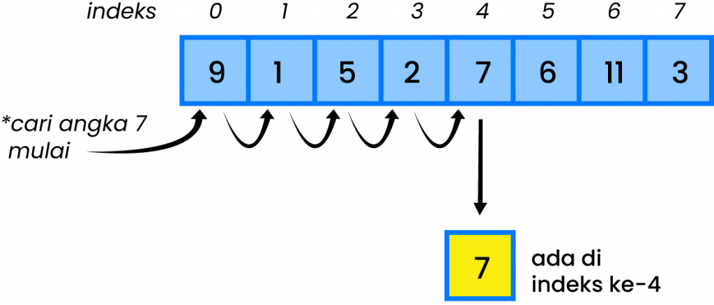
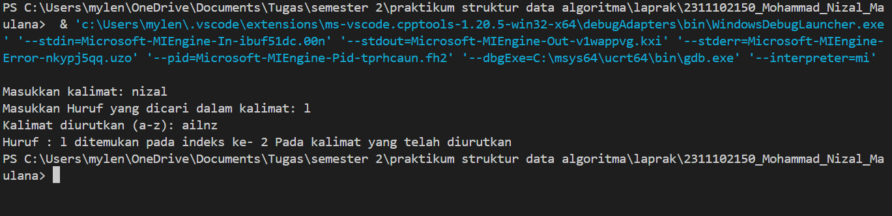
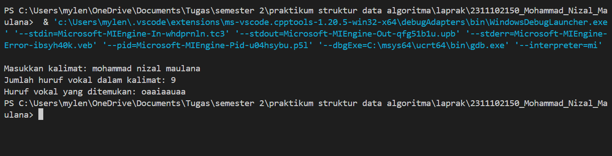
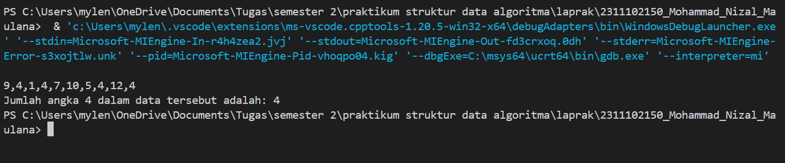

# <h1 align="center">Laporan Praktikum Modul 8 ALGORITMA SEARCHING</h1>
<p align="center">Mohammad Nizal Maulana - 2311102150</p>

## Dasar Teori

Searching adalah hal yang  kita lakukan dalam kehidupan sehari-hari, Seringkali kita melakukan pencarian sebuah kata tertentu dalam berkas naskah untuk menggantinya dengan kata lain. Dalam ilmju kompuuter pengambilan dan organisasi data merepresentasikan prinsip dasar algoritma. Proses Searching bertujuan untuk menemukan elemen spesifik dalam sebuah struktur data.</br>
Jenis-jenis searching</br>
- Binary search
binary search adalah pencarian yang menerapkan proses yang sama untuk paruh pertama, jika tidak menerapkan proses yang sama untuk babak kedua. Binary search juga bekerja dengan cara yang sama. Algoritma yang menerapkan strategi seperti itu disebut sebagai algoritma binary search, proses yang terjadi dalam binary search sebagai berikut:
- Membaca array data
- apabila array belum terurut, maka diurutkan dahulu
- Menentukan data yang akan dicari
- Menentukan elemen tengah dari array
- Jika nilai elemen tengah sama dengan data yang dicari, maka pencarian selesai
 

- Sequential search
Metode sequential search atau disebut pencarian beruntun dapat digunakan untuk melakukan pencarian data baik pada array yang sudah terurut maupun yang belum terurut. Proses yang terjadi pada metode sequential search ini sebagai berikut: 
- Membaca array data
- Menentukan data yang dicari
- Mencari data mulai dari data pertama sampai dengan data terakhir, data yang dicari dibandingkan dengan masing-masing data didalam array.


## Guided 

### 1.  Buatlah sebuah project dengan menggunakan sequential search sederhana untuk melakukan pencarian data.

```C++
#include <iostream>

using namespace std;

int main(){
    int n = 10;
    int data[n] = {9,4,1,7,5,12,4,13,4,10};
    int cari = 10;
    bool ketemu = false;
    int i;

    for (i = 0; i < n; i++){
        if(data[i] == cari){
            ketemu = true;
            break;
        }
    }

    cout << "Program sequential search"<<endl;
    cout << "Data : {9,4,1,7,5,12,4,13,4,10}"<<endl;

    if(ketemu){
        cout << "\nAngka " << cari << " ditemukan pada indeks ke- " << i <<endl;
    }else{
        cout << "Data tidak ditemukan" <<endl;
    }
    return 0;
}
```
Kode di atas merupakan  implementasi struktur data algoritma searching (sequential search). Program mendeklarasikan  variabel n yang bernilai 10 dan array data yang berisi 10 elemen {9,4,1,7,5,12,4,13,4,10}. kode ini juga terdapat perulangan for yang akan menglooping data mulai dari indeks 0, kemudian if akan mengecek apakah elemen pada indeks i sama dengan nilai yang dimasukan, jika ada maka akan bernilai true. pada output user diminta memasukan angka yang jika angka yang dimasukan ada dalam data maka akan bernilai true, jika tidak ada maka program akan mengirimkan pesan Data tidak ditemukan.

### 2.  Buatlah sebuah project untuuk melakukan pencarian data dengan menggunakan binary search.

```C++
#include <iostream>
#include <conio.h>
#include <iomanip>

using namespace std;

int dataArray[7] = {1,8,2,5,4,9,7};
int cari;

void selection_sort(){
    int temp, min, i ,j;
    for (i =0; i < 7; i++){
        min = i;
        for (j = i +1; j < 7; j++){
            if(dataArray[j] < dataArray[min]){
                min = j;
            }
        }
        temp = dataArray[i];
        dataArray[i] = dataArray[min];
        dataArray[min] = temp;
    }
}

void binarySearch(){
    int awal,akhir,tengah;
    bool b_flag = false;
    awal = 0;
    akhir = 6;
    while (!b_flag && awal <= akhir){
        tengah = (awal + akhir)/2;
        if(dataArray[tengah] == cari){
            b_flag = true;
        }else if(dataArray[tengah] < cari){
            awal = tengah + 1;
        }else{
            akhir = tengah - 1;
        }
    }
    if(b_flag){
        cout << "\nData ditemukan pada index ke- " << tengah <<endl;

    }else{
        cout << "Data tidak ditemukan" <<endl;
    }
}

int main(){
    cout << "BINARY SEARCH"<<endl;
    cout << "\nData : ";

    for(int x =0; x<7; x++){
        cout <<setw(3)<<dataArray[x];
    }
    cout << endl;

    cout << "Masukan data yang ingin dicari : ";
    cin >> cari;

    cout <<"\nData diurutkan : ";
    selection_sort();

    for(int x=0; x<7; x++){
        cout <<setw(3) << dataArray[x];
    }
    cout << endl;
    binarySearch();
    _getche();
    return 0;
}
```
kode diatas merupakan implementasi dari algoritma searching menggunakan binary search dan pengurutan menggunakan selection sort. Program berisi array yang bernilai 7 {1,8,2,5,4,9,7} kemudian `int cari` : variabel untuk menyimpan nilai yang akan dicari. Fungsi dari selection sort untuk mengurutkan elemen yang ada didalam array mulai dari yang terkecil, dan fungsi dar binary search untuk melakukan pencarian binary pada array yang sudah diurutkan oleh selection sort. Pada int main program akan meminta user untuk memasukan nilai yang ingin dicari, yang kemudian akan memanggil fungsi selection sort untuk menggurutkan data, dan yang terakhir akan memanggil fungsi binary search untuk mencari nilai yang dimasukan oleh user yang telah diurutkan.

## Unguided 

### 1. Buatlah sebuah program untuk mencari sebuah huruf pada sebuah kalimat yang sudah di input dengan menggunakan binary search. 

```C++
#include <iostream>

using namespace std;

// Prosedur untuk mengurutkan kalimat secara manual (menggunakan bubble sort)
void bubbleSort_150(char arr[], int n){
    for (int i=0; i < n - 1; i++){
        for(int j=0; j < n - i - 1; j++){
            if(arr[j] > arr[j+1]){
                //temukan elemen
                char temp_150 = arr[j];
                arr[j] = arr[j+1];
                arr[j+1] = temp_150;
            }
        }
    }
}

// Fungsi binary search untuk mencari karakter pada kalimat yang di inputkan

int binarySearch_150(const char arr[], int kiri_150, int kanan_150, char cariHuruf_150){
    while (kiri_150 <= kanan_150){
        int tengah_150 = kiri_150 + (kanan_150 - kiri_150) / 2;

        if(arr[tengah_150] == cariHuruf_150)
        return tengah_150; // karakter ditemukan dalam indeks tengah_150
        if (arr[tengah_150] < cariHuruf_150)
        kiri_150 = tengah_150 + 1; // pindah ke kanan
        else
        kanan_150 = tengah_150 - 1; // pindah ke kiri
    }

    return -1; // huruf tidak ditemukan
}

int main() {
    char masukan_150[100];
    char cariHuruf_150;

    cout << "Masukkan kalimat: ";
    cin.getline(masukan_150,100);

    cout << "Masukkan Huruf yang dicari dalam kalimat: ";
    cin >> cariHuruf_150;

    //Menghitung panjang kalimat
    int length_150 = 0;
    while(masukan_150[length_150] != '\0'){
        length_150++;
    }

    //Mengurutken kalimat
    bubbleSort_150(masukan_150, length_150);

    //Menampilkan kalimat yang sudah diurutkan
    cout << "Kalimat diurutkan (a-z): " << masukan_150 << endl;

    //Mencari huuruf yang dimasukan dengan binnary search
    int result_150 = binarySearch_150(masukan_150,0,length_150-1,cariHuruf_150);
    if(result_150 != -1){
        cout << "Huruf : " << cariHuruf_150 << " ditemukan pada indeks ke- " << result_150 << " Pada kalimat yang telah diurutkan"<<endl;
    }else{
        cout << "Huruf " << cariHuruf_150 << " Tidak ditemukan dalam kalimat "<<endl;
    }
    return 0;
}
```
#### Output:


Kode diatas merupakan implementasi dari algoritma searching binary search dan pengurutan menggunakan bubble sort. pada prosedur `bubbleSort_150` mengimplementasi algoritma bubble sort untuk mengurutkan array karakter. Pengurutan dilakukan dengan membandingkan setiap elemen dari yang terkecil ke yang terbesar, pada fungsi `binarySearch_150` mengimplementasikan algoritma binary search untuk mencari karakter dalam array yang sudah diurutkan `bubbleSort_150`. pada `int main` user akan diminta untuk menginputkan sebuah kalimat, setelah user memasukan kalimat, user juga diminta menginputkan huruf yang ingin dicari dalam kalimat, setelah itu bubble sort akan mengurutkan huruf pada kalimat dimulai dari yang terkecil, yang terakhir `binarySearch_150` akan mencari huruf yang sudah dimasukan oleh user yang telah diurutkan. Jika huruf ditemukan maka program akan menampilkan indeks karakter dalam kalimat yang sudah diurutkan, jika tidak ada maka program akan mengirimkan pesan bahwa huruf tidak ditemukan

### 2. Buatlah sebuah program yang dapat menghitung banyaknya huruf vocal dalam sebuah kalimat

```C++
#include <iostream>

using namespace std;

// Fungsi untuk menghitung jumlah angka vokal dalam sebuah kalimat (menggunakan Sequential Search)
int hitungVokal_SequentialSearch_150(int arr[], int cariHurufVokal[], int &IndexVokal) {
    int temukan_150 = 0;
    IndexVokal = 0;
    for (int i = 0; arr[i] != '\0'; i++) {
        int ch_150 = arr[i];
        if (ch_150 == 'a' || ch_150 == 'i' || ch_150 == 'u' || ch_150 == 'e' || ch_150 == 'o' ||
            ch_150 == 'A' || ch_150 == 'I' || ch_150 == 'U' || ch_150 == 'E' || ch_150 == 'O') {
            cariHurufVokal[IndexVokal++] = ch_150;
            temukan_150++;
        }
    }
    cariHurufVokal[IndexVokal] = '\0'; // Mengakhiri string dengan null terminator
    return temukan_150;
}

int main() {
    int masukankalimat[100];
    int cariHurufVokal[100];
    int IndexVokal;

    cout << "Masukkan kalimat: ";
    char input[100];
    cin.getline(input, 100);

    // Convert the input char array to an int array
    int i = 0;
    while (input[i] != '\0') {
        masukankalimat[i] = input[i];
        i++;
    }
    masukankalimat[i] = '\0'; // Null terminator for the int array

    int hitungHurufVokal_150 = hitungVokal_SequentialSearch_150(masukankalimat, cariHurufVokal, IndexVokal);

    cout << "Jumlah huruf vokal dalam kalimat: " << hitungHurufVokal_150 << endl;
    cout << "Huruf vokal yang ditemukan: ";
    for (int j = 0; j < IndexVokal; j++) {
        cout << static_cast<char>(cariHurufVokal[j]);
    }
    cout << endl;

    return 0;
}

```
#### Output:


Kode diatas merupakan implementasi dari algoritma searching menggunakan sequential search. Pada fungsi `hitungVokal_SequentialSearch_150` menerima 3 parameter yaitu `arr` , `cariHurufVokal` dan `IndexVokal`. Fungsi ini menginisialisasi `temukan_150` dan `IndexVokal` ke nol. Fungsi akan memeriksa apakah karakter tersebut adalah huruf vokal (baik kecil maupun besar), jika ditemukan maka karakter tersebut akan ditambahkan ke array `cariHurufVokal` dan penghitung vokal `temukan_150`. Pada fungsi main user akan diminta memasukan sebuah kalimat, setelah itu program akan memanggil fungsi `hitungVokal_SequentialSearch_150` untuk menghitung huruf vokal dari kalimat yang sudah dimasukan, dan program akan menyimpan hasilnya di `hitungHurufVokal_150`. Program juga akan menampilkan jumlah huruf vokal yang ditemukan, dan juga program menampilkan huruf vokal yang ditemukan melalui array `cariHurufVokal`.

### 3. Diketahui data = 9,4,1,4,7,10,5,4,12,4. Hitunglah berapa banyak angka 4 dengan menggunakan algoritma sequential search.

```C++
#include <iostream>

using namespace std;

// Fungsi untuk menghitung jumlah angka 4 dalam array menggunakan sequential search
int HitungAngka4_150(int arr_150[], int ukuran_150){
    int hitung_150 = 0;
    for(int i=0; i<ukuran_150; i++){
        if (arr_150[i] == 4){
            hitung_150++;
        }
    }
    return hitung_150;
}

int main(){
    int angka_150[] = {9,4,1,4,7,10,5,4,12,4};
    int ukuranData_150 = 10; // ukuran array didefinisikan secara manual

    int Angka4_150 = HitungAngka4_150(angka_150,ukuranData_150);

    cout << "9,4,1,4,7,10,5,4,12,4"<<endl;
    cout << "Jumlah angka 4 dalam data tersebut adalah: " << Angka4_150 << endl;

    return 0;
}
```
#### Output:


Kode diatas meupakan implementasi dari algoritma searching menggunakan sequential search, untuk menghitung berapa banyak kemunculan angka 4 dalam sebuah array. Fungsi `HitungAngka4_150` menerima dua paramenter yaitu `arr_150` yang berisi data yang akan diperiksa dan `ukuran_150` yang menunjukan ukuran array tersebut. Fungsi juga menginisialisasi variabel `hitung_150` untuk menghitung banyaknya angka 4 yang muncul. Pada fungsi main akan menginisialisai array `angka_150` dengan nilai {9,4,1,4,7,10,5,4,12,4}, variabel `angka_150` akan menyimpan ukuran array dari `angka_150` yaitu 10, kemudian fungsi `HitungAngka4_150` akan dipanggil dan mencetak elemen-elemen yang ada dalam array, yang terakhir program akan mencetak jumlah kemunculan angka 4 dalam array yang ada.

## Kesimpulan
Setelah melakukan percobaan dapat disimpulkan: </br>
[1] Sequentiel search merupakan algoritma searching yang cara kerjanya dengan memeriksa setiap elemen dalam struktur data satu per satu dari awal hingga akhir.</br>
[2] Sementara binary search akan mencari elemen dalam array yang sudah terurut dengan membagi data menjadi dua bagian, yaitu membandingkan elemen tengah dengan nilai yang dicari dan mengulangi proses pada bagian yang relevan.

## Referensi
[1] PURBASARI, Wika, et al. ALGORITMA PEMROGRAMAN. 2024..</br>
[2] Dr. Joseph Teguh Santoso, S. M. (2021). STRUKTUR DATA dan ALGORITMA ( bagian 2)