# <h1 align="center">Laporan Praktikum Modul 9 GRAPH DAN TREE</h1>
<p align="center">2311102150 - Mohammad Nizal Maulana</p>

## Dasar Teori

Graph merupakan kumpulan node di dalam bidang dua dimensi yang dihubungkan dengan sekumpulan garis (sisi). Graph dapat digunakan untuk merepresentasikan objek-objek diskret dan hubungan antara objek-objek tersebut. Stuktur data bergantung pada struktur graph dan algoritma yang digunakan untuk memanipulasi graph. Secara teori, salah satu dari keduanya dapat dibedakan antara linkedlist dan matriks(array 2 dimensi). Tetapi dalam penggunaanya, struktur terbaik yang sering digunakan adalah kombinasi keduanya.</br>

ISTILAH PADA GRAPH</br>
- Vertex</br>
Vertek merupakan himpunan node pada sebuah graph
- Edge</br>
Edge yaitu himpunan garis yang menghubungkan tiao node
- Adjacent</br>
Dua buah titik dikatakan adjacent jika keduanya terhubung dengan sebuah sisi
- Path</br>
Path adalah jalur dengan setiap vertex berbeda
- Cycle</br>
Cycle merupakan lintasan yang berawal dan berakhir pada simpul yang sama.

Tree merupakan struktur data yang tidak linear atau non linear yang digunakan untuk merepresentasikan hubungan data yang bersifat hierarkis antara elemen-elemennya. Kumpulan elemen yang salah satu elemennya disebut dengan root(akar) dan sisa elemen lainnya disebut sebagai simpul(node/vertex) yang terpecah menjadi sejumlah himpunan yang tidak saling berhubungan satu sama lain, yang disebut subtree/cabang.</br>
perbedaan Graph dengan Tree:
- Pada Tree tidak terdapat Cycle
- Pada Graph tidak ada root(akar)

## Guided 

### 1. Guided 1 Program Graph

```C++
#include <iostream>
#include <iomanip>

using namespace std;
string simpul[7] = {
    "Ciamis", "Bandung", "Bekasi", "Tasikmalaya", "Cianjur", "Purwokerto", "Yogyakarta"
};
int busur[7][7] = {
    {0,7,8,0,0,0,0},
    {0,0,5,0,0,15,0},
    {0,6,0,0,5,0,0},
    {0,5,0,0,2,4,0},
    {23,0,0,10,0,0,8},
    {0,0,0,0,7,0,3},
    {0,0,0,0,9,4,0}
};
void tampilGraph(){
    for(int baris = 0; baris<7; baris++){
        cout<< " " <<setiosflags(ios :: left)<< setw(15) << simpul[baris]<< " : ";
        for(int kolom = 0; kolom<7; kolom++){
            if(busur[baris][kolom] != 0){
                cout << " "<<simpul[kolom]<< "{" << busur[baris][kolom]<<"}";
            }
        }cout << endl;
    }
}
int main(){
    tampilGraph();
    return 0;
}
```
Kode diatas merupakan implementasi dari sebuah graf dalam bentuk adjacency matrix. `simpul` adalah array string yang berisi nama-nama simpul dalam graf, `busur` adalah matriks 7x7 yang menyimpan bobot dari setiap busur antara simpul-simpul dalam graf. Fungsi `tampilGraph()` bertujuan untuk menampilkan graf dalam format yang mudah dibaca. Pada fungsi `main()` fungsi main akan memanggil fungsi `tampilGraph()` untuk menampilkan isi dari graf.

### 2. Guided 2 Program Tree

```C++
#include <iostream>
#include <iomanip>
using namespace std;
struct Pohon
{
    char data;
    Pohon *left, *right, *parent;
};
Pohon *root, *baru;
void init()
{
    root = NULL;
}
bool isEmpty()
{
    return root == NULL;
}
void buatNode(char data)
{
    if (isEmpty())
    {
        root = new Pohon();
        root->data = data;
        root->left = NULL;
        root->right = NULL;
        root->parent = NULL;
        cout << "\n Node " << data << " berhasil dibuat sebagai root."
<< endl;
    }
    else
    {
        cout << "\n Tree sudah ada!" << endl;
    }
}
Pohon *insertLeft(char data, Pohon *node)
{
    if (isEmpty())
    {
        cout << "\n Buat tree terlebih dahulu!" << endl;
        return NULL;
    }
    else
    {
        if (node->left != NULL)
        {
            cout << "\n Node " << node->data << " sudah ada child kiri !" << endl; 
                return NULL;
        }
        else
        {
            Pohon *baru = new Pohon();
            baru->data = data;
            baru->left = NULL;
            baru->right = NULL;
            baru->parent = node;
            node->left = baru;
            cout << "\n Node " << data << " berhasil ditambahkan ke child kiri " << baru->parent->data << endl; 
                return baru;
        }
    }
}
Pohon *insertRight(char data, Pohon *node)
{
    if (isEmpty())
    {
        cout << "\n Buat tree terlebih dahulu!" << endl;
        return NULL;
    }
    else
    {
        if (node->right != NULL)
        {
            cout << "\n Node " << node->data << " sudah ada child kanan !" << endl; 
                return NULL;
        }
        else
        {
            Pohon *baru = new Pohon();
            baru->data = data;
            baru->left = NULL;
            baru->right = NULL;
            baru->parent = node;
            node->right = baru;
            cout << "\n Node " << data << " berhasil ditambahkan ke child kanan " << baru->parent->data << endl; 
                return baru;
        }
    }
}
void update(char data, Pohon *node)
{
    if (isEmpty())
    {
        cout << "\n Buat tree terlebih dahulu!" << endl;
    }
    else
    {
        if (!node)
        {
            cout << "\n Node yang ingin diganti tidak ada!!" << endl;
        }
        else
        {
            char temp = node->data;
            node->data = data;
            cout << "\n Node " << temp << " berhasil diubah menjadi "<< data << endl;
        }
    }
}
void retrieve(Pohon *node)
{
    if (isEmpty())
    {
        cout << "\n Buat tree terlebih dahulu!" << endl;
    }
    else
    {
        if (!node)
        {
            cout << "\n Node yang ditunjuk tidak ada!" << endl;
        }
        else
        {
            cout << "\n Data node : " << node->data << endl;
        }
    }
}
void find(Pohon *node)
{
    if (isEmpty())
    {
        cout << "\n Buat tree terlebih dahulu!" << endl;
    }
    else
    {
        if (!node)
        {
            cout << "\n Node yang ditunjuk tidak ada!" << endl;
        }
        else
        {
            cout << "\n Data Node : " << node->data << endl;
            cout << " Root : " << root->data << endl;

            if (!node->parent)
                cout << " Parent : (tidak punya parent)" << endl;
            else
                cout << " Parent : " << node->parent->data << endl;

            if (node->parent != NULL && node->parent->left != node &&
                node->parent->right == node)
                cout << " Sibling : " << node->parent->left->data << endl;
            else if (node->parent != NULL && node->parent->right != node && node->parent->left == node)
                cout << " Sibling : " << node->parent->right->data << endl;
            else
                cout << " Sibling : (tidak punya sibling)" << endl;

            if (!node->left)
                cout << " Child Kiri : (tidak punya Child kiri)" << endl;
            else
                cout << " Child Kiri : " << node->left->data << endl;

            if (!node->right)
                cout << " Child Kanan : (tidak punya Child kanan)" << endl;
            else
                cout << " Child Kanan : " << node->right->data << endl;
        }
    }
}

// Penelusuran (Traversal)
// preOrder
void preOrder(Pohon *node = root)
{
    if (isEmpty())
    {
        cout << "\n Buat tree terlebih dahulu!" << endl;
    }
    else
    {
        if (node != NULL)
        {
            cout << " " << node->data << ", ";
            preOrder(node->left);
            preOrder(node->right);
        }
    }
}
// inOrder
void inOrder(Pohon *node = root)
{
    if (isEmpty())
    {
        cout << "\n Buat tree terlebih dahulu!" << endl;
    }
    else
    {
        if (node != NULL)
        {
            inOrder(node->left);
            cout << " " << node->data << ", ";
            inOrder(node->right);
        }
    }
}

// postOrder
void postOrder(Pohon *node = root)
{
    if (isEmpty())
    {
        cout << "\n Buat tree terlebih dahulu!" << endl;
    }
    else
    {
        if (node != NULL)
        {
            postOrder(node->left);
            postOrder(node->right);
            cout << " " << node->data << ", ";
        }
    }
}
// Hapus Node Tree
void deleteTree(Pohon *node)
{
    if (isEmpty())
    {
        cout << "\n Buat tree terlebih dahulu!" << endl;
    }
    else
    {
        if (node != NULL)
        {
            if (node != root)
            {
                node->parent->left = NULL;
                node->parent->right = NULL;
            }
            deleteTree(node->left);
            deleteTree(node->right);
            if (node == root)
            {
                delete root;
                root = NULL;
            }
            else
            {
                delete node;
            }
        }
    }
}
// Hapus SubTree
void deleteSub(Pohon *node)
{
    if (isEmpty())
    {
        cout << "\n Buat tree terlebih dahulu!" << endl;
    }
    else
    {
        deleteTree(node->left);
        deleteTree(node->right);
        cout << "\n Node subtree " << node->data << " berhasil dihapus." << endl; 
    }
}
// Hapus Tree
void clear()
{
    if (isEmpty())
    {
        cout << "\n Buat tree terlebih dahulu!!" << endl;
    }
    else
    {
        deleteTree(root);
        cout << "\n Pohon berhasil dihapus." << endl;
    }
}

// Cek Size Tree
int size(Pohon *node = root)
{
    if (isEmpty())
    {
        cout << "\n Buat tree terlebih dahulu!!" << endl;
        return 0;
    }
    else
    {
        if (!node)
        {
            return 0;
        }
        else
        {
            return 1 + size(node->left) + size(node->right);
        }
    }
}
// Cek Height Level Tree
int height(Pohon *node = root)
{
    if (isEmpty())
    {
        cout << "\n Buat tree terlebih dahulu!" << endl;
        return 0;
    }
    else
    {
        if (!node)
        {
            return 0;
        }
        else
        {
            int heightKiri = height(node->left);
            int heightKanan = height(node->right);
            if (heightKiri >= heightKanan)
            {
                return heightKiri + 1;
            }
            else
            {
                return heightKanan + 1;
            }
        }
    }
}
// Karakteristik Tree
void characteristic()
{
    cout << "\n Size Tree : " << size() << endl;
    cout << " Height Tree : " << height() << endl;
    cout << " Average Node of Tree : " << size() / height() << endl;
}

int main()
{
    buatNode('A');
    Pohon *nodeB, *nodeC, *nodeD, *nodeE, *nodeF, *nodeG, *nodeH, *nodeI, *nodeJ;
    
    nodeB = insertLeft('B', root),
    nodeC =  insertRight('C', root),
    nodeD = insertLeft('D', nodeB), 
    nodeE = insertRight('E', nodeB), 
    nodeF = insertLeft('F', nodeC), 
    nodeG = insertLeft('G', nodeE), 
    nodeH = insertRight('H', nodeE),
    nodeI = insertLeft('I', nodeG), 
    nodeJ = insertRight('J', nodeG);

    update('Z', nodeC);
    update('C', nodeC);

    retrieve(nodeC);

    find(nodeC);

    characteristic();

    cout << "PreOrder : " << endl;
    preOrder(root);
    cout << "\n" << endl;

    cout << "InOrder : " << endl;
    inOrder(root);
    cout << "\n" << endl;

    cout << "PostOrder : " << endl;
    postOrder(root);
    cout << "\n" << endl;

    return 0;
}
```
Kode diatas merupakan sebuah kode yang mengimplementasikan pohon biner(binary tree). struct pohon mendefinisikan node dari pohon biner. `pohon *root, *baru` mendefinisikan pointer ke root dari pohon dan node baru yang akan diubah. `init` untuk menginisialisai root pohon menjadi NULL, `isEmpty` mengecek apakah pohon kosong, `buatNode` untuk membuat node jika pohon kosong, `insertLeft` dan `insertRight` untuk menambahkan node pada anak kiri dan kanan, `update` untuk mengubah node yang dipilih, `retrieve` untuk mengambil dan mencetak data dari node yang ditunjuk, `find` untuk mencari dan mencetak node yang ditunjuk, `preOrder`,`inOrder`,`postOrder` melakukan penelusuran secara rekursif dan mencetak data dari setiap node yang dikunjungi, `deleteTree` menghapus semua node dalam pohon secara rekursif, `deleteSub` menghapus subtree dari node yang ditunjuk, `clear` menghapus seluruh pohon, `size` menghitung jumlah node dalam pohon, `height` menghitung tinggi pohon, `caracteristic` mena,pilkan ukuran,tinggi dan rata-rata node dari pohon. </br>
Fungsi `main`
- Membuat node root dengan data 'A'.
- Menambahkan beberapa node ke dalam pohon.
- Mengupdate data node tertentu.
- Mengambil dan mencari data node tertentu.
- Menampilkan karakteristik pohon.
- Melakukan penelusuran pre-order, in-order, dan post-order pada pohon.

## Unguided 

### 1. Buatlah program graph dengan menggunakan inputan user untuk menghitung jarak dari sebuah kota ke kota lainnya.
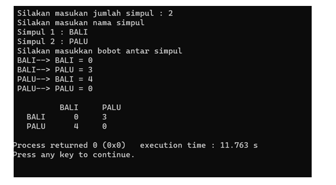
```C++
#include <iostream>
#include <string>

using namespace std;

int main(){
    int jumlahSimpul_150; // Deklarasi variaber int untuk menyimpan jumlah simpul
    cout << "Masukan Jumlah simpul: ";
    cin >> jumlahSimpul_150;

    string namaSimpul_150[jumlahSimpul_150]; // Deklarasi array string untuk menyimpan nama-nama simpul
    cout << "masukan nama simpul " <<endl;
    for(int i=0;i<jumlahSimpul_150;i++){
        cout << "Simpul " << i+1 << " : ";
        cin >> namaSimpul_150[i];
    } 

    int graph[jumlahSimpul_150][jumlahSimpul_150];// Deklarasi array 2D untuk menyimpan matriks ketetanggaan
    for(int i=0;i<jumlahSimpul_150;i++){
        for(int j=0;j<jumlahSimpul_150;j++){
            if(i==j){
                graph[i][j] = 0;
            }else{
                cout << namaSimpul_150[i] << " --> " <<namaSimpul_150[j] << " = ";
                cin >> graph[i][j];
            }
        }
    }

    cout << endl;
    cout << "Matriks keteanggaan: " <<endl;
    cout << "     ";
    for(int i=0;i<jumlahSimpul_150;i++){
        cout << namaSimpul_150[i] << " ";
    }
    cout << endl;

    for(int i=0;i<jumlahSimpul_150;i++){
        cout << namaSimpul_150[i] << " ";// cetak nama setiap simpul sebagai header baris
        for(int j=0; j<jumlahSimpul_150;j++){
            cout << graph[i][j] << " ";// Cetak nilai setiap elemen dalam matriks
        }
        cout <<endl;
    }
    return 0;
}
```
#### Output:
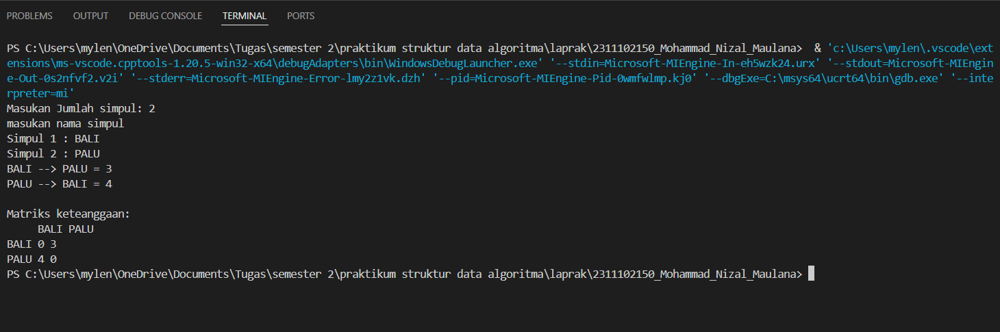

Kode diatas merupakan implementasi dari graf, program dimulai dengan mendeklarasikan variabel `jumlahSimpul_150` untuk menyimpan jumlah simpul yang akan dimasukkan. Setelah itu program akan mendeklarasikan array `namaSimpul_150` bertipe string dengan ukuran sesuai dengan jumlah simpul yang telah dimasukan. Setelah itu program akann mendeklarasikan array 2D`graph` untuk menyimpan matriks ketetanggaan. Yang terakhir setelah semua simpul telah dimasukan, program akan mencetak matriks ketetanggaan (adjacency matrix), dan setiap elemen dalam matriks akan menunjukan ada atau tidaknya hubungan antara simpul-simpul tersebut

### 2. Modifikasi guided tree diatas dengan program menu menggunakan input data tree dari user dan berikan fungsi tambahan untuk menampilkan node child dan descendant dari node yang diinput kan!

```C++
#include <iostream>
#include <iomanip>
using namespace std;

struct Pohon
{
    char data;
    Pohon *left, *right, *parent;
};
Pohon *root, *baru;

void init()
{
    root = NULL;
}

bool isEmpty()
{
    return root == NULL;
}

void buatNode(char data)
{
    if (isEmpty())
    {
        root = new Pohon();
        root->data = data;
        root->left = NULL;
        root->right = NULL;
        root->parent = NULL;
        cout << "\n Node " << data << " berhasil dibuat sebagai root." << endl;
    }
    else
    {
        cout << "\n Tree sudah ada!" << endl;
    }
}

Pohon *insertLeft(char data, Pohon *node)
{
    if (isEmpty())
    {
        cout << "\n Buat tree terlebih dahulu!" << endl;
        return NULL;
    }
    else
    {
        if (node->left != NULL)
        {
            cout << "\n Node " << node->data << " sudah ada child kiri!" << endl;
            return NULL;
        }
        else
        {
            Pohon *baru = new Pohon();
            baru->data = data;
            baru->left = NULL;
            baru->right = NULL;
            baru->parent = node;
            node->left = baru;
            cout << "\n Node " << data << " berhasil ditambahkan ke child kiri " << baru->parent->data << endl;
            return baru;
        }
    }
}

Pohon *insertRight(char data, Pohon *node)
{
    if (isEmpty())
    {
        cout << "\n Buat tree terlebih dahulu!" << endl;
        return NULL;
    }
    else
    {
        if (node->right != NULL)
        {
            cout << "\n Node " << node->data << " sudah ada child kanan!" << endl;
            return NULL;
        }
        else
        {
            Pohon *baru = new Pohon();
            baru->data = data;
            baru->left = NULL;
            baru->right = NULL;
            baru->parent = node;
            node->right = baru;
            cout << "\n Node " << data << " berhasil ditambahkan ke child kanan " << baru->parent->data << endl;
            return baru;
        }
    }
}

void update(char data, Pohon *node)
{
    if (isEmpty())
    {
        cout << "\n Buat tree terlebih dahulu!" << endl;
    }
    else
    {
        if (!node)
        {
            cout << "\n Node yang ingin diganti tidak ada!!" << endl;
        }
        else
        {
            char temp = node->data;
            node->data = data;
            cout << "\n Node " << temp << " berhasil diubah menjadi " << data << endl;
        }
    }
}

void retrieve(Pohon *node)
{
    if (isEmpty())
    {
        cout << "\n Buat tree terlebih dahulu!" << endl;
    }
    else
    {
        if (!node)
        {
            cout << "\n Node yang ditunjuk tidak ada!" << endl;
        }
        else
        {
            cout << "\n Data node: " << node->data << endl;
        }
    }
}

void find(Pohon *node)
{
    if (isEmpty())
    {
        cout << "\n Buat tree terlebih dahulu!" << endl;
    }
    else
    {
        if (!node)
        {
            cout << "\n Node yang ditunjuk tidak ada!" << endl;
        }
        else
        {
            cout << "\n Data Node: " << node->data << endl;
            cout << " Root: " << root->data << endl;

            if (!node->parent)
                cout << " Parent: (tidak punya parent)" << endl;
            else
                cout << " Parent: " << node->parent->data << endl;

            if (node->parent != NULL && node->parent->left != node && node->parent->right == node)
                cout << " Sibling: " << node->parent->left->data << endl;
            else if (node->parent != NULL && node->parent->right != node && node->parent->left == node)
                cout << " Sibling: " << node->parent->right->data << endl;
            else
                cout << " Sibling: (tidak punya sibling)" << endl;

            if (!node->left)
                cout << " Child Kiri: (tidak punya Child kiri)" << endl;
            else
                cout << " Child Kiri: " << node->left->data << endl;

            if (!node->right)
                cout << " Child Kanan: (tidak punya Child kanan)" << endl;
            else
                cout << " Child Kanan: " << node->right->data << endl;
        }
    }
}

void preOrder(Pohon *node)
{
    if (isEmpty())
    {
        cout << "\n Buat tree terlebih dahulu!" << endl;
    }
    else
    {
        if (node != NULL)
        {
            cout << " " << node->data << ", ";
            preOrder(node->left);
            preOrder(node->right);
        }
    }
}

void inOrder(Pohon *node)
{
    if (isEmpty())
    {
        cout << "\n Buat tree terlebih dahulu!" << endl;
    }
    else
    {
        if (node != NULL)
        {
            inOrder(node->left);
            cout << " " << node->data << ", ";
            inOrder(node->right);
        }
    }
}

void postOrder(Pohon *node)
{
    if (isEmpty())
    {
        cout << "\n Buat tree terlebih dahulu!" << endl;
    }
    else
    {
        if (node != NULL)
        {
            postOrder(node->left);
            postOrder(node->right);
            cout << " " << node->data << ", ";
        }
    }
}

void deleteTree(Pohon *node)
{
    if (isEmpty())
    {
        cout << "\n Buat tree terlebih dahulu!" << endl;
    }
    else
    {
        if (node != NULL)
        {
            if (node != root)
            {
                node->parent->left = NULL;
                node->parent->right = NULL;
            }
            deleteTree(node->left);
            deleteTree(node->right);
            if (node == root)
            {
                delete root;
                root = NULL;
            }
            else
            {
                delete node;
            }
        }
    }
}

void deleteSub(Pohon *node)
{
    if (isEmpty())
    {
        cout << "\n Buat tree terlebih dahulu!" << endl;
    }
    else
    {
        deleteTree(node->left);
        deleteTree(node->right);
        cout << "\n Node subtree " << node->data << " berhasil dihapus." << endl;
    }
}

void clear()
{
    if (isEmpty())
    {
        cout << "\n Buat tree terlebih dahulu!" << endl;
    }
    else
    {
        deleteTree(root);
        cout << "\n Pohon berhasil dihapus." << endl;
    }
}

int size(Pohon *node)
{
    if (isEmpty())
    {
        cout << "\n Buat tree terlebih dahulu!" << endl;
        return 0;
    }
    else
    {
        if (!node)
        {
            return 0;
        }
        else
        {
            return 1 + size(node->left) + size(node->right);
        }
    }
}

int height(Pohon *node)
{
    if (isEmpty())
    {
        cout << "\n Buat tree terlebih dahulu!" << endl;
        return 0;
    }
    else
    {
        if (!node)
        {
            return 0;
        }
        else
        {
            int heightKiri = height(node->left);
            int heightKanan = height(node->right);
            if (heightKiri >= heightKanan)
            {
                return heightKiri + 1;
            }
            else
            {
                return heightKanan + 1;
            }
        }
    }
}

void characteristic()
{
    cout << "\n ukuran pohon: " << size(root) << endl;
    cout << " tinggi pohon: " << height(root) << endl;
    cout << " Rata-rata node pohon: " << size(root) / height(root) << endl;
}

void displayChildren(Pohon *node)
{
    if (isEmpty())
    {
        cout << "\n Buat tree terlebih dahulu!" << endl;
    }
    else if (!node)
    {
        cout << "\n Node yang ditunjuk tidak ada!" << endl;
    }
    else
    {
        if (node->left)
            cout << " Child Kiri: " << node->left->data << endl;
        else
            cout << " Child Kiri: (tidak punya Child kiri)" << endl;

        if (node->right)
            cout << " Child Kanan: " << node->right->data << endl;
        else
            cout << " Child Kanan: (tidak punya Child kanan)" << endl;
    }
}

void displayDescendants(Pohon *node)
{
    if (isEmpty())
    {
        cout << "\n Buat tree terlebih dahulu!" << endl;
    }
    else if (!node)
    {
        cout << "\n Node yang ditunjuk tidak ada!" << endl;
    }
    else
    {
        cout << " Keturunan dari " << node->data << ": ";
        preOrder(node);
        cout << endl;
    }
}

Pohon *findNode(Pohon *node, char data)
{
    if (node == NULL)
        return NULL;
    if (node->data == data)
        return node;

    Pohon *leftNode = findNode(node->left, data);
    if (leftNode != NULL)
        return leftNode;

    return findNode(node->right, data);
}

int main()
{
    init();
    int pilih_2311102150;
    char data_2311102150;
    Pohon *node = nullptr;

    do
    {
        cout << "\nMenu:\n";
        cout << "1. Buat Pohon\n";
        cout << "2. Tambah kiri\n";
        cout << "3. Tambah kanan\n";
        cout << "4. Perbarui Node\n";
        cout << "5. mengambil Node\n";
        cout << "6. Temukan Node\n";
        cout << "7. Tampilkan node\n";
        cout << "8. Tampilkan keturunan (child)\n";
        cout << "9. Sifat\n";
        cout << "10. PreOrder Traversal\n";
        cout << "11. InOrder Traversal\n";
        cout << "12. PostOrder Traversal\n";
        cout << "13. Hapus pohon\n";
        cout << "14. keluar\n";
        cout << "Masukkan pilihan : ";
        cin >> pilih_2311102150;

        switch (pilih_2311102150)
        {
        case 1:
            cout << "Masukkan root: ";
            cin >> data_2311102150;
            buatNode(data_2311102150);
            break;

        case 2:
            cout << "Masukkan data node baru: ";
            cin >> data_2311102150;
            cout << "Masukkan data parent baru: ";
            char parentDataLeft;
            cin >> parentDataLeft;
            node = findNode(root, parentDataLeft);
            if (node != nullptr)
                insertLeft(data_2311102150, node);
            break;

        case 3:
            cout << "Masukkan data node baru: ";
            cin >> data_2311102150;
            cout << "Masukkan data parent baru: ";
            char parentDataRight;
            cin >> parentDataRight;
            node = findNode(root, parentDataRight);
            if (node != nullptr)
                insertRight(data_2311102150, node);
            break;

        case 4:
            cout << "Masukan data yang ingin diubah: ";
            cin >> data_2311102150;
            cout << "Masukkan node baru: ";
            char newData;
            cin >> newData;
            node = findNode(root, data_2311102150);
            if (node != nullptr)
                update(newData, node);
            break;

        case 5:
            cout << "Masukan data yang akan diambil: ";
            cin >> data_2311102150;
            node = findNode(root, data_2311102150);
            retrieve(node);
            break;

        case 6:
            cout << "Masukkan data yang akan ditemukan: ";
            cin >> data_2311102150;
            node = findNode(root, data_2311102150);
            find(node);
            break;

        case 7:
            cout << "Masukan data untuk yang ingin ditampilkan: ";
            cin >> data_2311102150;
            node = findNode(root, data_2311102150);
            displayChildren(node);
            break;

        case 8:
            cout << "Masukkan data untuk menampilkan keturunan(child): ";
            cin >> data_2311102150;
            node = findNode(root, data_2311102150);
            displayDescendants(node);
            break;

        case 9:
            characteristic();
            break;

        case 10:
            cout << "PreOrder Traversal: ";
            preOrder(root);
            cout << endl;
            break;

        case 11:
            cout << "InOrder Traversal: ";
            inOrder(root);
            cout << endl;
            break;

        case 12:
            cout << "PostOrder Traversal: ";
            postOrder(root);
            cout << endl;
            break;

        case 13:
            clear();
            break;

        case 14:
            cout << "Keluar program" << endl;
            break;

        default:
            cout << "pilihan tidak tersedia" << endl;
        }
    } while (pilih_2311102150 != 14);

    return 0;
}

```
#### Output:
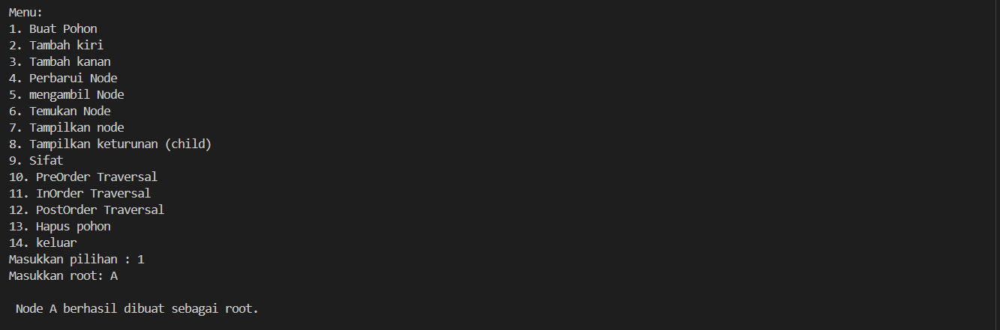

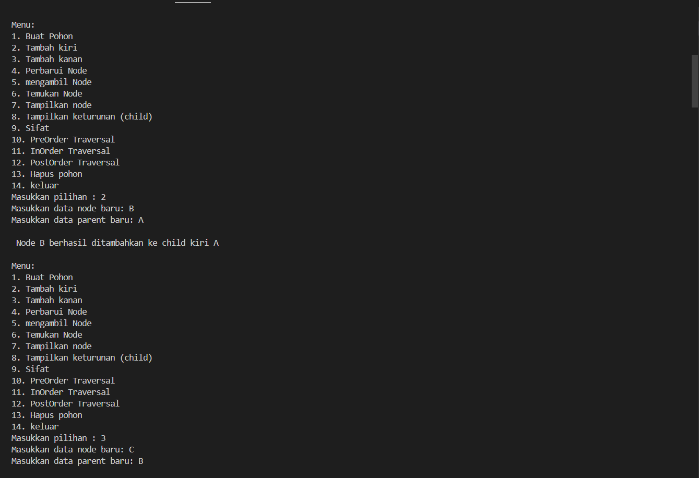

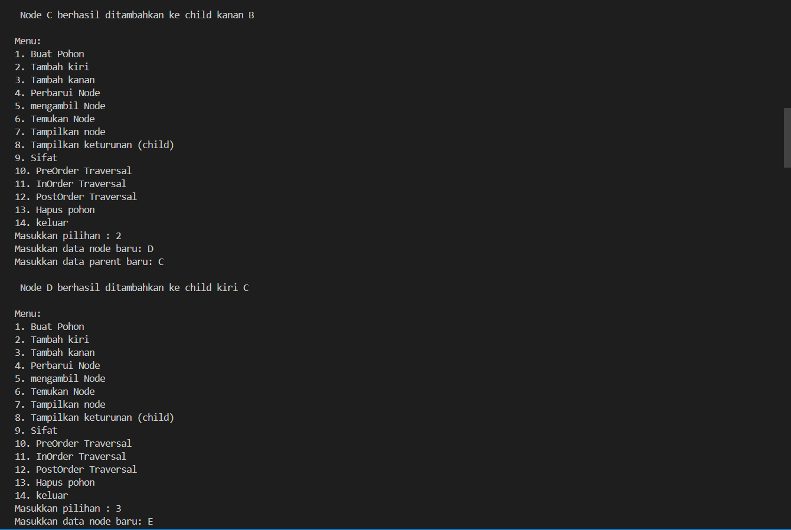

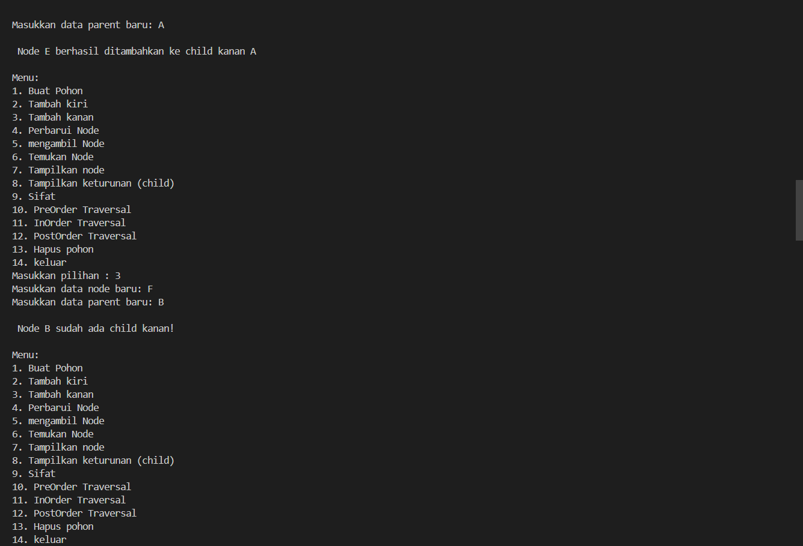

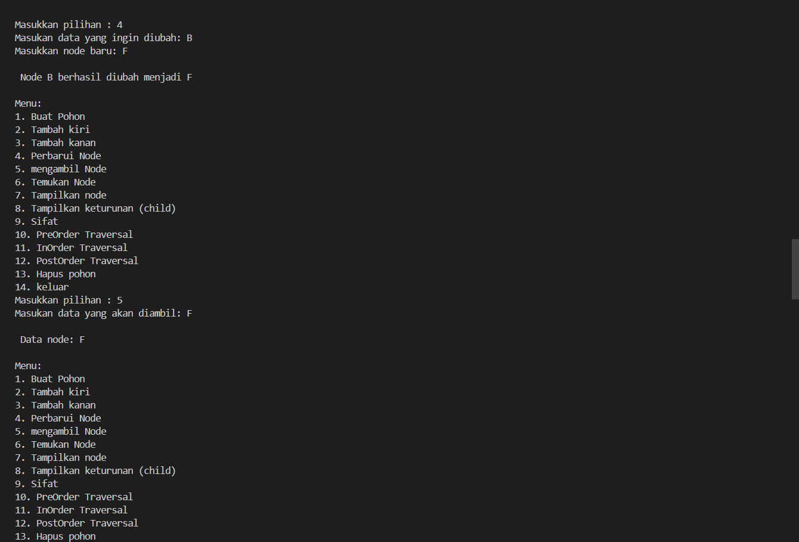

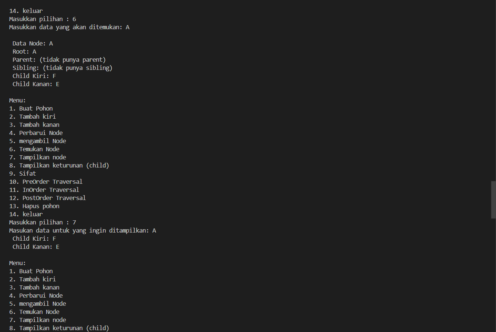

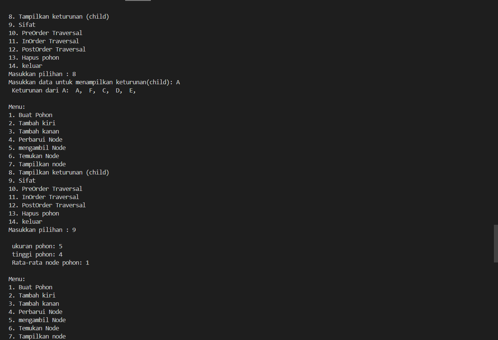

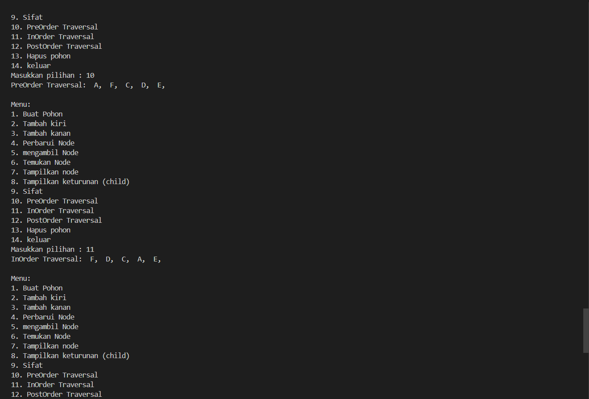

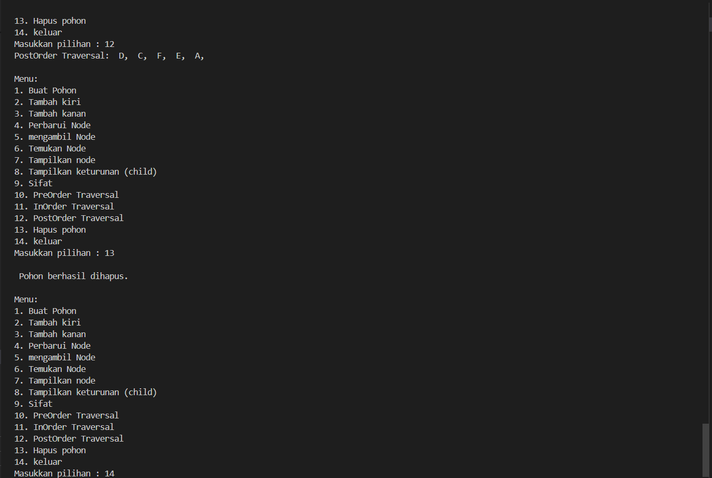

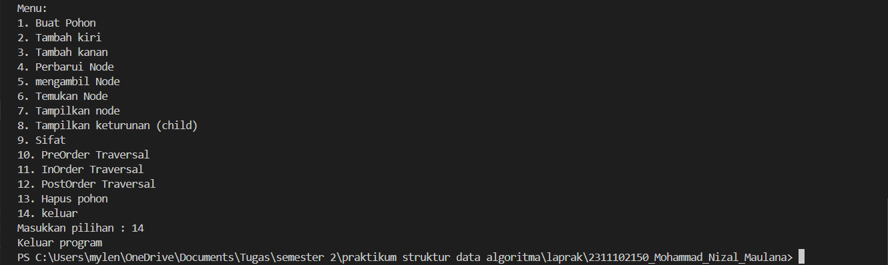

Kode diatas merupakan implementasi dari tree atau pohon biner. Program dimulai dengan mendefinisikan struktur `pohon` yang memiliki atribut `data`,`left` dan `right`. Terdapat variabel `root` yang digunakan sebagai akar dari pohon, dan `baru` sebagai pointer sementara. Fungsi `init` mengenisialisasi pohon dengan mengatur `root` menjadi `NULL` yang menandaka pohon terebut kosong. `isEmpty` akan mengecek apakah pohon kosong atau tidak, Fungsi `buatNode` akan membuat node baru jika pohon masih kosong. `insertLeft` dan `isertRight` digunakan menambahkan child kiri dan kanan. `update` digunakan untuk memperbarui nilai data dari node yang dipilih. `retrieve` akan menampilkan nilai data yang dipilih. `find` akan menampilkan detail informasi tentang node yang ditunjuk. `preOrder`,`inOrder` dan `postOrder` merupaka fugsi untuk traversal pohon dalam urutan preorder, inorder dan postorder. `deleteTree` menghapus seluruh pohon atau sub-pohon dari node yang ditujuk. `size` menampilkan jumlah total node dalam pohon `height` menampilkan tinggi pohon, `characteristic` menampilkan ukuran, tinggi dan rata-rata jumlah node, `displayChildern` menampilkan anak kiri dan kanan dari node yang ditunjuk. `displayDescenddants` menampilkan seluruh keturunan dari node yang ditunjuk. `findNode` akan mencari node berdasarkan nilai datanya. Pada int `main()` berisi menu yang dapat dipilih user untuk melakukan berbagai operasi pada pohon. User dapat memilih untuk membuat pohon, menambah node, memperbarui node, menampilkan data node, melakukan traversal, menghapus pohon, dan melihat karakteristik pohon. Program akan terus menampilkan menu ini sampai pengguna memilih untuk keluar dari program.

## Kesimpulan
Graph terdiri dari node (vertex) dan edge (sisi) yang menghubungkan node, dan bisa berupa directed atau undirected. Graph dapat direpresentasikan melalui adjacency matrix dan adjacency list.[1]</br>
Sementara Tree sendiri merupakan jenis khusus dari graph dengan struktur hierarkis dimana satu node berfungsi sebagai root (akar). Salah satu contohnya adalah binary tree, dimana setiap node memiliki paling banyak dua anak. Implementasi tree sering menggunakan pointer untuk merepresentasikan hubungan antar node. [2]

## Referensi
[1] Triase, T. (2020). Struktur Data: Diktat Edisi Revisi.</br>
[2] Mulyana, A. (2023). E-book: cara mudah untuk mempelajari algoritma dan struktur data.